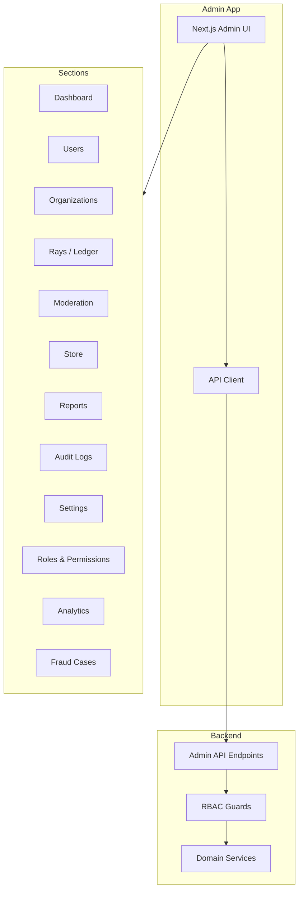
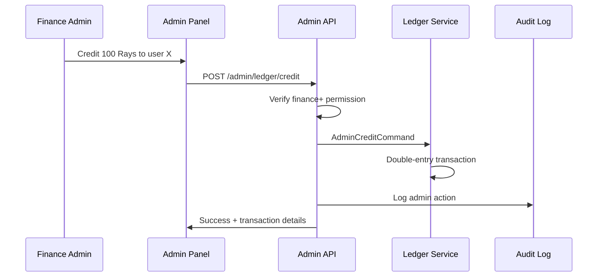

# ЛУЧИ — Admin Panel

**Версия:** 1.0.0  
**Дата:** 2026-08-07  

---

## 1. Overview

Admin Panel — полнофункциональная административная панель для управления платформой ЛУЧИ. Отдельное Next.js приложение (`apps/admin`) с RBAC-защитой.

---

## 2. Architecture



---

## 3. Sections & Features

### 3.1 Dashboard

**Route:** `/admin/dashboard`  
**Permission:** `admin:dashboard`

| Widget | Data Source | Refresh |
|--------|------------|---------|
| Users overview | DAU, MAU, new today | Real-time |
| Good deeds stats | Submitted/approved/rejected today | 5 min |
| Rays circulation | Total, credited/debited today | 5 min |
| Store stats | Orders today, revenue | 5 min |
| Moderation queue | Pending count, avg time | Real-time |
| Fraud alerts | Open cases, signals today | Real-time |
| Activity chart | 30-day trend (users, deeds, rays) | Daily |
| Top categories | Deeds by category (pie chart) | Daily |

```mermaid
graph TD
    subgraph Dashboard Layout
        ROW1[Users | Deeds | Rays | Store]
        ROW2[Activity Chart - 30 days]
        ROW3[Moderation Queue | Fraud Alerts]
        ROW4[Top Categories | Recent Actions]
    end
```

---

### 3.2 Users Management

**Route:** `/admin/users`  
**Permission:** `user:update:any`, `user:ban`

| Feature | Description |
|---------|-------------|
| User list | Search, filter by role/status/city, paginated |
| User detail | Profile, stats, roles, balance, history |
| Edit user | Change display name, status, roles |
| Ban/unban | Temporary or permanent ban with reason |
| View activity | Posts, deeds, transactions, sessions |
| Impersonate | View as user (audit logged, super_admin only) |

**User Detail Tabs:**
- Profile
- Good Deeds
- Rays & Transactions
- Social Activity
- Roles & Permissions
- Sessions
- Audit Log
- Fraud Signals

---

### 3.3 Organizations

**Route:** `/admin/organizations`  
**Permission:** `org:verify`, `org:manage`

| Feature | Description |
|---------|-------------|
| Org list | Filter by verification status |
| Org detail | Info, tasks, events, members |
| Verify/reject | Organization verification workflow |
| Suspend | Suspend organization |

---

### 3.4 Rays / Ledger

**Route:** `/admin/rays`  
**Permission:** `rays:view:any`, `rays:credit`, `rays:debit`

| Feature | Description |
|---------|-------------|
| Transaction list | All transactions, filterable |
| Transaction detail | Full double-entry view |
| Manual credit | Admin credit Rays to user (with reason) |
| Manual debit | Admin debit Rays from user (with reason) |
| Rollback | Reverse transaction |
| Reconciliation | Verify ledger integrity |
| Circulation stats | Total Rays, distribution chart |



---

### 3.5 Moderation

**Route:** `/admin/moderation`  
**Permission:** `moderation:review`

| Feature | Description |
|---------|-------------|
| Review queue | Priority-sorted, filterable by type |
| Submission review | Photos, GPS map, user history, AI recommendation |
| Quick approve/reject | With reward amount input |
| Escalation | Send to senior moderator |
| Reports | User reports list |
| Report resolution | Investigate and resolve |
| Ban management | Create/remove bans |

**Review UI Layout:**

```
┌─────────────────────────────────────────────────────┐
│ Submission #1234                    [Approve] [Reject]│
├──────────────────────┬──────────────────────────────┤
│                      │ Task: Уборка парка           │
│   [Photo 1]  [Photo 2]│ Category: Экология           │
│                      │ Reward range: 20-50           │
│   [GPS Map]          │ User: @good_soul (Level 5)   │
│                      │ AI: REVIEW (confidence: 65%)  │
│                      │ Previous deeds: 12 (92% approved)│
│                      │                               │
│                      │ Reward amount: [___35___]     │
│                      │ Note: [________________]      │
└──────────────────────┴──────────────────────────────┘
```

---

### 3.6 Store Management

**Route:** `/admin/store`  
**Permission:** `product:create`, `order:view:all`

| Feature | Description |
|---------|-------------|
| Products CRUD | Create, edit, archive products |
| Categories | Manage product categories |
| Orders | View all orders, update status |
| Refunds | Process refunds |
| Inventory | Stock management |

---

### 3.7 Reports & Complaints

**Route:** `/admin/reports`  
**Permission:** `report:view`, `report:resolve`

| Feature | Description |
|---------|-------------|
| Open reports | Filter by type, priority |
| Report detail | Reporter, target, history |
| Resolve | Action taken, resolution note |
| Statistics | Reports by type, resolution time |

---

### 3.8 Audit Logs

**Route:** `/admin/audit-log`  
**Permission:** `admin:audit_log`

| Feature | Description |
|---------|-------------|
| Log viewer | Searchable, filterable audit trail |
| Filters | By actor, action, resource, date range |
| Detail view | Old/new values diff |
| Export | CSV export |

---

### 3.9 Settings

**Route:** `/admin/settings`  
**Permission:** `admin:settings`

| Setting Group | Examples |
|---------------|---------|
| Reward Engine | Category multipliers, streak bonuses |
| Transfer Limits | Daily limits, min/max amounts |
| Registration | Open/closed, email verification required |
| Moderation | Auto-reject thresholds, escalation rules |
| Anti-Fraud | Risk score thresholds, device limits |
| Store | Order timeout, refund period |
| Platform | Maintenance mode, announcement banner |

---

### 3.10 Roles & Permissions

**Route:** `/admin/roles`  
**Permission:** `role:manage`

| Feature | Description |
|---------|-------------|
| Role list | All roles with permission count |
| Edit role | Permission checklist |
| Assign roles | User → role assignment |
| Permission matrix | Visual role × permission grid |

---

### 3.11 Analytics

**Route:** `/admin/analytics`  
**Permission:** `admin:analytics`

| Feature | Description |
|---------|-------------|
| User analytics | Registration trend, retention, DAU/MAU |
| Deed analytics | By category, approval rate, review time |
| Rays analytics | Circulation, transfer volume, rewards |
| Store analytics | Orders, revenue, top products |
| Export | CSV/Excel export |

---

### 3.12 Fraud Cases

**Route:** `/admin/fraud`  
**Permission:** `fraud:view`, `fraud:investigate`

| Feature | Description |
|---------|-------------|
| Open cases | Priority-sorted fraud cases |
| Case detail | Signals, user history, related accounts |
| Investigate | Add notes, link evidence |
| Resolve | Confirm fraud / dismiss false positive |
| User risk score | View and override |

---

## 4. Admin App Structure

```
apps/admin/
├── src/
│   ├── app/
│   │   ├── layout.tsx              # Admin layout with sidebar
│   │   ├── page.tsx                # Redirect to dashboard
│   │   ├── dashboard/
│   │   ├── users/
│   │   │   ├── page.tsx            # User list
│   │   │   └── [id]/page.tsx       # User detail
│   │   ├── organizations/
│   │   ├── rays/
│   │   │   ├── page.tsx            # Transactions
│   │   │   └── [id]/page.tsx       # Transaction detail
│   │   ├── moderation/
│   │   │   ├── page.tsx            # Review queue
│   │   │   └── [id]/page.tsx       # Review detail
│   │   ├── store/
│   │   │   ├── products/
│   │   │   └── orders/
│   │   ├── reports/
│   │   ├── audit-log/
│   │   ├── settings/
│   │   ├── roles/
│   │   ├── analytics/
│   │   └── fraud/
│   ├── components/
│   │   ├── layout/
│   │   │   ├── AdminSidebar.tsx
│   │   │   ├── AdminHeader.tsx
│   │   │   └── AdminBreadcrumb.tsx
│   │   ├── dashboard/
│   │   ├── users/
│   │   ├── moderation/
│   │   └── shared/
│   │       ├── DataTable.tsx
│   │       ├── StatCard.tsx
│   │       ├── ConfirmDialog.tsx
│   │       └── PermissionGate.tsx
│   ├── hooks/
│   │   ├── useAdminAuth.ts
│   │   └── usePermissions.ts
│   └── lib/
│       ├── api-client.ts
│       └── permissions.ts
```

---

## 5. Access Control in Admin

```typescript
// Every admin page wrapped with permission check
<PermissionGate permission="admin:dashboard">
  <DashboardPage />
</PermissionGate>

// Sidebar items filtered by permissions
const menuItems = [
  { label: 'Dashboard', href: '/dashboard', permission: 'admin:dashboard' },
  { label: 'Users', href: '/users', permission: 'user:update:any' },
  { label: 'Moderation', href: '/moderation', permission: 'moderation:review' },
  { label: 'Rays', href: '/rays', permission: 'rays:view:any' },
  // ...
].filter(item => hasPermission(item.permission));
```

---

## 6. Business Rules

1. Admin panel on separate subdomain: `admin.luchi.app`
2. Requires admin-level role to access any page
3. All admin actions logged in audit_log
4. Manual Ray credit/debit requires reason (min 10 chars)
5. Cannot delete users — only ban/suspend
6. Cannot modify ledger entries — only create new transactions
7. Settings changes require admin+ role
8. Role changes require admin+ role
9. Super admin actions require super_admin role
10. Session timeout: 30 minutes inactive (stricter than user app)

---

## 7. Error Handling

| Scenario | UI Behavior |
|----------|-------------|
| 403 Forbidden | "Access denied" page with required permission |
| 404 Not found | "Resource not found" with back link |
| 422 Validation | Inline field errors |
| 500 Server error | Error toast + retry button |
| Network error | Offline banner + retry |

---

## 8. Unit Tests

| Test | Description |
|------|-------------|
| PermissionGate | Renders children only with permission |
| Sidebar filtering | Shows only permitted menu items |
| DataTable | Pagination, sorting, filtering |
| StatCard | Renders metric correctly |

---

## 9. Integration Tests

| Test | Description |
|------|-------------|
| Admin login flow | Login → dashboard access |
| User ban flow | Search user → ban → verify status |
| Moderation flow | Queue → review → approve → Rays credited |
| Manual credit | Credit Rays → verify balance → audit log |

---

## 10. Связанные документы

- [RBAC.md](./RBAC.md)
- [API.md](./API.md)
- [ANALYTICS.md](./ANALYTICS.md)
- [MODERATION.md](./MODERATION.md)
- [UI_SYSTEM.md](./UI_SYSTEM.md)
