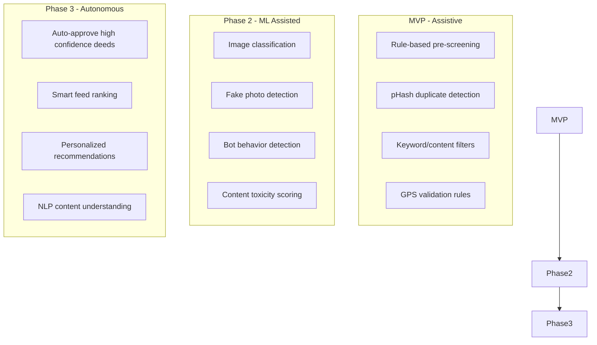
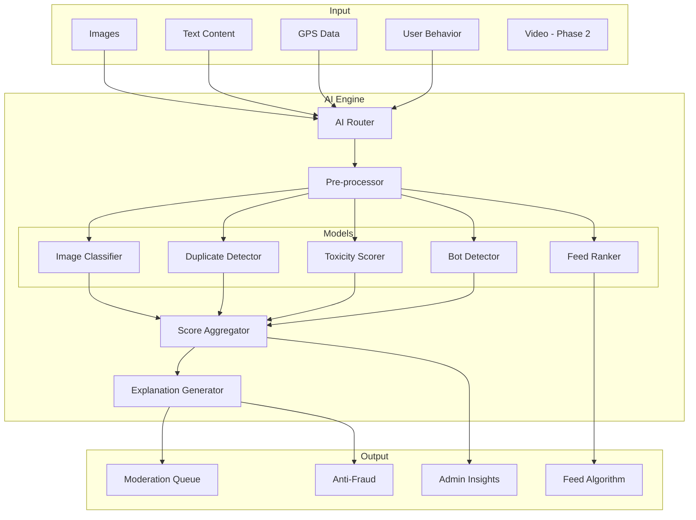
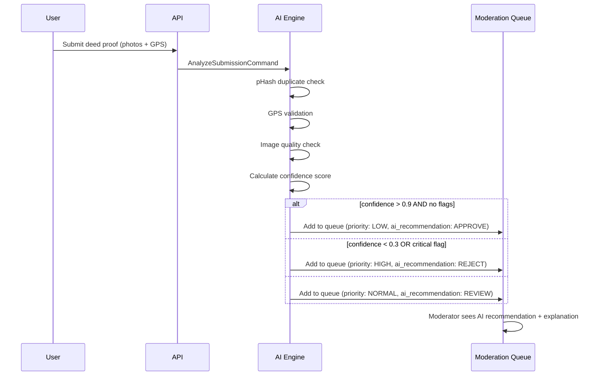
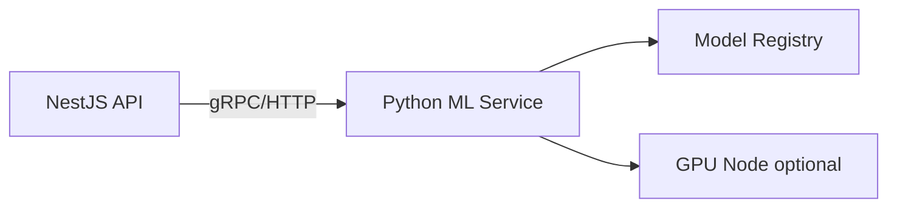

# ЛУЧИ — AI Module

**Версия:** 1.0.0  
**Дата:** 2026-08-07  

---

## 1. Overview

AI модуль обеспечивает интеллектуальную автоматизацию платформы: pre-moderation контента, assistive review добрых дел, anti-fraud ML-модели, рекомендации и анализ поведения. В MVP AI работает в **assistive mode** — финальное решение всегда за человеком.

---

## 2. AI Strategy



### Принципы

| # | Прinciple | Description |
|---|-----------|-------------|
| 1 | Human-in-the-loop | AI рекомендует, человек решает (MVP + Phase 2) |
| 2 | Explainability | Каждая AI-рекомендация имеет reason + confidence |
| 3 | Fail-safe | При ошибке AI → manual review, не auto-reject |
| 4 | Privacy | PII не отправляется во внешние модели без consent |
| 5 | Auditability | Все AI-решения логируются |

---

## 3. Architecture



---

## 4. Use Cases

### 4.1 Good Deed Pre-Screening (MVP)



**MVP Checks:**

| Check | Method | Output |
|-------|--------|--------|
| Duplicate photo | pHash hamming distance | `duplicate_score: 0.0-1.0` |
| GPS valid | Distance from task location | `gps_valid: boolean` |
| Photo quality | Min resolution, blur detection | `quality_score: 0.0-1.0` |
| Photo relevance | EXIF timestamp vs submission time | `timestamp_valid: boolean` |
| Image manipulation | Basic ELA (Phase 2) | `manipulation_score: 0.0-1.0` |

### 4.2 Content Moderation (Phase 2)

| Check | Model | Action |
|-------|-------|--------|
| Toxicity | Text classifier | Flag if score > 0.7 |
| Hate speech | Fine-tuned BERT | Auto-hide if > 0.9 |
| Spam | Pattern + ML | Flag for review |
| NSFW images | Image classifier | Auto-hide if > 0.85 |
| Personal info | NER model | Flag for review |

### 4.3 Bot Detection (Phase 2)

**Input features:**
- Action timestamps (interval regularity)
- Session duration patterns
- Mouse/touch movement (client-side)
- API call patterns
- Content similarity across actions

**Output:** `bot_probability: 0.0-1.0`

### 4.4 Feed Ranking (Phase 2)

```
score = w1×recency + w2×engagement + w3×author_rank + w4×deed_relevance + w5×social_proximity

recency = exp(-λ × hours_since_post)
engagement = log(1 + reactions + 2×comments)
author_rank = user.rays_rank_percentile
deed_relevance = match(user.interests, post.deed_category)
social_proximity = is_friend ? 1.0 : is_following ? 0.7 : 0.3
```

### 4.5 Recommendations (Phase 3)

| Type | Description |
|------|-------------|
| Task recommendations | Based on user history, location, interests |
| Friend suggestions | Mutual friends, similar deed categories |
| Organization suggestions | Based on city, interests |
| Store products | Based on purchase history, Ray balance |

---

## 5. AI Recommendation Schema

```typescript
interface AIRecommendation {
  id: UUID;
  targetType: 'DEED_SUBMISSION' | 'POST' | 'COMMENT' | 'USER';
  targetId: UUID;
  recommendation: 'APPROVE' | 'REJECT' | 'REVIEW' | 'FLAG';
  confidence: number;          // 0.0 - 1.0
  checks: AICheck[];
  createdAt: DateTime;
}

interface AICheck {
  checkType: string;
  result: 'PASS' | 'FAIL' | 'WARN';
  score: number;
  details: string;
}
```

**Example:**

```json
{
  "recommendation": "REVIEW",
  "confidence": 0.65,
  "checks": [
    { "checkType": "DUPLICATE_PHOTO", "result": "PASS", "score": 0.1, "details": "No similar photos found" },
    { "checkType": "GPS_VALIDATION", "result": "WARN", "score": 0.4, "details": "GPS 2.3km from task location (radius: 1km)" },
    { "checkType": "PHOTO_QUALITY", "result": "PASS", "score": 0.85, "details": "Resolution 1920x1080, no blur detected" },
    { "checkType": "TIMESTAMP", "result": "PASS", "score": 0.9, "details": "Photo taken 2 hours ago" }
  ]
}
```

---

## 6. Module Structure

```
modules/ai/
├── domain/
│   ├── entities/
│   │   └── ai-recommendation.entity.ts
│   ├── services/
│   │   ├── ai-router.service.ts
│   │   └── explanation.service.ts
│   └── interfaces/
│       ├── image-analyzer.interface.ts
│       ├── text-analyzer.interface.ts
│       └── behavior-analyzer.interface.ts
├── application/
│   ├── commands/
│   │   ├── analyze-submission.command.ts
│   │   ├── analyze-content.command.ts
│   │   └── rank-feed.command.ts
│   └── handlers/
│       ├── analyze-submission.handler.ts
│       └── analyze-content.handler.ts
├── infrastructure/
│   ├── analyzers/
│   │   ├── phash.analyzer.ts           # MVP
│   │   ├── gps.analyzer.ts             # MVP
│   │   ├── quality.analyzer.ts         # MVP
│   │   ├── toxicity.analyzer.ts        # Phase 2
│   │   ├── bot-detector.analyzer.ts    # Phase 2
│   │   └── image-classifier.analyzer.ts # Phase 2
│   └── ml/
│       ├── model-loader.ts
│       └── inference.service.ts
└── presentation/
    └── controllers/
        └── ai.controller.ts            # Admin: view AI stats
```

---

## 7. Model Deployment Strategy

| Phase | Deployment | Models |
|-------|-----------|--------|
| MVP | In-process (Node.js) | pHash, GPS rules, quality checks |
| Phase 2 | Sidecar (Python/FastAPI) | TensorFlow/PyTorch models |
| Phase 3 | Dedicated ML service | Custom trained models |

### MVP: No External ML

All MVP "AI" is rule-based + algorithmic:
- pHash: `sharp` + `imghash` libraries
- GPS: Haversine distance calculation
- Quality: Image metadata + resolution check
- No external API calls, no GPU required

### Phase 2: ML Sidecar



---

## 8. Data for ML Training (Phase 2+)

| Dataset | Source | Size Target |
|---------|--------|-------------|
| Deed approval/rejection | Moderation decisions | 10K+ labeled |
| Fraud confirmed/dismissed | Fraud cases | 5K+ labeled |
| Content moderation | Moderator actions | 20K+ labeled |
| User engagement | Click/react data | 100K+ events |

### Data Pipeline

```
Moderation decisions → Labeling → Training set → Model training → Validation → Deploy
                                    ↑
                              Human review queue (quality control)
```

---

## 9. Integration Points

| Event | AI Action | Output |
|-------|-----------|--------|
| DeedSubmissionCreated | Full analysis pipeline | AI recommendation in queue |
| PostCreated | Toxicity + spam check | Flag if needed |
| MediaUploaded | pHash + quality | Store metadata |
| UserRegistered | Bot pattern check | Flag if suspicious |
| FeedRequested | Rank posts (Phase 2) | Sorted feed |

---

## 10. Business Rules

1. AI never auto-approves deeds in MVP (always human review)
2. AI can auto-reject only duplicate photos (pHash match > 95%)
3. AI recommendations visible to moderators, not users
4. Confidence threshold for auto-actions: > 0.95 (Phase 2)
5. AI analysis must complete within 5 seconds
6. Failed AI analysis → default to manual review (fail-safe)
7. All AI decisions logged with model version
8. User can appeal AI-influenced decisions

---

## 11. Error Codes

| Code | Description |
|------|-------------|
| AI_ANALYSIS_FAILED | AI pipeline error (fail-safe to manual) |
| AI_TIMEOUT | Analysis exceeded 5s limit |
| AI_MODEL_UNAVAILABLE | ML service down (Phase 2) |

---

## 12. Edge Cases

| Case | Handling |
|------|----------|
| AI service down | Skip AI, add to manual queue |
| Low quality photo | Warn moderator, don't auto-reject |
| New category (no training data) | Default to manual review |
| AI disagrees with moderator | Log for model improvement |
| Adversarial image (Phase 2) | Flag + manual review |

---

## 13. Unit Tests

| Test | Description |
|------|-------------|
| pHash duplicate detection | Same image → high score |
| pHash different images | Different images → low score |
| GPS within radius | Valid → PASS |
| GPS outside radius | Invalid → WARN/FAIL |
| Quality check low res | Small image → low score |
| Fail-safe on error | Error → REVIEW recommendation |
| Confidence calculation | Correct weighted average |

---

## 14. Integration Tests

| Test | Description |
|------|-------------|
| Submission → AI → queue | Full pipeline with recommendation |
| Duplicate photo → auto-reject | High confidence rejection |
| AI timeout → manual queue | Graceful degradation |

---

## 15. Monitoring

| Metric | Alert |
|--------|-------|
| AI analysis latency p99 | > 5s |
| AI error rate | > 5% |
| AI vs human agreement rate | < 70% (model drift) |
| Auto-reject rate | > 30% (too aggressive) |

---

## 16. Связанные документы

- [MODERATION.md](./MODERATION.md)
- [ANTI_FRAUD.md](./ANTI_FRAUD.md)
- [MEDIA.md](./MEDIA.md)
- [ARCHITECTURE.md](./ARCHITECTURE.md)
