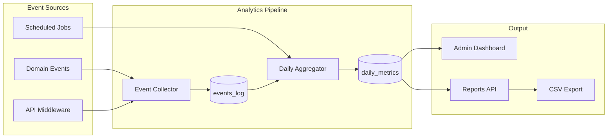

# ЛУЧИ — Analytics Module

**Версия:** 1.0.0  
**Дата:** 2026-08-07  

---

## 1. Overview

Analytics модуль собирает, агрегирует и визуализирует метрики платформы для admin dashboard, модераторской отчётности и product analytics.

---

## 2. Architecture



---

## 3. Key Metrics

### 3.1 User Metrics

| Metric | Description | Granularity |
|--------|-------------|-------------|
| `users.total` | Total registered users | Daily |
| `users.active_daily` | DAU | Daily |
| `users.active_monthly` | MAU | Daily |
| `users.new` | New registrations | Daily |
| `users.verified` | Verified users | Daily |
| `users.retention_d7` | 7-day retention | Weekly |
| `users.retention_d30` | 30-day retention | Monthly |

### 3.2 Good Deeds Metrics

| Metric | Description |
|--------|-------------|
| `deeds.submitted` | Submissions created |
| `deeds.approved` | Submissions approved |
| `deeds.rejected` | Submissions rejected |
| `deeds.approval_rate` | approved / (approved + rejected) |
| `deeds.avg_review_time_min` | Average moderation time |
| `deeds.by_category` | Breakdown by category |

### 3.3 Rays Metrics

| Metric | Description |
|--------|-------------|
| `rays.total_circulation` | Sum of all user balances |
| `rays.credited` | Total Rays credited (period) |
| `rays.debited` | Total Rays debited (period) |
| `rays.transferred` | P2P transfer volume |
| `rays.avg_reward` | Average reward per deed |
| `rays.store_revenue` | Rays spent in store |

### 3.4 Social Metrics

| Metric | Description |
|--------|-------------|
| `social.posts_created` | New posts |
| `social.comments_created` | New comments |
| `social.reactions` | Total reactions |
| `social.friendships` | New friendships |

### 3.5 Store Metrics

| Metric | Description |
|--------|-------------|
| `store.orders` | Orders placed |
| `store.revenue_rays` | Rays spent |
| `store.top_products` | Best sellers |
| `store.conversion_rate` | Orders / store visitors |

### 3.6 Moderation Metrics

| Metric | Description |
|--------|-------------|
| `moderation.queue_size` | Pending reviews |
| `moderation.reviews_completed` | Reviews done (period) |
| `moderation.avg_time_min` | Average review time |
| `moderation.reports_open` | Open reports |

### 3.7 Fraud Metrics

| Metric | Description |
|--------|-------------|
| `fraud.signals` | Fraud signals detected |
| `fraud.cases_open` | Open fraud cases |
| `fraud.confirmed` | Confirmed fraud cases |
| `fraud.blocked_amount` | Rays blocked/prevented |

---

## 4. Data Collection

### Event Log Schema

```sql
CREATE TABLE analytics.events_log (
    id          UUID PRIMARY KEY DEFAULT gen_random_uuid(),
    event_type  VARCHAR(100) NOT NULL,
    user_id     UUID,
    properties  JSONB DEFAULT '{}',
    created_at  TIMESTAMPTZ NOT NULL DEFAULT NOW()
);
```

### Tracked Events

| Event | Properties |
|-------|-----------|
| `page.view` | page, referrer |
| `user.register` | source, device |
| `user.login` | method, device |
| `deed.submit` | task_id, category |
| `deed.approve` | submission_id, reward |
| `rays.transfer` | amount, recipient |
| `store.purchase` | order_id, total |
| `post.create` | has_media, has_deed |
| `search.query` | query, results_count |

---

## 5. Daily Aggregation

Cron job at 00:05 UTC:

```sql
INSERT INTO analytics.daily_metrics (date, metric_key, metric_value, dimensions)
SELECT 
    CURRENT_DATE - 1,
    'users.active_daily',
    COUNT(DISTINCT user_id),
    '{}'
FROM analytics.events_log
WHERE event_type = 'user.login'
  AND created_at >= CURRENT_DATE - 1
  AND created_at < CURRENT_DATE;
```

---

## 6. Admin Dashboard API

```
GET /admin/dashboard
GET /admin/analytics/users?from=2026-01-01&to=2026-08-07&granularity=daily
GET /admin/analytics/deeds?from=...&to=...
GET /admin/analytics/rays?from=...&to=...
GET /admin/analytics/export?type=users&format=csv
```

---

## 7. Module Structure

```
modules/analytics/
├── domain/
│   └── entities/
│       ├── event-log.entity.ts
│       └── daily-metric.entity.ts
├── application/
│   ├── services/
│   │   ├── event-collector.service.ts
│   │   └── aggregator.service.ts
│   └── queries/
│       ├── get-dashboard.query.ts
│       └── get-metrics.query.ts
├── infrastructure/
│   ├── repositories/
│   └── schedulers/
│       └── daily-aggregation.job.ts
└── presentation/
    └── controllers/
        └── analytics.controller.ts
```

---

## 8. Phase 2: Advanced Analytics

- ClickHouse for event storage (high volume)
- Real-time dashboards (Grafana)
- Cohort analysis
- Funnel analysis (register → verify → deed → reward → store)
- A/B testing framework
- Custom report builder

---

## 9. Business Rules

1. Events collected asynchronously (non-blocking)
2. PII not stored in event properties
3. Analytics data retained 2 years
4. Export limited to admin+ roles
5. Daily aggregation idempotent (upsert)
6. Real-time metrics via Redis counters (MVP)

---

## 10. Unit Tests

| Test | Description |
|------|-------------|
| Event collection | Event stored with correct properties |
| Daily aggregation | Metrics calculated correctly |
| Dashboard query | Returns all metric groups |
| Export | CSV format correct |

---

## 11. Связанные документы

- [ADMIN_PANEL.md](./ADMIN_PANEL.md)
- [ARCHITECTURE.md](./ARCHITECTURE.md)
- [DATABASE.md](./DATABASE.md)
