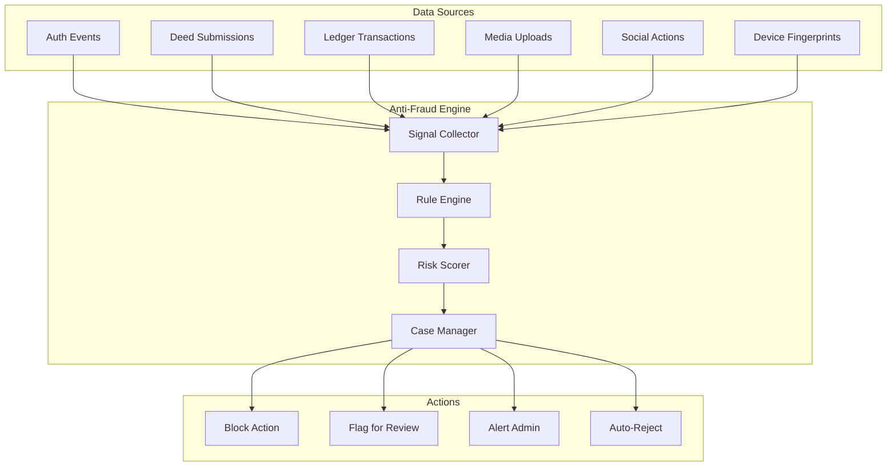
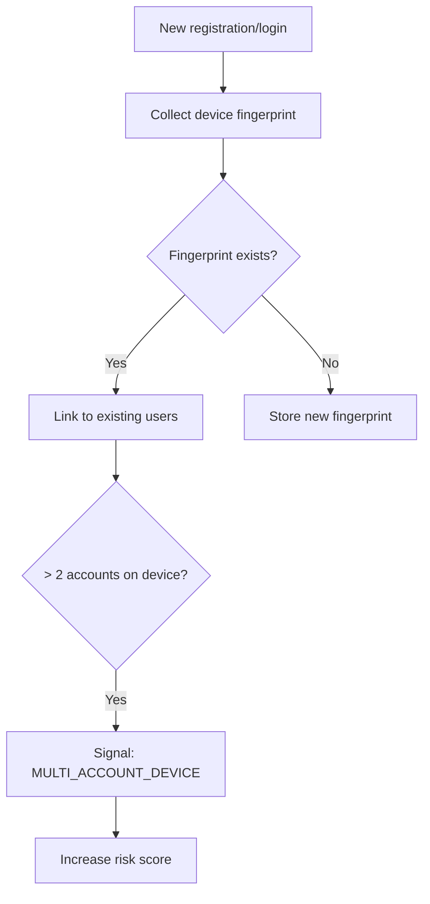
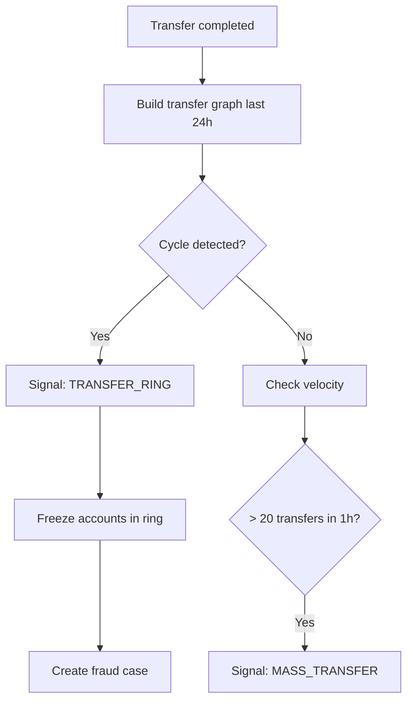
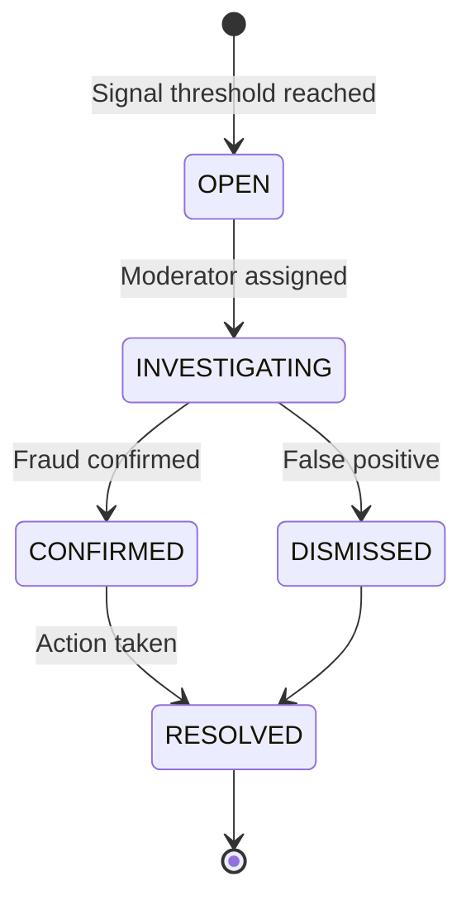

# ЛУЧИ — Anti-Fraud Module

**Версия:** 1.0.0  
**Дата:** 2026-08-07  

---

## 1. Overview

Anti-Fraud модуль защищает платформу от накрутки Лучей, мультиаккаунтов, ботов и мошеннических схем. Работает на rule-based engine (MVP) с переходом на ML-модели (Phase 2).

---

## 2. Architecture



---

## 3. Fraud Signals

### 3.1 Signal Types

| Signal | Source | Severity | Description |
|--------|--------|----------|-------------|
| `MULTI_ACCOUNT_DEVICE` | Device FP | HIGH | Same device, multiple accounts |
| `MULTI_ACCOUNT_IP` | Auth | MEDIUM | Same IP, multiple registrations |
| `DUPLICATE_PHOTO` | Media | HIGH | pHash match > 95% with existing |
| `DUPLICATE_VIDEO` | Media | HIGH | Video hash match |
| `GPS_MISMATCH` | Deed | HIGH | GPS far from task location |
| `GPS_SPOOF` | Deed | CRITICAL | GPS jump impossible distance |
| `MASS_TRANSFER` | Ledger | HIGH | Many transfers in short time |
| `TRANSFER_RING` | Ledger | CRITICAL | Circular transfer pattern |
| `VELOCITY_ANOMALY` | All | MEDIUM | Action rate > 3σ from normal |
| `BOT_PATTERN` | Social | MEDIUM | Regular interval actions |
| `NEW_ACCOUNT_HIGH_ACTIVITY` | All | MEDIUM | Account < 24h, high activity |
| `REWARD_FARMING` | Deeds | HIGH | Same task type repeated rapidly |
| `SELF_DEaling` | Deeds | CRITICAL | Org owner submits to own tasks |

### 3.2 Risk Score Calculation

```
user_risk_score = Σ(signal_severity_weight × signal_count) × decay_factor

Severity weights:
  LOW = 1
  MEDIUM = 3
  HIGH = 7
  CRITICAL = 15

Decay: score halves every 30 days of clean activity
```

| Score Range | Action |
|-------------|--------|
| 0–10 | Normal |
| 11–25 | Monitor |
| 26–50 | Flag transfers + deed reviews |
| 51–75 | Manual review required |
| 76+ | Auto-block + case creation |

---

## 4. Detection Rules (MVP)

### 4.1 Multi-Account Detection



### 4.2 Duplicate Photo Detection

```
1. On media upload: compute perceptual hash (pHash)
2. Query: SELECT * FROM media_assets WHERE phash IS NOT NULL
3. Compare hamming distance
4. If distance < 5 (threshold): Signal DUPLICATE_PHOTO
5. Block submission or flag for review
```

### 4.3 Transfer Ring Detection



### 4.4 GPS Validation

| Check | Rule | Signal |
|-------|------|--------|
| Distance from task | > task.radius × 2 | GPS_MISMATCH |
| Impossible travel | > 500 km/h between submissions | GPS_SPOOF |
| Static GPS | Same coords 5+ submissions | BOT_PATTERN |
| Missing GPS | Task requires GPS | Flag for review |

---

## 5. Case Management



### Case Resolution Actions

| Action | Effect |
|--------|--------|
| Ban user | Account suspended |
| Reverse transactions | Ledger rollback |
| Reject submissions | Deed rejected |
| Warning | Risk score reset partially |
| Dismiss | No action, score adjusted |

---

## 6. Module Structure

```
modules/anti-fraud/
├── domain/
│   ├── entities/
│   │   ├── fraud-signal.entity.ts
│   │   ├── fraud-case.entity.ts
│   │   └── device-fingerprint.entity.ts
│   ├── services/
│   │   ├── rule-engine.service.ts
│   │   ├── risk-scorer.service.ts
│   │   ├── duplicate-detector.service.ts
│   │   └── transfer-analyzer.service.ts
│   └── events/
│       └── fraud-detected.event.ts
├── application/
│   ├── commands/
│   │   ├── analyze-submission.command.ts
│   │   ├── analyze-transfer.command.ts
│   │   └── resolve-case.command.ts
│   └── queries/
│       ├── get-user-risk.query.ts
│       └── get-cases.query.ts
├── infrastructure/
│   ├── detectors/
│   │   ├── phash.detector.ts
│   │   ├── gps.detector.ts
│   │   └── velocity.detector.ts
│   └── repositories/
└── presentation/
    └── controllers/
        └── fraud.controller.ts
```

---

## 7. Integration Points

| Event | Check | Action |
|-------|-------|--------|
| UserRegistered | Device FP, IP | Link fingerprint |
| DeedSubmissionCreated | Photo hash, GPS, velocity | Pre-review flag |
| RaysTransferred | Velocity, ring detection | Block if critical |
| MediaUploaded | pHash duplicate | Flag/reject |
| UserLoggedIn | Geo validation, device | Update fingerprint |

---

## 8. Business Rules

1. Every registration creates/updates device fingerprint
2. Duplicate photo (pHash distance < 5) → auto-reject submission
3. Transfer blocked if user risk score > 50
4. Transfer blocked if daily limit exceeded
5. GPS required for location-based tasks
6. Fraud case auto-created when score > 76
7. Confirmed fraud → all related accounts investigated
8. False positive dismiss → score reduced by 50%
9. Admin can whitelist users (bypass checks)
10. All fraud signals immutable (append-only)

---

## 9. Error Codes

| Code | HTTP | Description |
|------|------|-------------|
| FRAUD_BLOCKED | 403 | Action blocked by anti-fraud |
| DUPLICATE_PROOF | 422 | Photo/video already used |
| GPS_REQUIRED | 422 | GPS data required for this task |
| GPS_INVALID | 422 | GPS data invalid or spoofed |
| TRANSFER_RING | 403 | Circular transfer detected |
| ACCOUNT_UNDER_REVIEW | 403 | Account flagged for investigation |

---

## 10. Edge Cases

| Case | Handling |
|------|----------|
| Family sharing device | Allow up to 3 accounts per device |
| Similar but not duplicate photo | pHash distance 5-10: flag, not auto-reject |
| VPN usage | Flag but don't auto-block |
| Legitimate mass transfer (event) | Admin whitelist for event period |
| GPS inaccuracy in buildings | Allow radius × 3 tolerance |

---

## 11. Unit Tests

| Test | Description |
|------|-------------|
| Multi-account detection | 3+ accounts on device → signal |
| Duplicate photo | Same pHash → signal |
| GPS mismatch | Far from task → signal |
| Transfer ring | A→B→C→A detected |
| Velocity check | 50 actions in 1 min → signal |
| Risk score calculation | Correct weighted sum |
| Score decay | Old signals decay over time |

---

## 12. Integration Tests

| Test | Description |
|------|-------------|
| Fraud blocks transfer | High risk user transfer rejected |
| Duplicate photo blocks submission | Same photo rejected |
| Case lifecycle | Signal → case → investigate → resolve |

---

## 13. Phase 2: ML Models

| Model | Input | Output |
|-------|-------|--------|
| Bot detector | Action timestamps, patterns | Bot probability |
| Fake photo detector | Image features | Fake probability |
| Behavior anomaly | User action sequence | Anomaly score |
| Collusion detector | Transfer graph | Collusion probability |

---

## 14. Связанные документы

- [SECURITY.md](./SECURITY.md)
- [MODERATION.md](./MODERATION.md)
- [REWARD_ENGINE.md](./REWARD_ENGINE.md)
- [AI.md](./AI.md)
- [MEDIA.md](./MEDIA.md)
