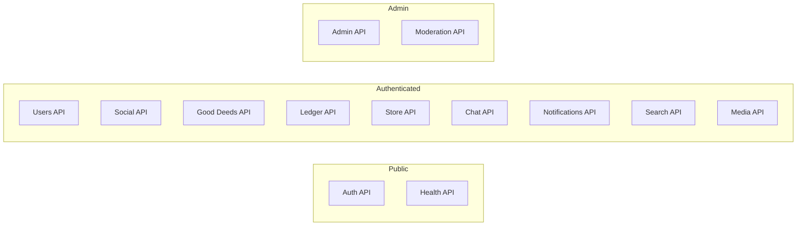

# ЛУЧИ — API Specification

**Версия:** 1.0.0  
**Дата:** 2026-08-07  
**Base URL:** `https://api.luchi.app/api/v1`  
**Format:** JSON (RFC 8259)  
**Errors:** RFC 7807 Problem Details  

---

## 1. Общие соглашения

### 1.1 Authentication

```
Authorization: Bearer <access_token>
```

Refresh token передаётся через HttpOnly cookie `refresh_token`.

### 1.2 Pagination (Cursor-based)

```json
{
  "data": [...],
  "meta": {
    "next_cursor": "eyJpZCI6IjEyMyJ9",
    "prev_cursor": null,
    "has_more": true,
    "total_count": 1500
  }
}
```

Query params: `?cursor=<cursor>&limit=20` (default 20, max 100)

### 1.3 Error Format (RFC 7807)

```json
{
  "type": "https://api.luchi.app/errors/insufficient-balance",
  "title": "Insufficient Balance",
  "status": 422,
  "detail": "Account balance (50 Rays) is less than required amount (100 Rays)",
  "instance": "/api/v1/ledger/transfer",
  "code": "INSUFFICIENT_BALANCE",
  "trace_id": "abc-123-def"
}
```

### 1.4 Idempotency

Для мутирующих операций с Ledger и Store:

```
Idempotency-Key: <uuid-v4>
```

### 1.5 Rate Limits

| Endpoint Group | Limit | Window |
|---------------|-------|--------|
| Auth | 10 req | 1 min |
| General API | 100 req | 1 min |
| Ledger transfer | 5 req | 1 min |
| Media upload | 20 req | 1 hour |
| Search | 30 req | 1 min |

Headers: `X-RateLimit-Limit`, `X-RateLimit-Remaining`, `X-RateLimit-Reset`

---

## 2. API Modules Overview



---

## 3. Auth API

### POST /auth/register

**Permission:** Public

```json
// Request
{
  "email": "user@example.com",
  "password": "SecureP@ss123!",
  "username": "good_soul",
  "display_name": "Анна Иванова",
  "accept_terms": true
}

// Response 201
{
  "data": {
    "user": {
      "id": "uuid",
      "email": "user@example.com",
      "username": "good_soul",
      "display_name": "Анна Иванова"
    },
    "access_token": "eyJ...",
    "expires_in": 900
  }
}
// + Set-Cookie: refresh_token (HttpOnly, Secure, SameSite=Strict)
```

**Errors:**
| Code | Status | Description |
|------|--------|-------------|
| EMAIL_TAKEN | 409 | Email already registered |
| USERNAME_TAKEN | 409 | Username already taken |
| WEAK_PASSWORD | 422 | Password doesn't meet requirements |
| TERMS_NOT_ACCEPTED | 422 | Must accept terms |

### POST /auth/login

```json
// Request
{ "email": "user@example.com", "password": "SecureP@ss123!" }

// Response 200
{
  "data": {
    "user": { "id": "uuid", "username": "good_soul", ... },
    "access_token": "eyJ...",
    "expires_in": 900
  }
}
```

**Errors:** `INVALID_CREDENTIALS` (401), `ACCOUNT_BANNED` (403), `ACCOUNT_SUSPENDED` (403)

### POST /auth/refresh

Uses refresh_token cookie. Returns new access_token + rotates refresh_token.

### POST /auth/logout

Revokes current session.

### POST /auth/forgot-password

### POST /auth/reset-password

---

## 4. Users API

### GET /users/me

**Permission:** Authenticated

```json
{
  "data": {
    "id": "uuid",
    "email": "user@example.com",
    "username": "good_soul",
    "display_name": "Анна Иванова",
    "avatar_url": "https://...",
    "bio": "Люблю помогать!",
    "city": "Москва",
    "level": 5,
    "experience_points": 1250,
    "rays_balance": 340,
    "stats": {
      "deeds_completed": 23,
      "friends_count": 45,
      "followers_count": 120,
      "following_count": 80
    },
    "roles": ["user", "verified_user"],
    "created_at": "2026-01-15T10:00:00Z"
  }
}
```

### PATCH /users/me

```json
{
  "display_name": "Анна И.",
  "bio": "Волонтёр экологического движения",
  "city": "Москва",
  "avatar_media_id": "uuid"
}
```

### GET /users/:username

Public profile view.

### GET /users/:username/deeds

User's completed good deeds.

### GET /users/:username/achievements

---

## 5. Social API

### Posts

| Method | Endpoint | Description | Permission |
|--------|----------|-------------|------------|
| GET | /feed | User's feed | auth |
| POST | /posts | Create post | `post:create` |
| GET | /posts/:id | Get post | auth |
| PATCH | /posts/:id | Edit own post | owner |
| DELETE | /posts/:id | Delete own post | owner |
| GET | /users/:id/posts | User's posts | auth |

```json
// POST /posts
{
  "content": "Сегодня посадила 10 деревьев! 🌳",
  "media_ids": ["uuid1", "uuid2"],
  "deed_submission_id": "uuid",
  "visibility": "PUBLIC"
}
```

### Comments

| Method | Endpoint | Description |
|--------|----------|-------------|
| GET | /posts/:id/comments | List comments |
| POST | /posts/:id/comments | Add comment |
| POST | /comments/:id/like | Toggle comment like |
| PATCH | /comments/:id | Edit comment |
| DELETE | /comments/:id | Delete comment |

### Reactions

| Method | Endpoint | Description |
|--------|----------|-------------|
| POST | /reactions | Add/change reaction |
| DELETE | /reactions | Remove reaction |

```json
// POST /reactions
{
  "target_type": "POST",
  "target_id": "uuid",
  "reaction_type": "SUPPORT"
}
```

### Friends & Follows

| Method | Endpoint | Description |
|--------|----------|-------------|
| POST | /friends/request | Send friend request |
| POST | /friends/:id/accept | Accept request |
| POST | /friends/:id/decline | Decline request |
| DELETE | /friends/:id | Remove friend |
| GET | /friends | List friends |
| POST | /follows/:userId | Follow user |
| DELETE | /follows/:userId | Unfollow user |
| GET | /followers | My followers |
| GET | /following | My following |

### Stories

| Method | Endpoint | Description |
|--------|----------|-------------|
| POST | /stories | Create story |
| GET | /stories/feed | Stories from following |
| GET | /stories/:userId | User's active stories |
| POST | /stories/:id/view | Mark as viewed |

---

## 6. Good Deeds API

### Categories

| Method | Endpoint | Description |
|--------|----------|-------------|
| GET | /deeds/categories | List categories |

### Tasks

| Method | Endpoint | Description | Permission |
|--------|----------|-------------|------------|
| GET | /deeds/tasks | List tasks (filterable) | auth |
| GET | /deeds/tasks/:id | Task detail | auth |
| POST | /deeds/tasks | Create task | `task:create` |
| PATCH | /deeds/tasks/:id | Update task | owner/org |
| DELETE | /deeds/tasks/:id | Cancel task | owner/org |

```json
// GET /deeds/tasks?category=ecology&city=moscow&status=ACTIVE&cursor=...
{
  "data": [
    {
      "id": "uuid",
      "title": "Уборка парка Сокольники",
      "category": { "id": "uuid", "name": "Экология", "icon": "🌿" },
      "organization": { "id": "uuid", "name": "Green Moscow" },
      "reward_min": 20,
      "reward_max": 50,
      "location_city": "Москва",
      "proof_type": "PHOTO",
      "current_participants": 12,
      "max_participants": 50,
      "ends_at": "2026-08-15T18:00:00Z"
    }
  ],
  "meta": { "next_cursor": "...", "has_more": true }
}
```

### Submissions

| Method | Endpoint | Description | Permission |
|--------|----------|-------------|------------|
| POST | /deeds/submissions | Submit proof (attachments + helped usernames) | `deed:submit` |
| GET | /deeds/submissions/me | My submissions | auth |
| GET | /deeds/confirmations/me | Pending help confirmations | auth |
| POST | /deeds/confirmations/:id/confirm | Beneficiary confirms help | auth |
| POST | /deeds/confirmations/:id/deny | Beneficiary denies help | auth |
| GET | /deeds/queue | Moderation queue | `moderation:review` |
| POST | /deeds/queue/:id/approve | Approve (needs beneficiary confirm unless `override`) | `moderation:review` |
| POST | /deeds/queue/:id/reject | Reject submission | `moderation:review` |

```json
// POST /deeds/submissions
{
  "taskId": "uuid",
  "description": "Убрала 5 мешков мусора в парке",
  "attachments": [
    { "url": "/uploads/photo.jpg", "kind": "PHOTO", "originalName": "park.jpg", "mimeType": "image/jpeg" }
  ],
  "helpedUsernames": ["olga_help"]
}
```

### Events

| Method | Endpoint | Description |
|--------|----------|-------------|
| GET | /deeds/events | List events |
| GET | /deeds/events/:id | Event detail |
| POST | /deeds/events | Create event |
| POST | /deeds/events/:id/register | Register |
| POST | /deeds/events/:id/check-in | Check in (GPS) |

### Organizations

| Method | Endpoint | Description | Permission |
|--------|----------|-------------|------------|
| GET | /organizations | List orgs | auth |
| GET | /organizations/:slug | Org detail | auth |
| POST | /organizations | Register org | auth |
| PATCH | /organizations/:id | Update org | org owner |

---

## 7. Ledger API

### GET /ledger/balance

```json
{
  "data": {
    "account_id": "uuid",
    "balance": 340,
    "currency": "RAYS",
    "last_transaction_at": "2026-08-06T15:30:00Z"
  }
}
```

### GET /ledger/transactions

Query: `?type=REWARD&from=2026-01-01&to=2026-08-07&cursor=...`

```json
{
  "data": [
    {
      "id": "uuid",
      "transaction_type": "REWARD",
      "status": "POSTED",
      "amount": 30,
      "direction": "CREDIT",
      "reason": "Good deed approved: Уборка парка",
      "source_type": "DEED_SUBMISSION",
      "source_id": "uuid",
      "created_at": "2026-08-06T15:30:00Z"
    }
  ]
}
```

### POST /ledger/transfer

**Permission:** `rays:transfer`  
**Headers:** `Idempotency-Key: <uuid>`

```json
// Request
{
  "recipient_id": "uuid",
  "amount": 50,
  "message": "Спасибо за помощь!"
}

// Response 201
{
  "data": {
    "transaction_id": "uuid",
    "amount": 50,
    "recipient": { "id": "uuid", "username": "friend" },
    "new_balance": 290
  }
}
```

**Errors:**
| Code | Status | Description |
|------|--------|-------------|
| INSUFFICIENT_BALANCE | 422 | Not enough Rays |
| SELF_TRANSFER | 422 | Cannot transfer to self |
| TRANSFER_LIMIT_EXCEEDED | 429 | Daily/hourly limit |
| RECIPIENT_NOT_FOUND | 404 | Invalid recipient |
| FRAUD_BLOCKED | 403 | Blocked by anti-fraud |

### GET /ledger/transfers

Transfer history (sent + received).

---

## 8. Store API

### GET /store/products

Query: `?category=electronics&min_price=10&max_price=500&cursor=...`

### GET /store/products/:id

### POST /store/orders

**Headers:** `Idempotency-Key: <uuid>`

```json
{
  "items": [
    { "product_id": "uuid", "quantity": 1 }
  ],
  "shipping_address": {
    "city": "Москва",
    "street": "ул. Ленина, 1",
    "postal_code": "123456"
  }
}
```

### GET /store/orders

### GET /store/orders/:id

---

## 9. Chat API

### GET /chat/conversations

### POST /chat/conversations

```json
// Direct chat
{ "type": "DIRECT", "participant_id": "uuid" }

// Group chat
{ "type": "GROUP", "title": "Эко-волонтёры", "participant_ids": ["uuid1", "uuid2"] }
```

### GET /chat/conversations/:id/messages

Query: `?cursor=...&limit=50`

### POST /chat/conversations/:id/messages

```json
{
  "content": "Привет! Когда следующая уборка?",
  "message_type": "TEXT"
}
```

### WebSocket: /ws/chat

Events: `message.new`, `message.read`, `typing.start`, `typing.stop`

---

## 10. Notifications API

### GET /notifications

Query: `?unread_only=true&cursor=...`

### POST /notifications/:id/read

### POST /notifications/read-all

### GET /notifications/preferences

### PATCH /notifications/preferences

---

## 11. Search API

### GET /search

Query: `?q=экология&type=users,posts,organizations,tasks&cursor=...`

```json
{
  "data": {
    "users": [{ "id": "uuid", "username": "...", "display_name": "..." }],
    "posts": [{ "id": "uuid", "content": "...", "author": {...} }],
    "organizations": [{ "id": "uuid", "name": "...", "slug": "..." }],
    "tasks": [{ "id": "uuid", "title": "...", "category": {...} }]
  }
}
```

---

## 12. Media API

### POST /media/upload

Content-Type: multipart/form-data

```
file: <binary>
type: "image" | "video"
```

Response:
```json
{
  "data": {
    "id": "uuid",
    "url": "https://cdn.luchi.app/...",
    "mime_type": "image/jpeg",
    "width": 1920,
    "height": 1080,
    "status": "READY"
  }
}
```

### GET /media/:id

---

## 13. Moderation API

**Permission:** `moderation:*`

### GET /moderation/queue

Query: `?type=DEED_SUBMISSION&status=PENDING&assigned_to=me`

### POST /moderation/queue/:id/approve

```json
{
  "reward_amount": 35,
  "note": "Отличная работа, фото подтверждают"
}
```

### POST /moderation/queue/:id/reject

```json
{
  "reason": "PHOTO_MISMATCH",
  "note": "Фото не соответствует заданию"
}
```

### GET /moderation/reports

### POST /moderation/reports/:id/resolve

---

## 14. Admin API

**Permission:** `admin:*`

| Method | Endpoint | Description |
|--------|----------|-------------|
| GET | /admin/dashboard | Dashboard stats + charts |
| GET | /admin/reports | Deeds, rays, 14-day activity |
| GET | /admin/users | User management |
| PATCH | /admin/users/:id | Update user status/role |
| GET | /admin/roles | Assignable roles |
| GET | /admin/organizations | Org management |
| POST | /admin/organizations | Create organization |
| PATCH | /admin/organizations/:id | Update organization |
| GET | /admin/products | Store catalog for admin |
| POST | /admin/products | Create product |
| PATCH | /admin/products/:id | Update product |
| GET | /admin/transactions | All transactions |
| POST | /admin/ledger/credit | Admin credit Rays |
| POST | /admin/ledger/debit | Admin debit Rays |
| GET | /admin/audit-log | Audit log |
| GET | /admin/settings | Platform settings |
| PATCH | /admin/settings | Update settings |
| GET | /admin/roles | Role management |
| POST | /admin/roles | Create role |
| PATCH | /admin/roles/:id/permissions | Update permissions |

### GET /admin/dashboard

```json
{
  "data": {
    "users": { "total": 12500, "active_today": 3200, "new_today": 45 },
    "deeds": { "submitted_today": 120, "approved_today": 95, "rejected_today": 15 },
    "rays": { "total_circulation": 2500000, "credited_today": 4500, "transferred_today": 1200 },
    "store": { "orders_today": 35, "revenue_rays_today": 8500 },
    "moderation": { "queue_size": 25, "avg_review_time_min": 12 },
    "fraud": { "signals_today": 8, "cases_open": 3 }
  }
}
```

---

## 15. Health API

| Method | Endpoint | Description |
|--------|----------|-------------|
| GET | /health | Liveness probe |
| GET | /ready | Readiness probe (checks DB, Redis, S3) |

---

## 16. Webhook Events (Phase 2)

| Event | Payload |
|-------|---------|
| `deed.approved` | submission, user, reward_amount |
| `order.completed` | order, user, products |
| `user.banned` | user, reason |

---

## 17. API Versioning Strategy

- URI versioning: `/api/v1/`, `/api/v2/`
- Deprecation header: `Sunset: Sat, 01 Jan 2028 00:00:00 GMT`
- Minimum 6 months overlap between versions

---

## 18. OpenAPI Generation

Auto-generated from NestJS decorators + Swagger plugin.  
Available at: `/api/docs` (dev/staging only)

---

## 19. Связанные документы

- [AUTH.md](./AUTH.md)
- [RBAC.md](./RBAC.md)
- [ARCHITECTURE.md](./ARCHITECTURE.md)
- [SECURITY.md](./SECURITY.md)
