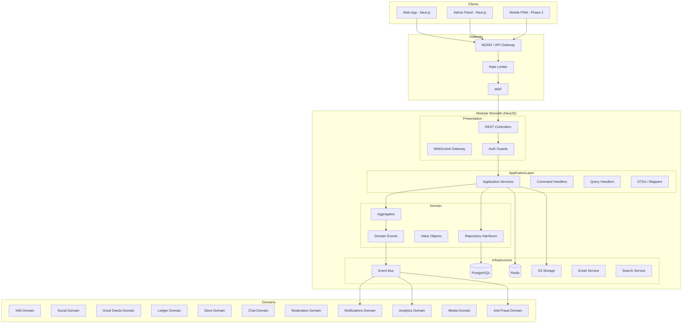
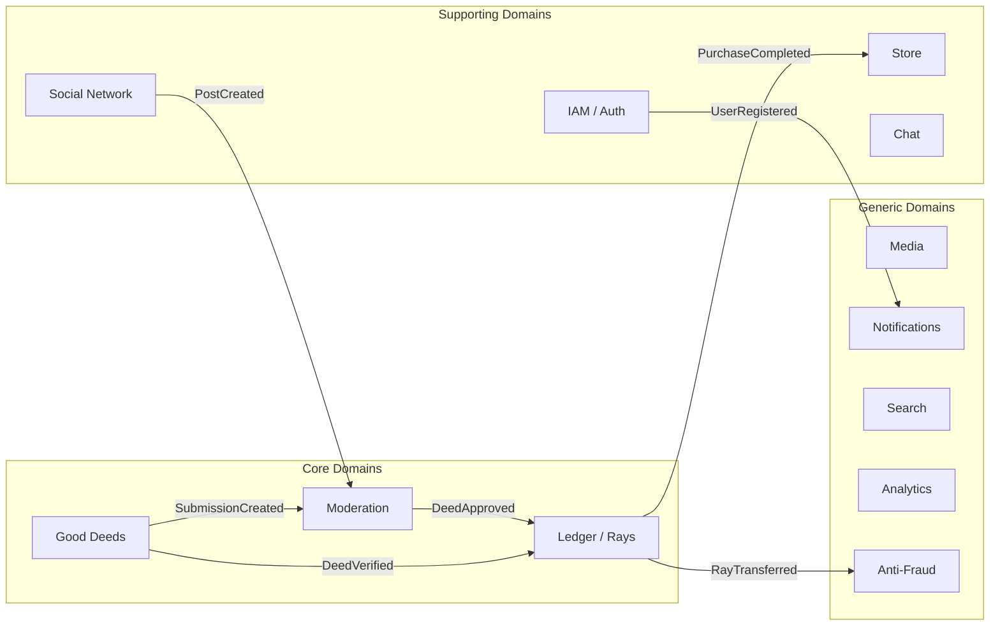
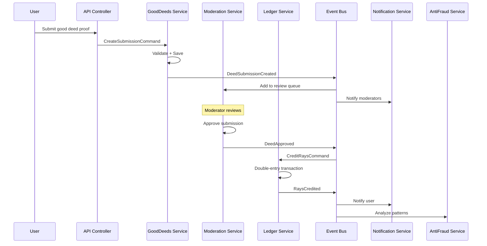
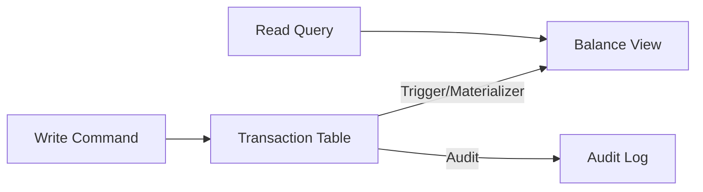
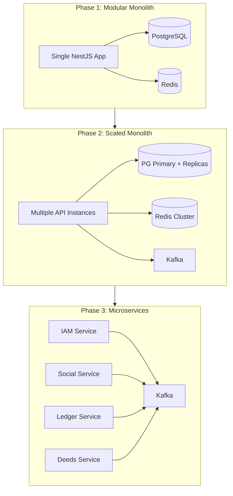
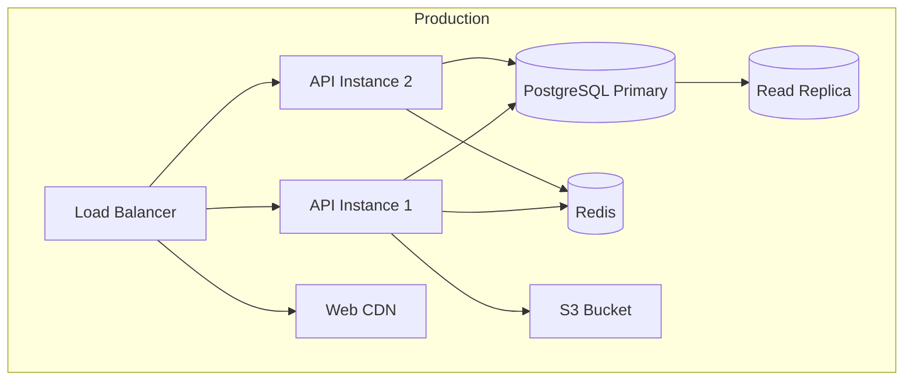

# ЛУЧИ — Architecture Document

**Версия:** 1.0.0  
**Дата:** 2026-08-07  
**Стиль:** Clean Architecture + DDD + Event-Driven  

---

## 1. Архитектурное видение

Платформа ЛУЧИ строится как **Modular Monolith** с чёткими доменными границами, готовый к декомпозиции в микросервисы без переписывания бизнес-логики.

### Ключевые принципы

| Принцип | Реализация |
|---------|------------|
| Clean Architecture | Domain → Application → Infrastructure → Presentation |
| SOLID | Single-responsibility modules, DI, interfaces |
| DDD | Bounded contexts, aggregates, domain events |
| Event-Driven | Domain events → event bus → handlers |
| CQRS (selective) | Ledger writes vs balance reads |
| Repository Pattern | Data access abstraction per aggregate |
| Service Layer | Application services orchestrate use cases |
| DTO | Boundary objects between layers |

---

## 2. High-Level Architecture



---

## 3. Bounded Contexts (Domains)



### Domain Map

| Domain | Aggregate Roots | Responsibility |
|--------|----------------|----------------|
| **IAM** | User, Session, Role | Identity, auth, RBAC |
| **Social** | Post, Comment, Friendship, Follow | Social graph, content |
| **GoodDeeds** | Task, Submission, Event, Organization | Good deeds lifecycle |
| **Ledger** | Transaction, Account | Double-entry Rays accounting |
| **Store** | Product, Order | Marketplace |
| **Chat** | Conversation, Message | Messaging |
| **Moderation** | ReviewQueue, Report, Ban | Content/deed moderation |
| **AntiFraud** | FraudCase, Rule, Signal | Fraud detection |
| **Notifications** | Notification | Delivery |
| **Media** | MediaAsset | Upload, storage, processing |
| **Analytics** | Metric, Event | Metrics collection |
| **Search** | — (read-only) | Full-text search |

---

## 4. Clean Architecture Layers

```
┌─────────────────────────────────────────────────────────────┐
│                    PRESENTATION LAYER                        │
│  Controllers, Guards, Filters, WebSocket Gateways, DTOs     │
├─────────────────────────────────────────────────────────────┤
│                    APPLICATION LAYER                         │
│  Use Cases, Command/Query Handlers, Application Services,   │
│  Event Handlers, Mappers, Validators                         │
├─────────────────────────────────────────────────────────────┤
│                      DOMAIN LAYER                            │
│  Entities, Aggregates, Value Objects, Domain Events,         │
│  Domain Services, Repository Interfaces, Business Rules      │
├─────────────────────────────────────────────────────────────┤
│                   INFRASTRUCTURE LAYER                       │
│  Repository Implementations, ORM, External APIs, Event Bus,  │
│  Cache, Storage, Email, Search                               │
└─────────────────────────────────────────────────────────────┘

         Dependencies point INWARD only ↑
```

---

## 5. Project Structure

```
luchi/
├── apps/
│   ├── api/                          # NestJS Backend (Modular Monolith)
│   │   ├── src/
│   │   │   ├── main.ts
│   │   │   ├── app.module.ts
│   │   │   ├── shared/               # Cross-cutting concerns
│   │   │   │   ├── kernel/           # Base classes, interfaces
│   │   │   │   ├── infrastructure/   # DB, cache, storage, event bus
│   │   │   │   ├── presentation/     # Global filters, pipes, guards
│   │   │   │   └── config/           # Configuration module
│   │   │   └── modules/
│   │   │       ├── iam/
│   │   │       │   ├── domain/
│   │   │       │   │   ├── entities/
│   │   │       │   │   ├── value-objects/
│   │   │       │   │   ├── events/
│   │   │       │   │   ├── repositories/   # Interfaces
│   │   │       │   │   └── services/       # Domain services
│   │   │       │   ├── application/
│   │   │       │   │   ├── commands/
│   │   │       │   │   ├── queries/
│   │   │       │   │   ├── handlers/
│   │   │       │   │   ├── services/
│   │   │       │   │   └── dto/
│   │   │       │   ├── infrastructure/
│   │   │       │   │   ├── repositories/   # Implementations
│   │   │       │   │   └── mappers/
│   │   │       │   ├── presentation/
│   │   │       │   │   ├── controllers/
│   │   │       │   │   └── guards/
│   │   │       │   └── iam.module.ts
│   │   │       ├── social/
│   │   │       ├── good-deeds/
│   │   │       ├── ledger/
│   │   │       ├── store/
│   │   │       ├── chat/
│   │   │       ├── moderation/
│   │   │       ├── anti-fraud/
│   │   │       ├── notifications/
│   │   │       ├── media/
│   │   │       ├── analytics/
│   │   │       └── search/
│   │   └── test/
│   │       ├── unit/
│   │       ├── integration/
│   │       └── e2e/
│   ├── web/                          # Next.js User App
│   │   ├── src/
│   │   │   ├── app/
│   │   │   ├── components/
│   │   │   ├── features/
│   │   │   ├── hooks/
│   │   │   ├── lib/
│   │   │   └── styles/
│   │   └── public/
│   └── admin/                        # Next.js Admin Panel
│       └── src/
├── packages/
│   ├── shared-types/                 # Shared TypeScript types
│   ├── ui/                           # Design System components
│   └── config/                       # ESLint, TSConfig shared
├── docs/                             # Documentation
├── infra/
│   ├── docker/
│   ├── k8s/                          # Phase 2
│   └── terraform/
├── scripts/
│   ├── seed/                         # Demo database seeder
│   └── migrate/
├── docker-compose.yml
├── turbo.json                        # Monorepo tooling
└── package.json
```

---

## 6. Domain Module Internal Structure

Каждый доменный модуль следует единой структуре:

```
modules/ledger/
├── domain/
│   ├── entities/
│   │   ├── transaction.entity.ts
│   │   ├── ledger-entry.entity.ts
│   │   └── account.entity.ts
│   ├── value-objects/
│   │   ├── money.vo.ts
│   │   ├── transaction-id.vo.ts
│   │   └── idempotency-key.vo.ts
│   ├── events/
│   │   ├── rays-credited.event.ts
│   │   ├── rays-debited.event.ts
│   │   └── transaction-rolled-back.event.ts
│   ├── repositories/
│   │   └── transaction.repository.interface.ts
│   ├── services/
│   │   └── ledger-domain.service.ts
│   └── exceptions/
│       └── insufficient-balance.exception.ts
├── application/
│   ├── commands/
│   │   ├── credit-rays.command.ts
│   │   ├── debit-rays.command.ts
│   │   ├── transfer-rays.command.ts
│   │   └── rollback-transaction.command.ts
│   ├── queries/
│   │   ├── get-balance.query.ts
│   │   └── get-transaction-history.query.ts
│   ├── handlers/
│   │   ├── credit-rays.handler.ts
│   │   └── get-balance.handler.ts
│   ├── services/
│   │   └── ledger-application.service.ts
│   └── dto/
│       ├── credit-rays.dto.ts
│       └── balance-response.dto.ts
├── infrastructure/
│   ├── repositories/
│   │   └── transaction.repository.ts
│   └── mappers/
│       └── transaction.mapper.ts
├── presentation/
│   ├── controllers/
│   │   └── ledger.controller.ts
│   └── guards/
│       └── ledger-access.guard.ts
├── ledger.module.ts
└── index.ts
```

---

## 7. Event-Driven Architecture

### 7.1 Event Flow



### 7.2 Domain Events Catalog

| Event | Publisher | Subscribers |
|-------|-----------|-------------|
| `UserRegistered` | IAM | Notifications, Analytics, AntiFraud |
| `UserVerified` | IAM | Notifications, Social |
| `PostCreated` | Social | Moderation, Analytics, Search |
| `DeedSubmissionCreated` | GoodDeeds | Moderation, AntiFraud |
| `DeedApproved` | Moderation | Ledger, Notifications, Social |
| `DeedRejected` | Moderation | Notifications |
| `RaysCredited` | Ledger | Notifications, Analytics, AntiFraud |
| `RaysDebited` | Ledger | Store, Analytics |
| `RaysTransferred` | Ledger | Notifications, AntiFraud |
| `PurchaseCompleted` | Store | Ledger, Notifications |
| `ReportCreated` | Moderation | Notifications |
| `UserBanned` | Moderation | IAM, Notifications |
| `FraudDetected` | AntiFraud | Moderation, IAM |
| `MessageSent` | Chat | Notifications |

### 7.3 Event Bus Implementation

**MVP:** In-process EventEmitter (NestJS EventEmitter2)  
**Phase 2:** Apache Kafka with outbox pattern  
**Phase 3:** Full event sourcing for Ledger domain

```typescript
// Outbox Pattern (Phase 2 ready)
interface OutboxEvent {
  id: string;
  aggregateType: string;
  aggregateId: string;
  eventType: string;
  payload: Record<string, unknown>;
  createdAt: Date;
  publishedAt: Date | null;
}
```

---

## 8. CQRS Strategy

| Domain | Write Model | Read Model | Strategy |
|--------|-------------|------------|----------|
| Ledger | PostgreSQL (transactions) | Materialized balance view | CQRS from MVP |
| Social Feed | PostgreSQL | Redis cache + precomputed feed | Cache-heavy |
| Search | PostgreSQL | Elasticsearch (Phase 2) | Full CQRS Phase 2 |
| Analytics | Events | TimescaleDB / ClickHouse | Event → aggregate |
| Good Deeds | PostgreSQL | Same DB | No CQRS MVP |

### Ledger CQRS Detail



Balance **never stored as mutable field**. Computed from:

```sql
-- Materialized view (refreshed on each transaction)
CREATE MATERIALIZED VIEW account_balances AS
SELECT 
    account_id,
    SUM(CASE WHEN entry_type = 'CREDIT' THEN amount ELSE -amount END) AS balance,
    MAX(created_at) AS last_transaction_at
FROM ledger_entries
WHERE status = 'POSTED'
GROUP BY account_id;
```

---

## 9. API Architecture

- **Style:** REST (JSON) + WebSocket (chat, notifications)
- **Versioning:** URI versioning `/api/v1/`
- **Pagination:** Cursor-based (keyset)
- **Filtering:** Query params with standardized format
- **Error Format:** RFC 7807 Problem Details
- **Documentation:** OpenAPI 3.1 (Swagger)

See [API.md](./API.md) for full specification.

---

## 10. Data Architecture

- **Primary DB:** PostgreSQL 16
- **Cache:** Redis 7 (sessions, rate limits, hot data)
- **Search:** PostgreSQL FTS (MVP) → Elasticsearch (Phase 2)
- **Storage:** S3-compatible (MinIO dev, AWS S3 prod)
- **Analytics:** PostgreSQL + materialized views (MVP) → ClickHouse (Phase 2)

See [DATABASE.md](./DATABASE.md) for full schema.

---

## 11. Communication Patterns

| Pattern | Usage |
|---------|-------|
| Sync REST | Client ↔ API, inter-module queries |
| Domain Events (async) | Inter-module commands, side effects |
| WebSocket | Chat, real-time notifications |
| Webhook (Phase 2) | External integrations |
| Outbox Pattern | Reliable event delivery |

### Inter-Module Rules

1. **No direct DB access across modules** — only through application services or events
2. **No circular dependencies** — dependency graph is DAG
3. **Shared kernel minimal** — only UUID, base entity, event interface
4. **Anti-Corruption Layer** — for external integrations

---

## 12. Scalability Path



### Extraction Order (when scaling)
1. **Ledger** — highest consistency requirements, independent scaling
2. **Notifications** — high throughput, async
3. **Media** — CPU-intensive processing
4. **Anti-Fraud** — ML workloads
5. **Chat** — WebSocket scaling
6. **Analytics** — read-heavy, different DB

---

## 13. Technology Stack

| Layer | Technology | Rationale |
|-------|-----------|-----------|
| Backend | NestJS (TypeScript) | Modular, DI, enterprise-ready |
| Frontend | Next.js 14 (App Router) | SSR, RSC, performance |
| Admin | Next.js 14 | Shared tooling with web |
| Database | PostgreSQL 16 | ACID, JSON, FTS, mature |
| Cache | Redis 7 | Sessions, rate limit, pub/sub |
| ORM | Prisma / TypeORM | Type-safe, migrations |
| Auth | Passport + JWT | Industry standard |
| Storage | S3 (MinIO dev) | Scalable object storage |
| Event Bus | EventEmitter2 → Kafka | Progressive complexity |
| Search | PG FTS → Elasticsearch | Progressive |
| Monorepo | Turborepo | Shared packages |
| CI/CD | GitHub Actions | Standard |
| Container | Docker + Compose | Dev/prod parity |
| Orchestration | K8s (Phase 2) | Production scale |
| Monitoring | Prometheus + Grafana | Metrics |
| Logging | Structured JSON → Loki | Centralized logs |
| Tracing | OpenTelemetry | Distributed tracing |

---

## 14. Deployment Architecture

See [DEPLOYMENT.md](./DEPLOYMENT.md) for details.



---

## 15. Cross-Cutting Concerns

| Concern | Implementation |
|---------|---------------|
| Logging | Structured JSON, correlation ID |
| Tracing | OpenTelemetry spans per request |
| Validation | class-validator + Zod (frontend) |
| Error Handling | Global exception filter, RFC 7807 |
| Idempotency | Idempotency-Key header + DB dedup |
| Audit | Audit middleware → audit_log table |
| Rate Limiting | Redis sliding window |
| Health Checks | /health, /ready endpoints |
| Config | Environment variables + validation |

---

## 16. Architecture Decision Records (ADR)

### ADR-001: Modular Monolith over Microservices
**Status:** Accepted  
**Context:** MVP team size, time to market  
**Decision:** Start with modular monolith, extract services when needed  
**Consequences:** Faster development, clear module boundaries required

### ADR-002: Double-Entry Ledger
**Status:** Accepted  
**Context:** Rays are financial-grade internal currency  
**Decision:** Never store balance as number, always compute from entries  
**Consequences:** More complex queries, perfect audit trail

### ADR-003: PostgreSQL as Primary Store
**Status:** Accepted  
**Context:** ACID required for ledger, team expertise  
**Decision:** PostgreSQL for everything MVP, specialized stores later  
**Consequences:** Simple ops, may need read replicas early

### ADR-004: Event-Driven Inter-Module Communication
**Status:** Accepted  
**Context:** Loose coupling between domains  
**Decision:** Domain events for all cross-module side effects  
**Consequences:** Eventual consistency for non-critical paths

### ADR-005: NestJS as Backend Framework
**Status:** Accepted  
**Context:** TypeScript full-stack, enterprise patterns  
**Decision:** NestJS with Clean Architecture modules  
**Consequences:** Verbose but structured, excellent DI

---

## 17. Связанные документы

- [DATABASE.md](./DATABASE.md)
- [API.md](./API.md)
- [SECURITY.md](./SECURITY.md)
- [REWARD_ENGINE.md](./REWARD_ENGINE.md)
- [DEPLOYMENT.md](./DEPLOYMENT.md)
- [TESTING.md](./TESTING.md)
