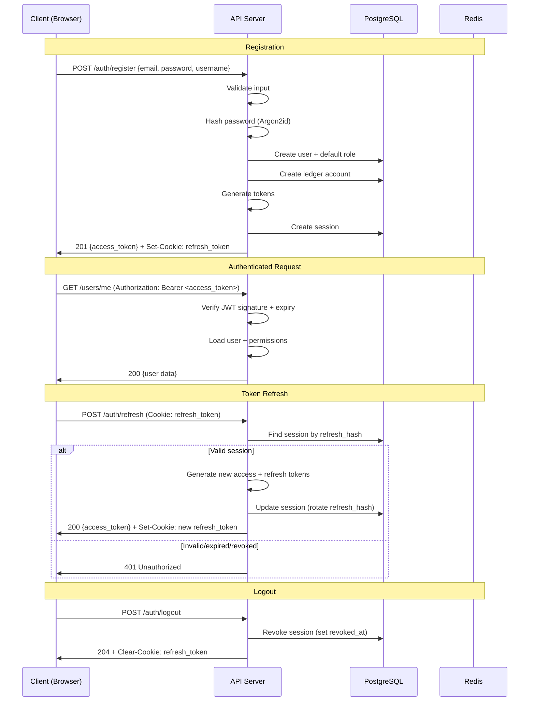
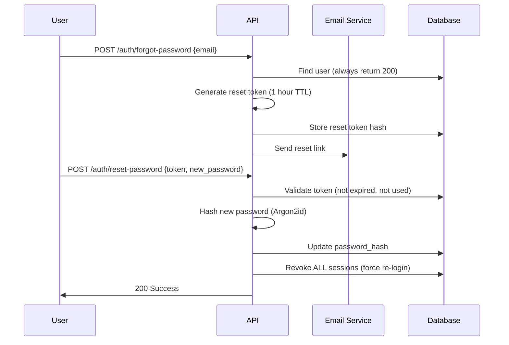
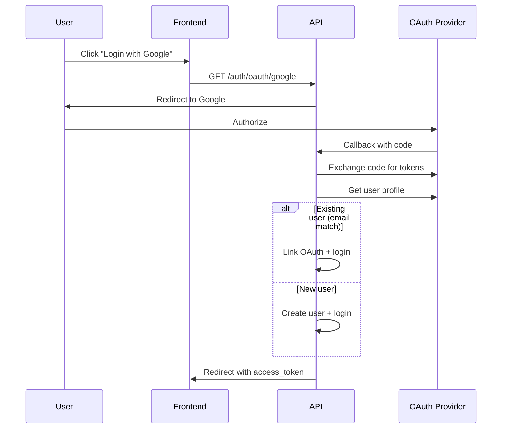
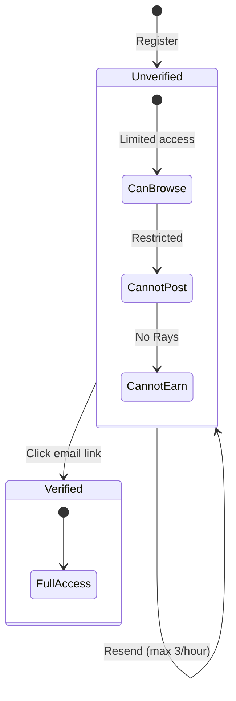

# ЛУЧИ — Authentication System

**Версия:** 1.0.0  
**Дата:** 2026-08-07  

---

## 1. Overview

Система аутентификации ЛУЧИ использует JWT Access Token + Refresh Token Rotation с хранением refresh token в HttpOnly cookie. Пароли хешируются Argon2id.

---

## 2. Authentication Flow



---

## 3. Token Architecture

### 3.1 Access Token (JWT)

| Property | Value |
|----------|-------|
| Algorithm | RS256 (RSA + SHA-256) |
| TTL | 15 minutes (900 seconds) |
| Storage | Memory (JavaScript variable) |
| Transport | Authorization header |

**Payload:**
```json
{
  "sub": "user-uuid",
  "email": "user@example.com",
  "username": "good_soul",
  "roles": ["user", "verified_user"],
  "permissions": ["post:create", "rays:transfer", "deed:submit"],
  "iat": 1691400000,
  "exp": 1691400900,
  "jti": "token-uuid"
}
```

### 3.2 Refresh Token

| Property | Value |
|----------|-------|
| Format | Opaque (random 256-bit, base64url) |
| TTL | 7 days |
| Storage | HttpOnly, Secure, SameSite=Strict cookie |
| Rotation | New token on every refresh, old invalidated |
| Max sessions | 5 per user |

**Storage in DB:**
```sql
-- Only hash stored, never plain token
refresh_token_hash = SHA-256(refresh_token)
```

---

## 4. Password Security

### 4.1 Argon2id Configuration

```typescript
const ARGON2_OPTIONS = {
  type: argon2.argon2id,
  memoryCost: 65536,    // 64 MB
  timeCost: 3,          // 3 iterations
  parallelism: 4,       // 4 threads
  hashLength: 32,       // 256 bits
};
```

### 4.2 Password Policy

| Rule | Requirement |
|------|-------------|
| Minimum length | 8 characters |
| Uppercase | At least 1 |
| Lowercase | At least 1 |
| Digit | At least 1 |
| Special character | At least 1 |
| Common passwords | Blocked (top 10K list) |
| Username in password | Blocked |
| Max length | 128 characters |

### 4.3 Password Reset Flow



---

## 5. Account Lockout

| Parameter | Value |
|-----------|-------|
| Max failed attempts | 5 |
| Lockout duration | 15 minutes |
| Counter reset | After successful login |
| Storage | Redis `lockout:{userId}` |
| Notification | Email on lockout |

---

## 6. OAuth2 Integration (Phase 2)

### Supported Providers

| Provider | Priority | Scopes |
|----------|----------|--------|
| Google | MVP optional | email, profile |
| VK | MVP optional | email |
| Yandex | Phase 2 | email, profile |
| Apple | Phase 2 | email, name |

### OAuth Flow



---

## 7. Email Verification



Unverified users can browse but cannot:
- Create posts
- Submit good deeds
- Transfer Rays
- Purchase in store

---

## 8. Multi-Factor Authentication (Phase 2)

| Method | Priority |
|--------|----------|
| TOTP (Google Authenticator) | Phase 2 |
| SMS OTP | Phase 3 |
| WebAuthn/FIDO2 | Phase 3 |

Required for:
- Admin/Moderator roles (mandatory)
- Large Ray transfers (> 500)
- Account settings changes

---

## 9. Session Management

### User Session List

```
GET /auth/sessions
```

Returns all active sessions with device info, IP, last active.

### Revoke Session

```
DELETE /auth/sessions/:id
```

User can revoke any session except current.

### Revoke All Sessions

```
POST /auth/sessions/revoke-all
```

Revokes all sessions except current. Used after password change.

---

## 10. Device Fingerprinting on Auth

On every login/register:

1. Client sends fingerprint data (JS library)
2. Server collects IP, User-Agent, TLS fingerprint
3. Combined hash stored in session
4. Anti-fraud module analyzes for multi-account patterns

---

## 11. Geo Validation

| Event | Action |
|-------|--------|
| Login from new country | Email notification |
| Login from VPN/Tor | Flag + optional block |
| Registration from blocked country | Reject (configurable) |
| Impossible travel | Block + alert (login Moscow → NYC in 1 hour) |

---

## 12. Auth Module Structure

```
modules/iam/
├── domain/
│   ├── entities/
│   │   ├── user.entity.ts
│   │   └── session.entity.ts
│   ├── value-objects/
│   │   ├── email.vo.ts
│   │   ├── password.vo.ts
│   │   └── refresh-token.vo.ts
│   ├── events/
│   │   ├── user-registered.event.ts
│   │   ├── user-logged-in.event.ts
│   │   └── user-logged-out.event.ts
│   └── services/
│       ├── password-hasher.service.ts
│       └── token.service.ts
├── application/
│   ├── commands/
│   │   ├── register-user.command.ts
│   │   ├── login.command.ts
│   │   ├── refresh-token.command.ts
│   │   └── logout.command.ts
│   └── handlers/
│       ├── register-user.handler.ts
│       └── login.handler.ts
├── infrastructure/
│   ├── strategies/
│   │   ├── jwt.strategy.ts
│   │   └── local.strategy.ts
│   └── guards/
│       ├── jwt-auth.guard.ts
│       └── optional-auth.guard.ts
└── presentation/
    └── controllers/
        └── auth.controller.ts
```

---

## 13. Error Codes

| Code | HTTP | Description |
|------|------|-------------|
| INVALID_CREDENTIALS | 401 | Wrong email/password |
| TOKEN_EXPIRED | 401 | Access token expired |
| TOKEN_INVALID | 401 | Malformed/invalid token |
| REFRESH_TOKEN_EXPIRED | 401 | Refresh token expired |
| REFRESH_TOKEN_REUSED | 401 | Token rotation violation (possible theft) |
| ACCOUNT_LOCKED | 423 | Too many failed attempts |
| ACCOUNT_BANNED | 403 | Account permanently banned |
| ACCOUNT_SUSPENDED | 403 | Account temporarily suspended |
| EMAIL_NOT_VERIFIED | 403 | Email verification required |
| WEAK_PASSWORD | 422 | Password policy violation |
| SESSION_LIMIT | 429 | Max sessions exceeded |

---

## 14. Business Rules

1. One email = one account
2. Username unique, 3-50 chars, alphanumeric + underscore
3. Password never logged, never returned in API
4. Refresh token reuse detection → revoke ALL sessions (theft indicator)
5. Password change → revoke all sessions
6. Account deletion → soft delete, 30-day grace period
7. OAuth users may not have password (can set later)

---

## 15. Edge Cases

| Case | Handling |
|------|----------|
| Concurrent refresh requests | First wins, second gets 401 (rotation) |
| Register with existing OAuth email | Link accounts prompt |
| Delete account with positive balance | Balance forfeited to system account |
| Login during active session | Allow (multi-device) up to limit |
| Expired reset token | Show "request new link" page |
| Brute force distributed | IP + account level rate limiting |

---

## 16. Unit Tests

| Test | Description |
|------|-------------|
| Password hashing | Argon2id produces valid hash, verify works |
| Password policy | Rejects weak passwords |
| JWT generation | Valid payload, correct expiry |
| JWT verification | Rejects expired, invalid signature |
| Refresh rotation | Old token invalidated after refresh |
| Refresh reuse detection | All sessions revoked on reuse |
| Account lockout | Locks after 5 failures, unlocks after 15 min |
| Registration | Creates user + account + default role |
| Session limit | Rejects 6th session |

---

## 17. Integration Tests

| Test | Description |
|------|-------------|
| Full login flow | Register → login → access protected → refresh → logout |
| Concurrent sessions | Login from 5 devices, 6th rejected |
| Password reset flow | Request → email → reset → old sessions revoked |
| OAuth flow | Google login → user created/linked |

---

## 18. Связанные документы

- [SECURITY.md](./SECURITY.md)
- [RBAC.md](./RBAC.md)
- [API.md](./API.md)
- [ANTI_FRAUD.md](./ANTI_FRAUD.md)
