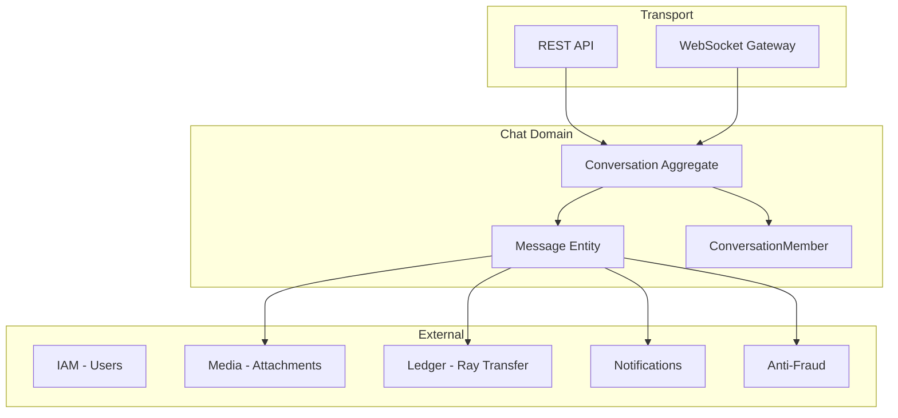
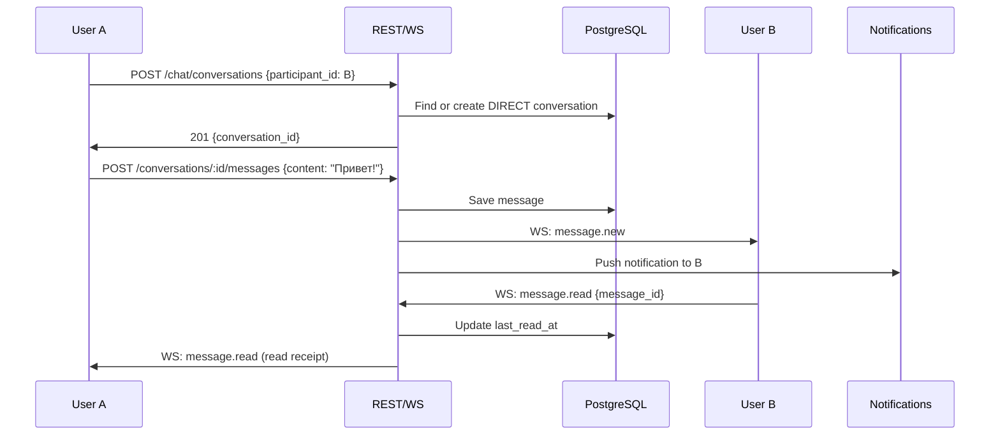
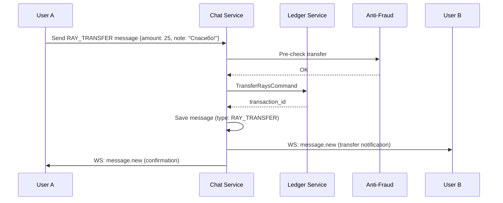

# ЛУЧИ — Chat Module

**Версия:** 1.0.0  
**Дата:** 2026-08-07  

---

## 1. Overview

Chat модуль обеспечивает личные и групповые сообщения, включая передачу Лучей через чат. MVP: 1:1 direct messages. Phase 2: group chats, channels.

---

## 2. Architecture



---

## 3. Conversation Types

| Type | Members | Features |
|------|---------|----------|
| `DIRECT` | 2 users | 1:1 messaging, Ray transfer |
| `GROUP` | 2–100 users | Group messaging, admins (Phase 2) |

---

## 4. Message Types

| Type | Content | Description |
|------|---------|-------------|
| `TEXT` | string | Plain text message |
| `IMAGE` | media_id | Image attachment |
| `VIDEO` | media_id | Video attachment (Phase 2) |
| `FILE` | media_id | File attachment |
| `SYSTEM` | string | System notification in chat |
| `RAY_TRANSFER` | metadata | Ray transfer with message |

---

## 5. Direct Chat Flow



---

## 6. Ray Transfer in Chat



---

## 7. WebSocket Protocol

### Connection

```
WS /ws/chat?token=<access_token>
```

### Events (Server → Client)

| Event | Payload |
|-------|---------|
| `message.new` | `{ conversation_id, message }` |
| `message.read` | `{ conversation_id, user_id, message_id }` |
| `typing.start` | `{ conversation_id, user_id }` |
| `typing.stop` | `{ conversation_id, user_id }` |
| `conversation.updated` | `{ conversation_id, last_message }` |

### Events (Client → Server)

| Event | Payload |
|-------|---------|
| `message.send` | `{ conversation_id, content, type }` |
| `message.read` | `{ conversation_id, message_id }` |
| `typing.start` | `{ conversation_id }` |
| `typing.stop` | `{ conversation_id }` |

---

## 8. Module Structure

```
modules/chat/
├── domain/
│   ├── entities/
│   │   ├── conversation.entity.ts
│   │   ├── message.entity.ts
│   │   └── conversation-member.entity.ts
│   ├── events/
│   │   ├── message-sent.event.ts
│   │   └── conversation-created.event.ts
│   └── repositories/
│       ├── conversation.repository.interface.ts
│       └── message.repository.interface.ts
├── application/
│   ├── commands/
│   │   ├── create-conversation.command.ts
│   │   ├── send-message.command.ts
│   │   └── mark-read.command.ts
│   └── queries/
│       ├── get-conversations.query.ts
│       └── get-messages.query.ts
├── infrastructure/
│   └── repositories/
└── presentation/
    ├── controllers/
    │   └── chat.controller.ts
    └── gateways/
        └── chat.gateway.ts          // WebSocket
```

---

## 9. Business Rules

1. Direct chat: find existing or create new (unique pair)
2. Cannot message blocked users
3. Cannot message banned users
4. Message max length: 4000 characters
5. Group max members: 100 (Phase 2)
6. Messages editable within 15 minutes (Phase 2)
7. Soft delete messages (show "[deleted]")
8. Ray transfer in chat follows same limits as direct transfer
9. Unread count = messages after last_read_at
10. Conversation sorted by last_message_at

---

## 10. Error Codes

| Code | HTTP/WS | Description |
|------|---------|-------------|
| CONVERSATION_NOT_FOUND | 404 | Conversation does not exist |
| NOT_A_MEMBER | 403 | User not in conversation |
| USER_BLOCKED | 403 | Cannot message blocked user |
| MESSAGE_TOO_LONG | 422 | Exceeds 4000 chars |
| GROUP_FULL | 422 | Max members reached |

---

## 11. Edge Cases

| Case | Handling |
|------|----------|
| Both users create direct chat simultaneously | Unique constraint, return existing |
| User deleted mid-conversation | Messages remain, show "[deleted user]" |
| Ray transfer fails in chat | Message not created, error returned |
| WebSocket disconnect | Messages queued, delivered on reconnect |
| Offline user | Store notification, deliver on next login |

---

## 12. Unit Tests

| Test | Description |
|------|-------------|
| Create direct conversation | Creates or returns existing |
| Send message | Saved with correct fields |
| Mark read | Updates last_read_at |
| Block prevents messaging | 403 returned |
| Ray transfer message | Creates transfer + message |
| Unread count | Correct calculation |

---

## 13. Integration Tests

| Test | Description |
|------|-------------|
| Full chat flow | Create → send → receive via WS → read |
| Ray transfer in chat | Send → ledger updated → both see message |
| Block during chat | Subsequent messages rejected |

---

## 14. Связанные документы

- [API.md](./API.md)
- [DATABASE.md](./DATABASE.md)
- [REWARD_ENGINE.md](./REWARD_ENGINE.md)
- [NOTIFICATIONS.md](./NOTIFICATIONS.md)
