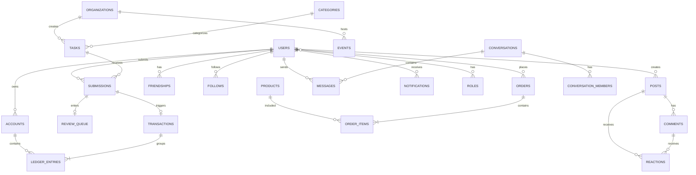
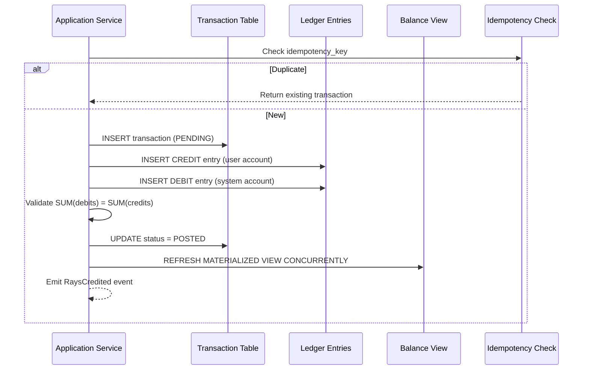

# ЛУЧИ — Database Design

**Версия:** 1.0.0  
**Дата:** 2026-08-07  
**СУБД:** PostgreSQL 16  

---

## 1. Обзор

База данных спроектирована по доменным схемам (PostgreSQL schemas), каждая из которых соответствует bounded context. Это обеспечивает логическую изоляцию и упрощает будущую декомпозицию в микросервисы.

### Schemas

| Schema | Domain | Tables |
|--------|--------|--------|
| `iam` | Identity & Access | users, sessions, roles, permissions, user_roles |
| `social` | Social Network | posts, comments, reactions, friendships, follows, stories |
| `deeds` | Good Deeds | categories, tasks, submissions, events, organizations, event_participants |
| `ledger` | Rays Currency | accounts, transactions, ledger_entries |
| `store` | Store | products, categories, orders, order_items |
| `chat` | Messaging | conversations, conversation_members, messages |
| `moderation` | Moderation | review_queue, reports, bans, moderation_actions |
| `fraud` | Anti-Fraud | fraud_signals, fraud_cases, device_fingerprints |
| `notifications` | Notifications | notifications, notification_preferences |
| `media` | Media | media_assets, media_variants |
| `analytics` | Analytics | events_log, daily_metrics |
| `audit` | Audit | audit_log |
| `shared` | Shared | outbox_events, idempotency_keys |

---

## 2. ER Diagram (Global)



---

## 3. IAM Schema

### 3.1 users

```sql
CREATE TABLE iam.users (
    id              UUID PRIMARY KEY DEFAULT gen_random_uuid(),
    email           VARCHAR(255) NOT NULL UNIQUE,
    email_verified  BOOLEAN NOT NULL DEFAULT FALSE,
    password_hash   VARCHAR(255) NOT NULL,
    username        VARCHAR(50) NOT NULL UNIQUE,
    display_name    VARCHAR(100) NOT NULL,
    avatar_url      TEXT,
    bio             TEXT,
    phone           VARCHAR(20),
    phone_verified  BOOLEAN NOT NULL DEFAULT FALSE,
    date_of_birth   DATE,
    city            VARCHAR(100),
    country         VARCHAR(2) DEFAULT 'RU',
    locale          VARCHAR(5) DEFAULT 'ru-RU',
    timezone        VARCHAR(50) DEFAULT 'Europe/Moscow',
    status          VARCHAR(20) NOT NULL DEFAULT 'ACTIVE'
                    CHECK (status IN ('ACTIVE','SUSPENDED','BANNED','DELETED')),
    level           INTEGER NOT NULL DEFAULT 1,
    experience_points INTEGER NOT NULL DEFAULT 0,
    rays_rank       INTEGER,
    last_active_at  TIMESTAMPTZ,
    created_at      TIMESTAMPTZ NOT NULL DEFAULT NOW(),
    updated_at      TIMESTAMPTZ NOT NULL DEFAULT NOW(),
    deleted_at      TIMESTAMPTZ
);

CREATE INDEX idx_users_email ON iam.users(email);
CREATE INDEX idx_users_username ON iam.users(username);
CREATE INDEX idx_users_status ON iam.users(status) WHERE deleted_at IS NULL;
CREATE INDEX idx_users_city ON iam.users(city) WHERE deleted_at IS NULL;
```

### 3.2 sessions

```sql
CREATE TABLE iam.sessions (
    id              UUID PRIMARY KEY DEFAULT gen_random_uuid(),
    user_id         UUID NOT NULL REFERENCES iam.users(id),
    refresh_token_hash VARCHAR(255) NOT NULL UNIQUE,
    device_fingerprint VARCHAR(255),
    ip_address      INET,
    user_agent      TEXT,
    geo_country     VARCHAR(2),
    geo_city        VARCHAR(100),
    expires_at      TIMESTAMPTZ NOT NULL,
    revoked_at      TIMESTAMPTZ,
    created_at      TIMESTAMPTZ NOT NULL DEFAULT NOW()
);

CREATE INDEX idx_sessions_user_id ON iam.sessions(user_id);
CREATE INDEX idx_sessions_expires ON iam.sessions(expires_at) WHERE revoked_at IS NULL;
```

### 3.3 roles & permissions

```sql
CREATE TABLE iam.roles (
    id          UUID PRIMARY KEY DEFAULT gen_random_uuid(),
    name        VARCHAR(50) NOT NULL UNIQUE,
    display_name VARCHAR(100) NOT NULL,
    description TEXT,
    is_system   BOOLEAN NOT NULL DEFAULT FALSE,
    created_at  TIMESTAMPTZ NOT NULL DEFAULT NOW()
);

CREATE TABLE iam.permissions (
    id          UUID PRIMARY KEY DEFAULT gen_random_uuid(),
    code        VARCHAR(100) NOT NULL UNIQUE,
    resource    VARCHAR(50) NOT NULL,
    action      VARCHAR(50) NOT NULL,
    description TEXT,
    created_at  TIMESTAMPTZ NOT NULL DEFAULT NOW()
);

CREATE TABLE iam.role_permissions (
    role_id       UUID NOT NULL REFERENCES iam.roles(id),
    permission_id UUID NOT NULL REFERENCES iam.permissions(id),
    PRIMARY KEY (role_id, permission_id)
);

CREATE TABLE iam.user_roles (
    user_id     UUID NOT NULL REFERENCES iam.users(id),
    role_id     UUID NOT NULL REFERENCES iam.roles(id),
    granted_by  UUID REFERENCES iam.users(id),
    granted_at  TIMESTAMPTZ NOT NULL DEFAULT NOW(),
    expires_at  TIMESTAMPTZ,
    PRIMARY KEY (user_id, role_id)
);
```

---

## 4. Ledger Schema (Critical)

### 4.1 Design Principles

1. **Double-Entry:** Every transaction has ≥2 entries (debit + credit)
2. **No mutable balance:** Balance = SUM(entries)
3. **Immutable entries:** Entries never updated, only reversed
4. **Idempotency:** Duplicate requests rejected via idempotency_key
5. **Audit trail:** Full history with reason, source, metadata

### 4.2 accounts

```sql
CREATE TABLE ledger.accounts (
    id          UUID PRIMARY KEY DEFAULT gen_random_uuid(),
    owner_id    UUID NOT NULL,
    owner_type  VARCHAR(20) NOT NULL CHECK (owner_type IN ('USER','ORGANIZATION','SYSTEM')),
    account_type VARCHAR(20) NOT NULL CHECK (account_type IN ('MAIN','ESCROW','SYSTEM')),
    currency    VARCHAR(10) NOT NULL DEFAULT 'RAYS',
    status      VARCHAR(20) NOT NULL DEFAULT 'ACTIVE'
                CHECK (status IN ('ACTIVE','FROZEN','CLOSED')),
    created_at  TIMESTAMPTZ NOT NULL DEFAULT NOW(),
    UNIQUE (owner_id, owner_type, account_type)
);

CREATE INDEX idx_accounts_owner ON ledger.accounts(owner_id, owner_type);
```

### 4.3 transactions

```sql
CREATE TABLE ledger.transactions (
    id                  UUID PRIMARY KEY DEFAULT gen_random_uuid(),
    idempotency_key     VARCHAR(255) NOT NULL UNIQUE,
    transaction_type    VARCHAR(30) NOT NULL
                        CHECK (transaction_type IN (
                            'REWARD','TRANSFER','PURCHASE','REFUND',
                            'ADMIN_CREDIT','ADMIN_DEBIT','ROLLBACK',
                            'EXCHANGE','FEE'
                        )),
    status              VARCHAR(20) NOT NULL DEFAULT 'PENDING'
                        CHECK (status IN ('PENDING','POSTED','REVERSED','FAILED')),
    reason              TEXT NOT NULL,
    source_type         VARCHAR(50),
    source_id           UUID,
    initiated_by        UUID NOT NULL,
    metadata            JSONB DEFAULT '{}',
    reversed_by_tx_id   UUID REFERENCES ledger.transactions(id),
    posted_at           TIMESTAMPTZ,
    created_at          TIMESTAMPTZ NOT NULL DEFAULT NOW()
);

CREATE INDEX idx_transactions_type ON ledger.transactions(transaction_type);
CREATE INDEX idx_transactions_status ON ledger.transactions(status);
CREATE INDEX idx_transactions_source ON ledger.transactions(source_type, source_id);
CREATE INDEX idx_transactions_initiated_by ON ledger.transactions(initiated_by);
CREATE INDEX idx_transactions_created ON ledger.transactions(created_at DESC);
```

### 4.4 ledger_entries

```sql
CREATE TABLE ledger.ledger_entries (
    id              UUID PRIMARY KEY DEFAULT gen_random_uuid(),
    transaction_id  UUID NOT NULL REFERENCES ledger.transactions(id),
    account_id      UUID NOT NULL REFERENCES ledger.accounts(id),
    entry_type      VARCHAR(10) NOT NULL CHECK (entry_type IN ('DEBIT','CREDIT')),
    amount          BIGINT NOT NULL CHECK (amount > 0),
    status          VARCHAR(20) NOT NULL DEFAULT 'POSTED'
                    CHECK (status IN ('POSTED','REVERSED')),
    created_at      TIMESTAMPTZ NOT NULL DEFAULT NOW()
);

CREATE INDEX idx_entries_account ON ledger.ledger_entries(account_id);
CREATE INDEX idx_entries_transaction ON ledger.ledger_entries(transaction_id);
CREATE INDEX idx_entries_account_created ON ledger.ledger_entries(account_id, created_at DESC);
```

### 4.5 Balance Materialized View

```sql
CREATE MATERIALIZED VIEW ledger.account_balances AS
SELECT
    a.id AS account_id,
    a.owner_id,
    a.owner_type,
    COALESCE(SUM(
        CASE 
            WHEN le.entry_type = 'CREDIT' AND le.status = 'POSTED' THEN le.amount
            WHEN le.entry_type = 'DEBIT' AND le.status = 'POSTED' THEN -le.amount
            ELSE 0
        END
    ), 0) AS balance,
    COUNT(le.id) AS entry_count,
    MAX(le.created_at) AS last_entry_at
FROM ledger.accounts a
LEFT JOIN ledger.ledger_entries le ON le.account_id = a.id
WHERE a.status = 'ACTIVE'
GROUP BY a.id, a.owner_id, a.owner_type;

CREATE UNIQUE INDEX idx_account_balances_id ON ledger.account_balances(account_id);
CREATE INDEX idx_account_balances_owner ON ledger.account_balances(owner_id, owner_type);
```

### 4.6 Ledger Sequence Diagram



---

## 5. Good Deeds Schema

### 5.1 categories

```sql
CREATE TABLE deeds.categories (
    id          UUID PRIMARY KEY DEFAULT gen_random_uuid(),
    slug        VARCHAR(50) NOT NULL UNIQUE,
    name        VARCHAR(100) NOT NULL,
    description TEXT,
    icon        VARCHAR(50),
    color       VARCHAR(7),
    base_reward_min INTEGER NOT NULL DEFAULT 5,
    base_reward_max INTEGER NOT NULL DEFAULT 50,
    sort_order  INTEGER NOT NULL DEFAULT 0,
    is_active   BOOLEAN NOT NULL DEFAULT TRUE,
    created_at  TIMESTAMPTZ NOT NULL DEFAULT NOW()
);
```

### 5.2 organizations

```sql
CREATE TABLE deeds.organizations (
    id              UUID PRIMARY KEY DEFAULT gen_random_uuid(),
    owner_user_id   UUID NOT NULL,
    name            VARCHAR(200) NOT NULL,
    slug            VARCHAR(100) NOT NULL UNIQUE,
    description     TEXT,
    logo_url        TEXT,
    website         TEXT,
    email           VARCHAR(255),
    phone           VARCHAR(20),
    address         TEXT,
    city            VARCHAR(100),
    country         VARCHAR(2) DEFAULT 'RU',
    verification_status VARCHAR(20) NOT NULL DEFAULT 'PENDING'
                        CHECK (verification_status IN ('PENDING','VERIFIED','REJECTED','SUSPENDED')),
    verified_at     TIMESTAMPTZ,
    verified_by     UUID,
    created_at      TIMESTAMPTZ NOT NULL DEFAULT NOW(),
    updated_at      TIMESTAMPTZ NOT NULL DEFAULT NOW()
);
```

### 5.3 tasks

```sql
CREATE TABLE deeds.tasks (
    id              UUID PRIMARY KEY DEFAULT gen_random_uuid(),
    organization_id UUID REFERENCES deeds.organizations(id),
    category_id     UUID NOT NULL REFERENCES deeds.categories(id),
    title           VARCHAR(200) NOT NULL,
    description     TEXT NOT NULL,
    requirements    TEXT,
    reward_min      INTEGER NOT NULL,
    reward_max      INTEGER NOT NULL,
    location_type   VARCHAR(20) NOT NULL DEFAULT 'ANY'
                    CHECK (location_type IN ('ANY','CITY','GPS','REMOTE')),
    location_city   VARCHAR(100),
    location_lat    DECIMAL(10,7),
    location_lng    DECIMAL(10,7),
    location_radius_m INTEGER,
    max_participants INTEGER,
    current_participants INTEGER NOT NULL DEFAULT 0,
    proof_type      VARCHAR(20) NOT NULL DEFAULT 'PHOTO'
                    CHECK (proof_type IN ('PHOTO','VIDEO','GPS','DOCUMENT','MIXED')),
    status          VARCHAR(20) NOT NULL DEFAULT 'ACTIVE'
                    CHECK (status IN ('DRAFT','ACTIVE','PAUSED','COMPLETED','CANCELLED')),
    starts_at       TIMESTAMPTZ,
    ends_at         TIMESTAMPTZ,
    created_by      UUID NOT NULL,
    created_at      TIMESTAMPTZ NOT NULL DEFAULT NOW(),
    updated_at      TIMESTAMPTZ NOT NULL DEFAULT NOW()
);

CREATE INDEX idx_tasks_category ON deeds.tasks(category_id);
CREATE INDEX idx_tasks_org ON deeds.tasks(organization_id);
CREATE INDEX idx_tasks_status ON deeds.tasks(status);
CREATE INDEX idx_tasks_city ON deeds.tasks(location_city) WHERE status = 'ACTIVE';
```

### 5.4 submissions

```sql
CREATE TABLE deeds.submissions (
    id              UUID PRIMARY KEY DEFAULT gen_random_uuid(),
    task_id         UUID NOT NULL REFERENCES deeds.tasks(id),
    user_id         UUID NOT NULL,
    description     TEXT,
    proof_media_ids UUID[] NOT NULL DEFAULT '{}',
    gps_lat         DECIMAL(10,7),
    gps_lng         DECIMAL(10,7),
    gps_accuracy_m  INTEGER,
    status          VARCHAR(20) NOT NULL DEFAULT 'PENDING'
                    CHECK (status IN ('PENDING','IN_REVIEW','APPROVED','REJECTED','CANCELLED')),
    reward_amount   INTEGER,
    reviewed_by     UUID,
    reviewed_at     TIMESTAMPTZ,
    rejection_reason TEXT,
    transaction_id  UUID,
    metadata        JSONB DEFAULT '{}',
    created_at      TIMESTAMPTZ NOT NULL DEFAULT NOW(),
    updated_at      TIMESTAMPTZ NOT NULL DEFAULT NOW()
);

CREATE INDEX idx_submissions_task ON deeds.submissions(task_id);
CREATE INDEX idx_submissions_user ON deeds.submissions(user_id);
CREATE INDEX idx_submissions_status ON deeds.submissions(status);
```

### 5.5 events (volunteer events)

```sql
CREATE TABLE deeds.events (
    id              UUID PRIMARY KEY DEFAULT gen_random_uuid(),
    organization_id UUID NOT NULL REFERENCES deeds.organizations(id),
    category_id     UUID NOT NULL REFERENCES deeds.categories(id),
    title           VARCHAR(200) NOT NULL,
    description     TEXT NOT NULL,
    location_address TEXT,
    location_lat    DECIMAL(10,7),
    location_lng    DECIMAL(10,7),
    starts_at       TIMESTAMPTZ NOT NULL,
    ends_at         TIMESTAMPTZ NOT NULL,
    max_participants INTEGER,
    reward_per_hour INTEGER,
    status          VARCHAR(20) NOT NULL DEFAULT 'UPCOMING'
                    CHECK (status IN ('DRAFT','UPCOMING','ONGOING','COMPLETED','CANCELLED')),
    created_by      UUID NOT NULL,
    created_at      TIMESTAMPTZ NOT NULL DEFAULT NOW(),
    updated_at      TIMESTAMPTZ NOT NULL DEFAULT NOW()
);

CREATE TABLE deeds.event_participants (
    event_id    UUID NOT NULL REFERENCES deeds.events(id),
    user_id     UUID NOT NULL,
    status      VARCHAR(20) NOT NULL DEFAULT 'REGISTERED'
                CHECK (status IN ('REGISTERED','CHECKED_IN','COMPLETED','NO_SHOW','CANCELLED')),
    checked_in_at TIMESTAMPTZ,
    hours_spent DECIMAL(5,2),
    reward_amount INTEGER,
    PRIMARY KEY (event_id, user_id)
);
```

---

## 6. Social Schema

### 6.1 posts

```sql
CREATE TABLE social.posts (
    id              UUID PRIMARY KEY DEFAULT gen_random_uuid(),
    author_id       UUID NOT NULL,
    content         TEXT NOT NULL,
    media_ids       UUID[] DEFAULT '{}',
    deed_submission_id UUID,
    visibility      VARCHAR(20) NOT NULL DEFAULT 'PUBLIC'
                    CHECK (visibility IN ('PUBLIC','FRIENDS','PRIVATE')),
    status          VARCHAR(20) NOT NULL DEFAULT 'ACTIVE'
                    CHECK (status IN ('ACTIVE','HIDDEN','DELETED')),
    likes_count     INTEGER NOT NULL DEFAULT 0,
    comments_count  INTEGER NOT NULL DEFAULT 0,
    shares_count    INTEGER NOT NULL DEFAULT 0,
    created_at      TIMESTAMPTZ NOT NULL DEFAULT NOW(),
    updated_at      TIMESTAMPTZ NOT NULL DEFAULT NOW()
);

CREATE INDEX idx_posts_author ON social.posts(author_id, created_at DESC);
CREATE INDEX idx_posts_created ON social.posts(created_at DESC) WHERE status = 'ACTIVE';
```

### 6.2 comments

```sql
CREATE TABLE social.comments (
    id          UUID PRIMARY KEY DEFAULT gen_random_uuid(),
    post_id     UUID NOT NULL REFERENCES social.posts(id),
    author_id   UUID NOT NULL,
    parent_id   UUID REFERENCES social.comments(id),
    content     TEXT NOT NULL,
    status      VARCHAR(20) NOT NULL DEFAULT 'ACTIVE'
                CHECK (status IN ('ACTIVE','HIDDEN','DELETED')),
    likes_count INTEGER NOT NULL DEFAULT 0,
    created_at  TIMESTAMPTZ NOT NULL DEFAULT NOW(),
    updated_at  TIMESTAMPTZ NOT NULL DEFAULT NOW()
);

CREATE INDEX idx_comments_post ON social.comments(post_id, created_at);
CREATE INDEX idx_comments_parent ON social.comments(parent_id);
```

### 6.3 reactions

```sql
CREATE TABLE social.reactions (
    id          UUID PRIMARY KEY DEFAULT gen_random_uuid(),
    user_id     UUID NOT NULL,
    target_type VARCHAR(20) NOT NULL CHECK (target_type IN ('POST','COMMENT','STORY')),
    target_id   UUID NOT NULL,
    reaction_type VARCHAR(20) NOT NULL DEFAULT 'LIKE'
                  CHECK (reaction_type IN ('LIKE','LOVE','SUPPORT','INSPIRE','CELEBRATE')),
    created_at  TIMESTAMPTZ NOT NULL DEFAULT NOW(),
    UNIQUE (user_id, target_type, target_id)
);

CREATE INDEX idx_reactions_target ON social.reactions(target_type, target_id);
```

### 6.4 friendships & follows

```sql
CREATE TABLE social.friendships (
    id          UUID PRIMARY KEY DEFAULT gen_random_uuid(),
    requester_id UUID NOT NULL,
    addressee_id UUID NOT NULL,
    status      VARCHAR(20) NOT NULL DEFAULT 'PENDING'
                CHECK (status IN ('PENDING','ACCEPTED','DECLINED','BLOCKED')),
    created_at  TIMESTAMPTZ NOT NULL DEFAULT NOW(),
    updated_at  TIMESTAMPTZ NOT NULL DEFAULT NOW(),
    UNIQUE (requester_id, addressee_id)
);

CREATE TABLE social.follows (
    follower_id UUID NOT NULL,
    following_id UUID NOT NULL,
    created_at  TIMESTAMPTZ NOT NULL DEFAULT NOW(),
    PRIMARY KEY (follower_id, following_id)
);

CREATE INDEX idx_follows_following ON social.follows(following_id);
```

### 6.5 stories

```sql
CREATE TABLE social.stories (
    id          UUID PRIMARY KEY DEFAULT gen_random_uuid(),
    author_id   UUID NOT NULL,
    media_id    UUID NOT NULL,
    caption     TEXT,
    views_count INTEGER NOT NULL DEFAULT 0,
    expires_at  TIMESTAMPTZ NOT NULL,
    created_at  TIMESTAMPTZ NOT NULL DEFAULT NOW()
);

CREATE INDEX idx_stories_author ON social.stories(author_id, created_at DESC);
CREATE INDEX idx_stories_expires ON social.stories(expires_at);
```

---

## 7. Store Schema

```sql
CREATE TABLE store.product_categories (
    id          UUID PRIMARY KEY DEFAULT gen_random_uuid(),
    name        VARCHAR(100) NOT NULL,
    slug        VARCHAR(50) NOT NULL UNIQUE,
    sort_order  INTEGER NOT NULL DEFAULT 0,
    is_active   BOOLEAN NOT NULL DEFAULT TRUE
);

CREATE TABLE store.products (
    id              UUID PRIMARY KEY DEFAULT gen_random_uuid(),
    category_id     UUID REFERENCES store.product_categories(id),
    name            VARCHAR(200) NOT NULL,
    description     TEXT,
    image_url       TEXT,
    price_rays      INTEGER NOT NULL CHECK (price_rays > 0),
    stock           INTEGER,
    product_type    VARCHAR(20) NOT NULL DEFAULT 'PHYSICAL'
                    CHECK (product_type IN ('PHYSICAL','DIGITAL','CERTIFICATE','VOUCHER')),
    status          VARCHAR(20) NOT NULL DEFAULT 'ACTIVE'
                    CHECK (status IN ('DRAFT','ACTIVE','OUT_OF_STOCK','ARCHIVED')),
    partner_id      UUID,
    metadata        JSONB DEFAULT '{}',
    created_at      TIMESTAMPTZ NOT NULL DEFAULT NOW(),
    updated_at      TIMESTAMPTZ NOT NULL DEFAULT NOW()
);

CREATE TABLE store.orders (
    id              UUID PRIMARY KEY DEFAULT gen_random_uuid(),
    user_id         UUID NOT NULL,
    status          VARCHAR(20) NOT NULL DEFAULT 'PENDING'
                    CHECK (status IN ('PENDING','PAID','PROCESSING','SHIPPED','DELIVERED','CANCELLED','REFUNDED')),
    total_rays      INTEGER NOT NULL,
    transaction_id  UUID,
    shipping_address JSONB,
    metadata        JSONB DEFAULT '{}',
    created_at      TIMESTAMPTZ NOT NULL DEFAULT NOW(),
    updated_at      TIMESTAMPTZ NOT NULL DEFAULT NOW()
);

CREATE TABLE store.order_items (
    id          UUID PRIMARY KEY DEFAULT gen_random_uuid(),
    order_id    UUID NOT NULL REFERENCES store.orders(id),
    product_id  UUID NOT NULL REFERENCES store.products(id),
    quantity    INTEGER NOT NULL DEFAULT 1,
    price_rays  INTEGER NOT NULL,
    created_at  TIMESTAMPTZ NOT NULL DEFAULT NOW()
);
```

---

## 8. Chat Schema

```sql
CREATE TABLE chat.conversations (
    id          UUID PRIMARY KEY DEFAULT gen_random_uuid(),
    type        VARCHAR(20) NOT NULL CHECK (type IN ('DIRECT','GROUP')),
    title       VARCHAR(200),
    avatar_url  TEXT,
    created_by  UUID,
    last_message_at TIMESTAMPTZ,
    created_at  TIMESTAMPTZ NOT NULL DEFAULT NOW(),
    updated_at  TIMESTAMPTZ NOT NULL DEFAULT NOW()
);

CREATE TABLE chat.conversation_members (
    conversation_id UUID NOT NULL REFERENCES chat.conversations(id),
    user_id         UUID NOT NULL,
    role            VARCHAR(20) NOT NULL DEFAULT 'MEMBER'
                    CHECK (role IN ('OWNER','ADMIN','MEMBER')),
    joined_at       TIMESTAMPTZ NOT NULL DEFAULT NOW(),
    last_read_at    TIMESTAMPTZ,
    PRIMARY KEY (conversation_id, user_id)
);

CREATE TABLE chat.messages (
    id              UUID PRIMARY KEY DEFAULT gen_random_uuid(),
    conversation_id UUID NOT NULL REFERENCES chat.conversations(id),
    sender_id       UUID NOT NULL,
    content         TEXT,
    media_id        UUID,
    message_type    VARCHAR(20) NOT NULL DEFAULT 'TEXT'
                    CHECK (message_type IN ('TEXT','IMAGE','VIDEO','FILE','SYSTEM','RAY_TRANSFER')),
    metadata        JSONB DEFAULT '{}',
    edited_at       TIMESTAMPTZ,
    deleted_at      TIMESTAMPTZ,
    created_at      TIMESTAMPTZ NOT NULL DEFAULT NOW()
);

CREATE INDEX idx_messages_conversation ON chat.messages(conversation_id, created_at DESC);
```

---

## 9. Moderation Schema

```sql
CREATE TABLE moderation.review_queue (
    id              UUID PRIMARY KEY DEFAULT gen_random_uuid(),
    item_type       VARCHAR(30) NOT NULL
                    CHECK (item_type IN ('DEED_SUBMISSION','POST','COMMENT','ORGANIZATION','REPORT')),
    item_id         UUID NOT NULL,
    priority        INTEGER NOT NULL DEFAULT 0,
    assigned_to     UUID,
    status          VARCHAR(20) NOT NULL DEFAULT 'PENDING'
                    CHECK (status IN ('PENDING','IN_REVIEW','APPROVED','REJECTED','ESCALATED')),
    decision_reason TEXT,
    reviewed_by     UUID,
    reviewed_at     TIMESTAMPTZ,
    created_at      TIMESTAMPTZ NOT NULL DEFAULT NOW()
);

CREATE INDEX idx_review_queue_status ON moderation.review_queue(status, priority DESC, created_at);

CREATE TABLE moderation.reports (
    id              UUID PRIMARY KEY DEFAULT gen_random_uuid(),
    reporter_id     UUID NOT NULL,
    target_type     VARCHAR(30) NOT NULL,
    target_id       UUID NOT NULL,
    reason          VARCHAR(50) NOT NULL,
    description     TEXT,
    status          VARCHAR(20) NOT NULL DEFAULT 'OPEN'
                    CHECK (status IN ('OPEN','IN_REVIEW','RESOLVED','DISMISSED')),
    resolved_by     UUID,
    resolved_at     TIMESTAMPTZ,
    resolution_note TEXT,
    created_at      TIMESTAMPTZ NOT NULL DEFAULT NOW()
);

CREATE TABLE moderation.bans (
    id          UUID PRIMARY KEY DEFAULT gen_random_uuid(),
    user_id     UUID NOT NULL,
    banned_by   UUID NOT NULL,
    reason      TEXT NOT NULL,
    ban_type    VARCHAR(20) NOT NULL CHECK (ban_type IN ('TEMPORARY','PERMANENT')),
    expires_at  TIMESTAMPTZ,
    is_active   BOOLEAN NOT NULL DEFAULT TRUE,
    created_at  TIMESTAMPTZ NOT NULL DEFAULT NOW()
);
```

---

## 10. Anti-Fraud Schema

```sql
CREATE TABLE fraud.device_fingerprints (
    id              UUID PRIMARY KEY DEFAULT gen_random_uuid(),
    fingerprint_hash VARCHAR(255) NOT NULL UNIQUE,
    user_ids        UUID[] NOT NULL DEFAULT '{}',
    first_seen_at   TIMESTAMPTZ NOT NULL DEFAULT NOW(),
    last_seen_at    TIMESTAMPTZ NOT NULL DEFAULT NOW(),
    risk_score      DECIMAL(5,2) NOT NULL DEFAULT 0,
    is_blocked      BOOLEAN NOT NULL DEFAULT FALSE
);

CREATE TABLE fraud.fraud_signals (
    id          UUID PRIMARY KEY DEFAULT gen_random_uuid(),
    user_id     UUID,
    signal_type VARCHAR(50) NOT NULL,
    severity    VARCHAR(10) NOT NULL CHECK (severity IN ('LOW','MEDIUM','HIGH','CRITICAL')),
    details     JSONB NOT NULL DEFAULT '{}',
    ip_address  INET,
    device_fingerprint VARCHAR(255),
    created_at  TIMESTAMPTZ NOT NULL DEFAULT NOW()
);

CREATE INDEX idx_fraud_signals_user ON fraud.fraud_signals(user_id, created_at DESC);
CREATE INDEX idx_fraud_signals_type ON fraud.fraud_signals(signal_type, severity);

CREATE TABLE fraud.fraud_cases (
    id          UUID PRIMARY KEY DEFAULT gen_random_uuid(),
    user_id     UUID NOT NULL,
    case_type   VARCHAR(50) NOT NULL,
    status      VARCHAR(20) NOT NULL DEFAULT 'OPEN'
                CHECK (status IN ('OPEN','INVESTIGATING','CONFIRMED','DISMISSED','RESOLVED')),
    signals     UUID[] NOT NULL DEFAULT '{}',
    resolution  TEXT,
    assigned_to UUID,
    created_at  TIMESTAMPTZ NOT NULL DEFAULT NOW(),
    resolved_at TIMESTAMPTZ
);
```

---

## 11. Notifications Schema

```sql
CREATE TABLE notifications.notifications (
    id          UUID PRIMARY KEY DEFAULT gen_random_uuid(),
    user_id     UUID NOT NULL,
    type        VARCHAR(50) NOT NULL,
    title       VARCHAR(200) NOT NULL,
    body        TEXT,
    data        JSONB DEFAULT '{}',
    is_read     BOOLEAN NOT NULL DEFAULT FALSE,
    read_at     TIMESTAMPTZ,
    created_at  TIMESTAMPTZ NOT NULL DEFAULT NOW()
);

CREATE INDEX idx_notifications_user ON notifications.notifications(user_id, created_at DESC);
CREATE INDEX idx_notifications_unread ON notifications.notifications(user_id) WHERE is_read = FALSE;

CREATE TABLE notifications.notification_preferences (
    user_id     UUID NOT NULL,
    channel     VARCHAR(20) NOT NULL CHECK (channel IN ('IN_APP','EMAIL','PUSH')),
    event_type  VARCHAR(50) NOT NULL,
    is_enabled  BOOLEAN NOT NULL DEFAULT TRUE,
    PRIMARY KEY (user_id, channel, event_type)
);
```

---

## 12. Media Schema

```sql
CREATE TABLE media.media_assets (
    id              UUID PRIMARY KEY DEFAULT gen_random_uuid(),
    uploader_id     UUID NOT NULL,
    original_filename VARCHAR(255),
    mime_type       VARCHAR(100) NOT NULL,
    file_size       BIGINT NOT NULL,
    storage_key     TEXT NOT NULL,
    storage_bucket  VARCHAR(100) NOT NULL,
    width           INTEGER,
    height          INTEGER,
    duration_sec    INTEGER,
    phash           VARCHAR(64),
    status          VARCHAR(20) NOT NULL DEFAULT 'UPLOADING'
                    CHECK (status IN ('UPLOADING','PROCESSING','READY','FAILED','DELETED')),
    metadata        JSONB DEFAULT '{}',
    created_at      TIMESTAMPTZ NOT NULL DEFAULT NOW()
);

CREATE INDEX idx_media_uploader ON media.media_assets(uploader_id);
CREATE INDEX idx_media_phash ON media.media_assets(phash) WHERE phash IS NOT NULL;
```

---

## 13. Audit Schema

```sql
CREATE TABLE audit.audit_log (
    id              UUID PRIMARY KEY DEFAULT gen_random_uuid(),
    actor_id        UUID,
    actor_type      VARCHAR(20) NOT NULL DEFAULT 'USER',
    action          VARCHAR(100) NOT NULL,
    resource_type   VARCHAR(50) NOT NULL,
    resource_id     UUID,
    old_values      JSONB,
    new_values      JSONB,
    ip_address      INET,
    user_agent      TEXT,
    correlation_id  UUID,
    metadata        JSONB DEFAULT '{}',
    created_at      TIMESTAMPTZ NOT NULL DEFAULT NOW()
);

CREATE INDEX idx_audit_actor ON audit.audit_log(actor_id, created_at DESC);
CREATE INDEX idx_audit_resource ON audit.audit_log(resource_type, resource_id);
CREATE INDEX idx_audit_action ON audit.audit_log(action, created_at DESC);
CREATE INDEX idx_audit_created ON audit.audit_log(created_at DESC);
```

---

## 14. Shared Schema

```sql
CREATE TABLE shared.idempotency_keys (
    key             VARCHAR(255) PRIMARY KEY,
    request_hash    VARCHAR(64) NOT NULL,
    response_status INTEGER,
    response_body   JSONB,
    created_at      TIMESTAMPTZ NOT NULL DEFAULT NOW(),
    expires_at      TIMESTAMPTZ NOT NULL DEFAULT NOW() + INTERVAL '24 hours'
);

CREATE TABLE shared.outbox_events (
    id              UUID PRIMARY KEY DEFAULT gen_random_uuid(),
    aggregate_type  VARCHAR(50) NOT NULL,
    aggregate_id    UUID NOT NULL,
    event_type      VARCHAR(100) NOT NULL,
    payload         JSONB NOT NULL,
    created_at      TIMESTAMPTZ NOT NULL DEFAULT NOW(),
    published_at    TIMESTAMPTZ,
    retry_count     INTEGER NOT NULL DEFAULT 0
);

CREATE INDEX idx_outbox_unpublished ON shared.outbox_events(created_at) WHERE published_at IS NULL;
```

---

## 15. Indexing Strategy

| Pattern | Index Type | Example |
|---------|-----------|---------|
| Primary lookups | B-tree | user email, username |
| Feed queries | B-tree (composite) | posts(created_at DESC) |
| Full-text search | GIN | posts.content tsvector |
| Geo queries | GiST | tasks location |
| Array contains | GIN | proof_media_ids |
| Partial indexes | B-tree WHERE | active users, unread notifications |

### Full-Text Search (MVP)

```sql
ALTER TABLE social.posts ADD COLUMN search_vector tsvector
    GENERATED ALWAYS AS (to_tsvector('russian', coalesce(content, ''))) STORED;
CREATE INDEX idx_posts_search ON social.posts USING GIN(search_vector);

ALTER TABLE iam.users ADD COLUMN search_vector tsvector
    GENERATED ALWAYS AS (to_tsvector('russian', coalesce(display_name, '') || ' ' || coalesce(username, ''))) STORED;
CREATE INDEX idx_users_search ON iam.users USING GIN(search_vector);
```

---

## 16. Migration Strategy

1. **Tool:** Prisma Migrate / TypeORM migrations
2. **Naming:** `YYYYMMDDHHMMSS_description.sql`
3. **Rules:**
   - Backward-compatible migrations only (expand-contract)
   - No destructive changes without deprecation period
   - Ledger tables: append-only, no ALTER on entries
   - Each migration tested in CI against fresh + existing DB
4. **Rollback:** Every migration has corresponding down migration

---

## 17. Backup & Recovery

| Parameter | Value |
|-----------|-------|
| Full backup | Daily |
| WAL archiving | Continuous |
| Retention | 30 days |
| RPO | < 1 hour |
| RTO | < 4 hours |
| Ledger backup | Separate daily + WAL (critical) |
| Test restore | Monthly |

---

## 18. Performance Considerations

| Concern | Solution |
|---------|----------|
| Ledger balance queries | Materialized view + concurrent refresh |
| Feed generation | Precomputed feed cache in Redis |
| Hot tables (entries, messages) | Partitioning by month (Phase 2) |
| Connection pooling | PgBouncer (transaction mode) |
| Read scaling | Read replicas for queries |
| Large media | S3, not DB |

---

## 19. Связанные документы

- [ARCHITECTURE.md](./ARCHITECTURE.md)
- [REWARD_ENGINE.md](./REWARD_ENGINE.md)
- [SECURITY.md](./SECURITY.md)
- [API.md](./API.md)
