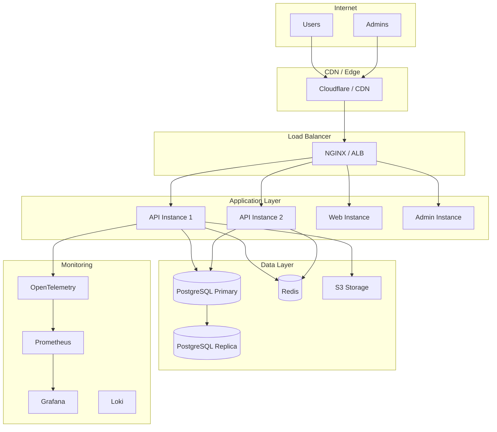
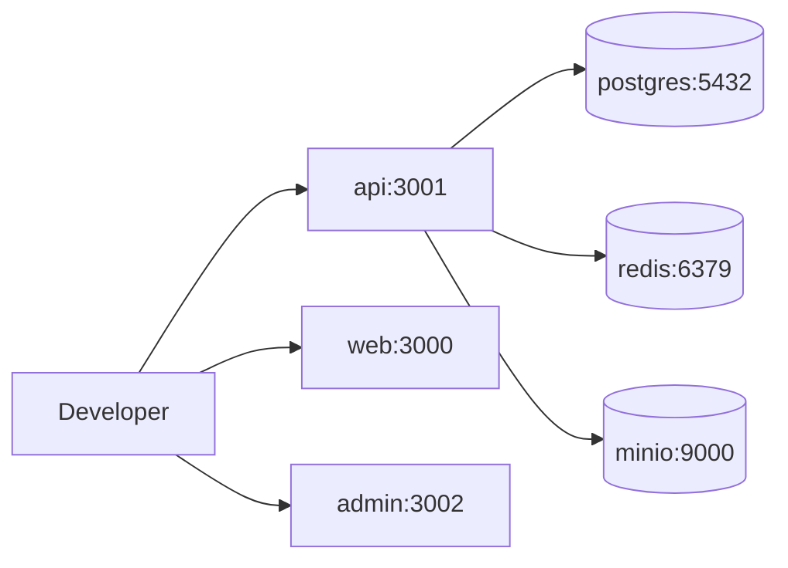
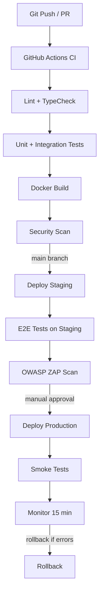
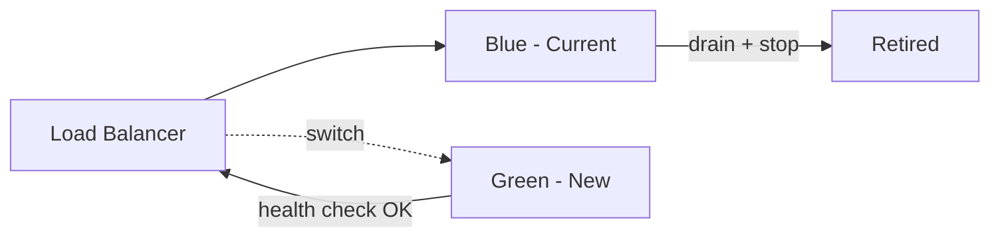

# ЛУЧИ — Deployment & Infrastructure

**Версия:** 1.0.0  
**Дата:** 2026-08-07  

---

## 1. Overview

Документ описывает инфраструктуру, окружения, CI/CD pipeline и стратегию деплоя платформы ЛУЧИ от development до production.

---

## 2. Environments

| Environment | Purpose | URL | Database |
|-------------|---------|-----|----------|
| **Development** | Local dev | `localhost:3000` | Docker PostgreSQL |
| **Staging** | Pre-production testing | `staging.luchi.app` | Dedicated PG instance |
| **Production** | Live platform | `luchi.app` / `api.luchi.app` | PG Primary + Replicas |

### Environment Variables

Each environment has its own `.env` file (never committed):

```
.env.development    # Local (gitignored)
.env.staging        # Staging secrets (Vault)
.env.production     # Production secrets (Vault)
.env.example        # Template (committed)
```

---

## 3. Infrastructure Architecture

### 3.1 Production (Phase 1)



### 3.2 Development (Docker Compose)



---

## 4. Docker Configuration

### 4.1 docker-compose.yml (Development)

```yaml
services:
  postgres:
    image: postgres:16-alpine
    environment:
      POSTGRES_DB: luchi
      POSTGRES_USER: luchi
      POSTGRES_PASSWORD: luchi_dev
    ports:
      - "5432:5432"
    volumes:
      - pgdata:/var/lib/postgresql/data

  redis:
    image: redis:7-alpine
    ports:
      - "6379:6379"

  minio:
    image: minio/minio
    command: server /data --console-address ":9001"
    environment:
      MINIO_ROOT_USER: minio
      MINIO_ROOT_PASSWORD: minio_dev
    ports:
      - "9000:9000"
      - "9001:9001"
    volumes:
      - miniodata:/data

  api:
    build:
      context: .
      dockerfile: infra/docker/Dockerfile.api
    ports:
      - "3001:3001"
    depends_on:
      - postgres
      - redis
      - minio
    env_file:
      - .env.development

  web:
    build:
      context: .
      dockerfile: infra/docker/Dockerfile.web
    ports:
      - "3000:3000"
    depends_on:
      - api

  admin:
    build:
      context: .
      dockerfile: infra/docker/Dockerfile.admin
    ports:
      - "3002:3002"
    depends_on:
      - api

volumes:
  pgdata:
  miniodata:
```

### 4.2 Production Dockerfile (Multi-stage)

```dockerfile
# infra/docker/Dockerfile.api
FROM node:20-alpine AS builder
WORKDIR /app
COPY package*.json turbo.json ./
COPY apps/api/package*.json apps/api/
COPY packages/ packages/
RUN npm ci
COPY apps/api/ apps/api/
RUN npm run build --workspace=apps/api

FROM node:20-alpine AS runner
WORKDIR /app
RUN addgroup --system --gid 1001 nodejs
RUN adduser --system --uid 1001 nestjs
COPY --from=builder /app/apps/api/dist ./dist
COPY --from=builder /app/node_modules ./node_modules
USER nestjs
EXPOSE 3001
HEALTHCHECK --interval=30s --timeout=3s \
  CMD wget -qO- http://localhost:3001/health || exit 1
CMD ["node", "dist/main.js"]
```

---

## 5. CI/CD Pipeline



### 5.1 Pipeline Stages

| Stage | Trigger | Duration | Actions |
|-------|---------|----------|---------|
| CI | Every PR | ~5 min | Lint, typecheck, unit tests, integration tests |
| Build | Merge to main | ~3 min | Docker build, push to registry |
| Deploy Staging | Auto on main | ~2 min | Deploy to staging, run E2E |
| Deploy Production | Manual approval | ~3 min | Blue-green deploy, smoke tests |

### 5.2 GitHub Actions Workflow

```yaml
name: CI/CD

on:
  push:
    branches: [main]
  pull_request:
    branches: [main]

jobs:
  ci:
    runs-on: ubuntu-latest
    services:
      postgres:
        image: postgres:16
        env:
          POSTGRES_DB: luchi_test
          POSTGRES_USER: test
          POSTGRES_PASSWORD: test
        ports: ['5432:5432']
      redis:
        image: redis:7
        ports: ['6379:6379']
    steps:
      - uses: actions/checkout@v4
      - uses: actions/setup-node@v4
        with:
          node-version: 20
          cache: npm
      - run: npm ci
      - run: npm run lint
      - run: npm run typecheck
      - run: npm run test:unit -- --coverage
      - run: npm run test:integration
      - run: npm run build

  deploy-staging:
    needs: ci
    if: github.ref == 'refs/heads/main'
    runs-on: ubuntu-latest
    steps:
      - run: echo "Deploy to staging"

  deploy-production:
    needs: deploy-staging
    if: github.ref == 'refs/heads/main'
    environment: production
    runs-on: ubuntu-latest
    steps:
      - run: echo "Deploy to production"
```

---

## 6. Deployment Strategy

### 6.1 Blue-Green Deployment



| Step | Action |
|------|--------|
| 1 | Deploy new version to green environment |
| 2 | Run health checks on green |
| 3 | Run smoke tests on green |
| 4 | Switch load balancer to green |
| 5 | Monitor for 15 minutes |
| 6 | If errors → switch back to blue (rollback) |
| 7 | If OK → decommission blue |

### 6.2 Database Migrations

| Rule | Description |
|------|-------------|
| Timing | Migrations run BEFORE app deployment |
| Direction | Forward-only in production (no down migrations) |
| Compatibility | Migrations must be backward-compatible (expand-contract) |
| Ledger | Ledger tables: append-only migrations only |
| Rollback | App rollback does NOT rollback migrations |

```bash
# Deployment sequence
1. npm run migrate:deploy     # Run pending migrations
2. docker compose up -d api  # Deploy new API version
3. curl /health              # Verify health
4. curl /ready               # Verify readiness (DB, Redis, S3)
```

---

## 7. Monitoring & Observability

### 7.1 Health Checks

| Endpoint | Purpose | Checks |
|----------|---------|--------|
| `GET /health` | Liveness | App running |
| `GET /ready` | Readiness | PostgreSQL, Redis, S3 connectivity |

### 7.2 Metrics (Prometheus)

| Metric | Type | Labels |
|--------|------|--------|
| `http_requests_total` | Counter | method, path, status |
| `http_request_duration_seconds` | Histogram | method, path |
| `ledger_transactions_total` | Counter | type, status |
| `active_users_gauge` | Gauge | — |
| `moderation_queue_size` | Gauge | type |
| `fraud_signals_total` | Counter | type, severity |

### 7.3 Logging

```json
{
  "timestamp": "2026-08-07T10:30:00Z",
  "level": "info",
  "message": "Rays credited",
  "correlation_id": "abc-123",
  "user_id": "uuid",
  "transaction_id": "uuid",
  "amount": 35,
  "service": "ledger",
  "environment": "production"
}
```

### 7.4 Alerting

| Alert | Condition | Severity | Action |
|-------|-----------|----------|--------|
| API down | Health check fails 3x | P0 | Page on-call |
| High error rate | 5xx > 1% for 5 min | P0 | Page on-call |
| DB connection pool exhausted | Active > 90% | P1 | Slack alert |
| Ledger reconciliation fail | Any mismatch | P0 | Page + block transfers |
| High latency | p99 > 1s for 10 min | P1 | Slack alert |
| Disk space | > 85% used | P2 | Slack alert |
| Failed migrations | Migration error | P0 | Block deploy |

---

## 8. Backup & Disaster Recovery

| Component | Method | Frequency | Retention |
|-----------|--------|-----------|-----------|
| PostgreSQL | pg_dump + WAL archiving | Daily full + continuous WAL | 30 days |
| Redis | RDB snapshots | Hourly | 7 days |
| S3 media | Cross-region replication | Continuous | Indefinite |
| Ledger (critical) | Separate daily backup + WAL | Daily + continuous | 1 year |

### Recovery Objectives

| Metric | Target |
|--------|--------|
| RPO (Recovery Point Objective) | < 1 hour |
| RTO (Recovery Time Objective) | < 4 hours |
| Ledger RPO | < 15 minutes |

### Disaster Recovery Plan

1. **DB failure:** Promote read replica to primary (< 15 min)
2. **App failure:** Blue-green rollback (< 5 min)
3. **Region failure:** Restore from backup to secondary region (< 4 hours)
4. **Data corruption:** Point-in-time recovery from WAL (< 1 hour)

---

## 9. Scaling Strategy

### Phase 1 (MVP — up to 10K users)

| Component | Setup |
|-----------|-------|
| API | 2 instances behind LB |
| Web | 1 instance + CDN |
| PostgreSQL | Single instance + daily backup |
| Redis | Single instance |
| S3 | Single bucket |

### Phase 2 (up to 100K users)

| Component | Setup |
|-----------|-------|
| API | 4-8 instances, auto-scaling |
| PostgreSQL | Primary + 2 read replicas |
| Redis | Redis Cluster (3 nodes) |
| S3 + CDN | CloudFront/Cloudflare |
| Search | Elasticsearch cluster |

### Phase 3 (up to 1M users)

| Component | Setup |
|-----------|-------|
| API | Microservices on K8s |
| PostgreSQL | Sharded / CockroachDB evaluation |
| Kafka | Event streaming |
| K8s | Full orchestration |
| Multi-region | Active-passive |

---

## 10. Security in Deployment

| Control | Implementation |
|---------|---------------|
| Secrets | Vault / AWS Secrets Manager |
| Network | VPC, private subnets for DB/Redis |
| Firewall | WAF on CDN, security groups |
| TLS | TLS 1.3 everywhere, auto-renewal |
| Container | Non-root user, read-only filesystem |
| Image scan | Trivy in CI pipeline |
| Access | SSH disabled, SSM/bastion only |

---

## 11. Infrastructure as Code

```
infra/
├── docker/
│   ├── Dockerfile.api
│   ├── Dockerfile.web
│   ├── Dockerfile.admin
│   └── docker-compose.yml
├── terraform/                    # Phase 2
│   ├── main.tf
│   ├── variables.tf
│   ├── modules/
│   │   ├── vpc/
│   │   ├── rds/
│   │   ├── ecs/
│   │   └── s3/
│   └── environments/
│       ├── staging/
│       └── production/
└── k8s/                          # Phase 3
    ├── api-deployment.yaml
    ├── web-deployment.yaml
    ├── ingress.yaml
    └── configmaps/
```

---

## 12. Deployment Checklist

### Pre-Launch

- [ ] All environment variables configured
- [ ] Database migrations tested on staging
- [ ] SSL certificates installed
- [ ] DNS configured (api.luchi.app, luchi.app, admin.luchi.app)
- [ ] CDN configured for static assets
- [ ] Monitoring and alerting active
- [ ] Backup verified (test restore)
- [ ] Load test passed (1000 concurrent)
- [ ] Security scan passed (OWASP ZAP)
- [ ] Penetration test passed
- [ ] Demo database seeded
- [ ] Rollback procedure tested
- [ ] On-call rotation configured

### Post-Launch

- [ ] Smoke tests passing
- [ ] Error rate < 0.1%
- [ ] Latency p99 < 500ms
- [ ] All health checks green
- [ ] Monitoring dashboards active
- [ ] First backup completed

---

## 13. Связанные документы

- [ARCHITECTURE.md](./ARCHITECTURE.md)
- [SECURITY.md](./SECURITY.md)
- [TESTING.md](./TESTING.md)
- [ROADMAP.md](./ROADMAP.md)
