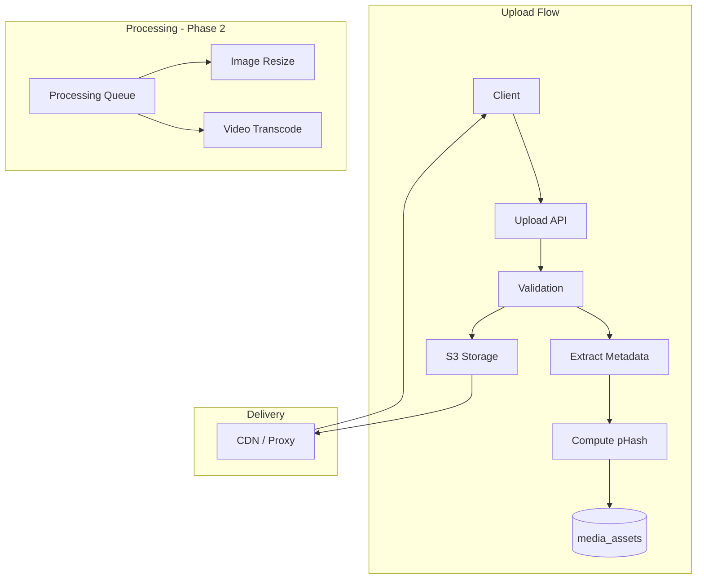
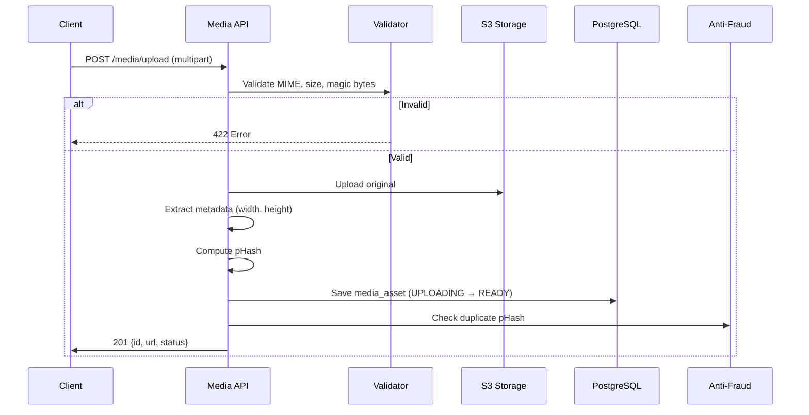

# ЛУЧИ — Media Module

**Версия:** 1.0.0  
**Дата:** 2026-08-07  

---

## 1. Overview

Media модуль управляет загрузкой, хранением, обработкой и доставкой медиафайлов (фото, видео). Критически важен для доказательств добрых дел и anti-fraud (pHash).

---

## 2. Architecture



---

## 3. Supported Formats

| Type | Formats | Max Size | Max Dimensions |
|------|---------|----------|----------------|
| Image | JPEG, PNG, WebP, HEIC | 10 MB | 4096×4096 |
| Video (Phase 2) | MP4, WebM | 100 MB | 1080p |
| Document | PDF | 5 MB | — |

---

## 4. Upload Flow



---

## 5. Storage Structure

```
s3://luchi-media/
├── originals/
│   └── {user_id}/{year}/{month}/{media_id}.{ext}
├── thumbnails/          # Phase 2
│   └── {media_id}_thumb.{ext}
├── variants/            # Phase 2
│   └── {media_id}_{size}.{ext}
└── temp/
    └── {upload_id}      # Multipart uploads
```

---

## 6. Perceptual Hash (pHash)

Used by Anti-Fraud for duplicate photo detection.

```
1. Resize image to 32×32 grayscale
2. Apply DCT (Discrete Cosine Transform)
3. Compute median of DCT coefficients
4. Generate 64-bit hash (each bit: coeff > median)
5. Store as hex string in media_assets.phash
```

Comparison: Hamming distance < 5 → duplicate.

---

## 7. Module Structure

```
modules/media/
├── domain/
│   ├── entities/
│   │   └── media-asset.entity.ts
│   └── repositories/
│       └── media.repository.interface.ts
├── application/
│   ├── commands/
│   │   └── upload-media.command.ts
│   └── queries/
│       └── get-media.query.ts
├── infrastructure/
│   ├── storage/
│   │   └── s3-storage.service.ts
│   ├── processing/
│   │   ├── phash.service.ts
│   │   └── metadata-extractor.service.ts
│   └── repositories/
└── presentation/
    └── controllers/
        └── media.controller.ts
```

---

## 8. Security

| Control | Implementation |
|---------|---------------|
| MIME validation | Magic bytes check, not just extension |
| Size limit | 10 MB images, enforced server-side |
| Virus scan | ClamAV integration (Phase 2) |
| Access control | Media linked to uploader, access via signed URLs |
| EXIF stripping | Remove GPS, camera info on upload (privacy) |
| Content-Type header | Correct MIME on delivery |

---

## 9. Business Rules

1. Upload requires authentication
2. Max 10 uploads per minute per user
3. EXIF metadata stripped (except dimensions)
4. pHash computed on every image upload
5. Deleted media: soft delete, S3 cleanup after 30 days
6. Media not directly accessible — served through API/CDN proxy
7. Only READY status media can be attached to posts/submissions

---

## 10. Error Codes

| Code | HTTP | Description |
|------|------|-------------|
| FILE_TOO_LARGE | 422 | Exceeds size limit |
| INVALID_FORMAT | 422 | Unsupported file type |
| UPLOAD_FAILED | 500 | S3 upload error |
| MEDIA_NOT_FOUND | 404 | Media ID not found |
| MEDIA_NOT_READY | 422 | Still processing |

---

## 11. Unit Tests

| Test | Description |
|------|-------------|
| Valid image upload | Saved with metadata + pHash |
| Invalid MIME rejected | 422 returned |
| Oversized file rejected | 422 returned |
| pHash computation | Consistent hash for same image |
| EXIF stripped | No GPS in stored file |

---

## 12. Связанные документы

- [ANTI_FRAUD.md](./ANTI_FRAUD.md)
- [API.md](./API.md)
- [DATABASE.md](./DATABASE.md)
