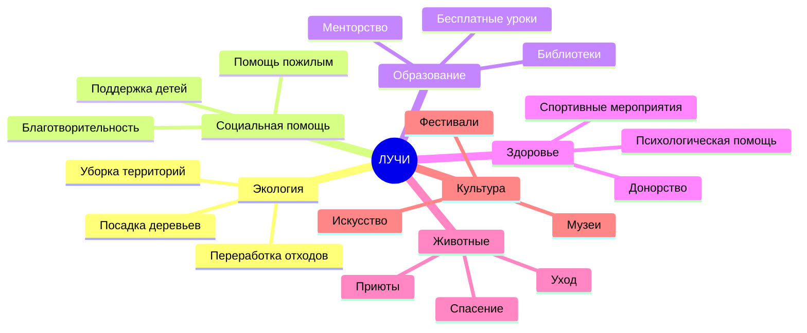
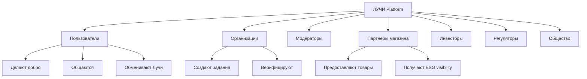

# ЛУЧИ — Mission Document

**Версия:** 1.0.0  
**Дата:** 2026-08-07  

---

## 1. Миссия

> **Мотивировать миллионы людей делать добро, создавая прозрачную экосистему, где каждое подтверждённое полезное действие получает признание, измеримую ценность и реальное вознаграждение.**

---

## 2. Стратегические цели

### 2.1 Продуктовые цели

| # | Цель | KPI | Срок |
|---|------|-----|------|
| G1 | Запуск MVP с полным циклом «дело → верификация → Лучи» | 1000 verified deeds | Q4 2026 |
| G2 | Живая социальная лента с engagement | DAU 10K | Q1 2027 |
| G3 | Магазин с 100+ товарами-партнёрами | 5000 redemptions/month | Q2 2027 |
| G4 | 50+ верифицированных организаций | 50 orgs | Q4 2026 |
| G5 | Fraud rate < 0.5% | < 0.5% rejected | Ongoing |

### 2.2 Технические цели

| # | Цель | KPI |
|---|------|-----|
| T1 | Uptime 99.9% | SLA |
| T2 | API p99 latency < 200ms | Monitoring |
| T3 | Ledger consistency 100% | Zero discrepancies |
| T4 | Security audit pass | OWASP + pentest |
| T5 | Horizontal scale to 1M users | Load test |

### 2.3 Социальные цели

- Увеличить участие в волонтёрстве на 30% среди активных пользователей
- Создать прозрачный рейтинг социального вклада
- Объединить 500+ организаций на одной платформе
- Снизить барьер входа в добрые дела через gamification

---

## 3. Целевые направления добрых дел



---

## 4. Принципы платформы

### 4.1 Этические принципы

1. **No Pay-to-Win** — нельзя купить Лучи за деньги (только за дела)
2. **Transparency** — любой пользователь может проследить историю начислений
3. **Fair Verification** — многоуровневая проверка без предвзятости
4. **Privacy Respect** — минимальный сбор данных, GDPR compliance
5. **Inclusive Design** — доступность для людей с ограниченными возможностями

### 4.2 Бизнес-принципы

1. **Freemium для пользователей** — базовый функционал бесплатен
2. **B2B для организаций** — подписка на расширенные инструменты
3. **Marketplace commission** — % от обмена в магазине
4. **ESG partnerships** — корпоративные программы
5. **No ads in feed** — монетизация не через рекламу в ленте

---

## 5. Модель ценности «Лучи»

```
Пользователь выполняет доброе дело
         │
         ▼
   Загружает доказательства (фото/видео/GPS)
         │
         ▼
   Модератор / AI проверяет
         │
         ▼
   Reward Engine начисляет Лучи (Ledger Entry)
         │
         ├──► Социальный профиль (рейтинг, достижения)
         ├──► Магазин (товары, сертификаты)
         ├──► Передача другим пользователям
         └──► (Future) Обмен на деньги / сертификаты
```

### Правила начисления (базовые)

| Категория | Базовые Лучи | Модификаторы |
|-----------|--------------|--------------|
| Экология (уборка) | 10–50 | +GPS, +до/после фото |
| Волонтёрство (мероприятие) | 20–100 | +часы, +организация |
| Социальная помощь | 15–80 | +верификация получателя |
| Образование | 10–60 | +отзыв ученика |
| Разовое доброе дело | 5–30 | +уникальность |

*Точные значения конфигурируются в Admin Panel через Reward Engine.*

---

## 6. Отличие от конкурентов

| Аспект | Типичная соцсеть | Типичное volunteer app | ЛУЧИ |
|--------|------------------|------------------------|------|
| Мотивация | Лайки | Часы/сертификат | Лучи + соцсеть |
| Верификация | Нет | Ручная | AI + модератор |
| Валюта | Нет | Нет | Double-entry ledger |
| Антифрод | Нет | Минимальный | Полноценный модуль |
| Масштаб | Глобальный | Локальный | Глобальный (цель) |

---

## 7. Заинтересованные стороны (Stakeholders)



---

## 8. Ограничения и допущения

### Ограничения
- MVP только web (mobile — Phase 2)
- Начальный рынок — РФ/СНГ
- Обмен на деньги — только архитектурная подготовка (регуляторика)
- AI-модерация — assistive, финальное решение за человеком (MVP)

### Допущения
- Пользователи готовы загружать фото/видео доказательств
- Организации заинтересованы в цифровом учёте волонтёров
- Партнёры магазина готовы принимать «бонусные баллы»
- Инфраструктура cloud (AWS/GCP/Yandex Cloud)

---

## 9. Связанные документы

- [VISION.md](./VISION.md)
- [PROJECT_SCOPE.md](./PROJECT_SCOPE.md)
- [REWARD_ENGINE.md](./REWARD_ENGINE.md)
- [ROADMAP.md](./ROADMAP.md)
