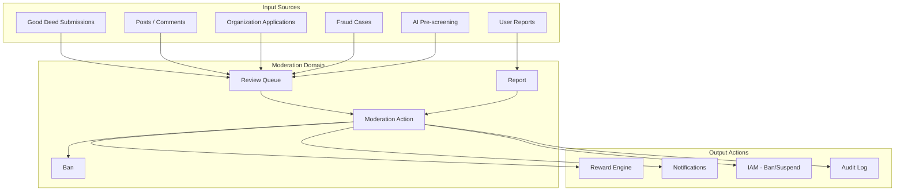
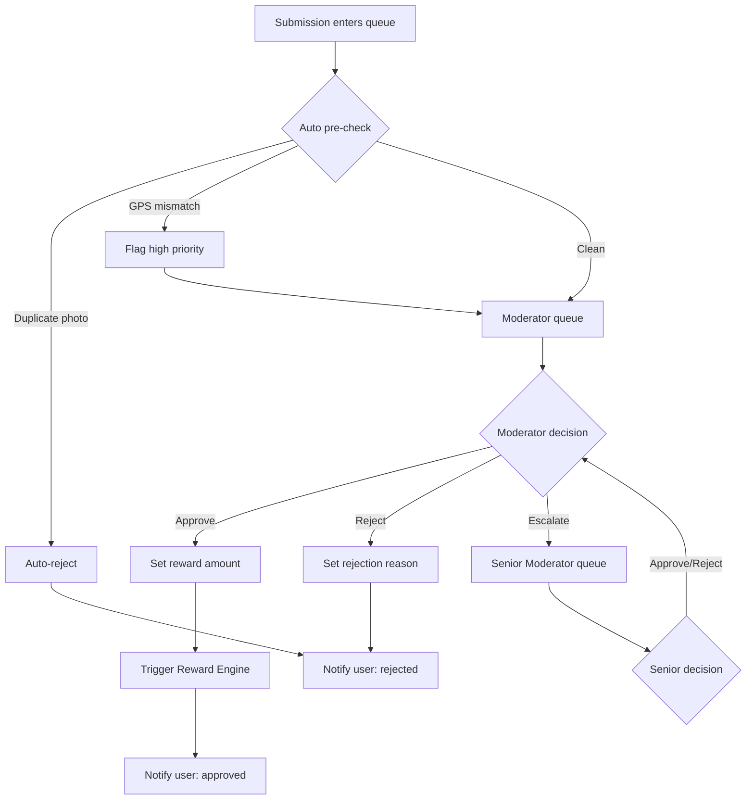
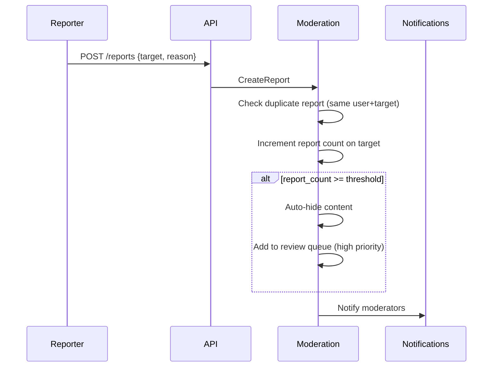

# ЛУЧИ — Moderation Module

**Версия:** 1.0.0  
**Дата:** 2026-08-07  

---

## 1. Overview

Moderation модуль обеспечивает многоуровневую проверку контента и добрых дел. Ядро платформы — верификация добрых дел перед начислением Лучей. Модерация также обрабатывает жалобы, блокировки и эскалации.

---

## 2. Architecture



---

## 3. Review Queue

### Queue Item Types

| Type | Source | Priority |
|------|--------|----------|
| `DEED_SUBMISSION` | User submits proof | High (default) |
| `POST` | AI flags / user report | Medium |
| `COMMENT` | AI flags / user report | Medium |
| `ORGANIZATION` | Org registration | High |
| `REPORT` | User report escalation | High |

### Priority Calculation

```
priority = base_priority + urgency_bonus + report_count_bonus

DEED_SUBMISSION: base = 10
ORGANIZATION: base = 15
POST (reported): base = 5 + (reports × 3)
COMMENT (reported): base = 3 + (reports × 2)
```

---

## 4. Good Deed Review Flow



---

## 5. Report System

### Report Reasons

| Reason | Code | Auto-action |
|--------|------|-------------|
| Spam | `SPAM` | Hide after 3 reports |
| Harassment | `HARASSMENT` | Priority queue |
| Fake deed | `FAKE_DEED` | Priority queue |
| Inappropriate content | `INAPPROPRIATE` | Standard queue |
| Fraud | `FRAUD` | Priority + fraud module |
| Impersonation | `IMPERSONATION` | Priority queue |
| Other | `OTHER` | Standard queue |

### Report Flow



---

## 6. Ban System

### Ban Types

| Type | Duration | Effect |
|------|----------|--------|
| `TEMPORARY` | Configurable (1h – 30d) | Cannot login/interact |
| `PERMANENT` | Indefinite | Account disabled |

### Ban Effects

- All sessions revoked immediately
- Posts/comments hidden
- Cannot earn or transfer Rays
- Cannot submit deeds
- Profile shows "Account suspended"
- Existing balance frozen (not forfeited unless permanent + policy)

---

## 7. Moderator Panel Features

| Feature | Description |
|---------|-------------|
| Review Queue | Filterable list with priority sorting |
| Submission Detail | Photos, GPS, task info, user history |
| Quick Actions | Approve / Reject / Escalate |
| User History | Past submissions, approval rate, fraud signals |
| Report Management | View, investigate, resolve reports |
| Ban Management | Create/remove bans with reason |
| Statistics | Reviews/day, avg time, approval rate |

---

## 8. Module Structure

```
modules/moderation/
├── domain/
│   ├── entities/
│   │   ├── review-queue-item.entity.ts
│   │   ├── report.entity.ts
│   │   ├── ban.entity.ts
│   │   └── moderation-action.entity.ts
│   ├── events/
│   │   ├── deed-approved.event.ts
│   │   ├── deed-rejected.event.ts
│   │   ├── user-banned.event.ts
│   │   └── report-created.event.ts
│   └── repositories/
├── application/
│   ├── commands/
│   │   ├── approve-submission.command.ts
│   │   ├── reject-submission.command.ts
│   │   ├── create-report.command.ts
│   │   ├── ban-user.command.ts
│   │   └── resolve-report.command.ts
│   └── queries/
│       ├── get-review-queue.query.ts
│       └── get-reports.query.ts
├── infrastructure/
└── presentation/
    └── controllers/
        ├── moderation.controller.ts
        └── reports.controller.ts
```

---

## 9. Business Rules

1. Every deed submission must be reviewed before Rays credited
2. Moderator cannot review own submissions
3. Rejection must include reason code
4. Escalation required for rewards > 100 Rays
5. Auto-reject on duplicate photo (pHash match > 95%)
6. 3+ reports on same content → auto-hide + priority review
7. Ban requires reason text (min 10 chars)
8. Temporary ban auto-expires (cron job)
9. All moderation actions logged in audit_log
10. Senior moderator can override regular moderator decisions

---

## 10. Error Codes

| Code | HTTP | Description |
|------|------|-------------|
| SUBMISSION_NOT_FOUND | 404 | Submission not in queue |
| ALREADY_REVIEWED | 409 | Submission already processed |
| SELF_REVIEW | 403 | Cannot review own submission |
| INVALID_REWARD_AMOUNT | 422 | Amount outside task range |
| REPORT_DUPLICATE | 409 | Already reported this target |
| BAN_NOT_FOUND | 404 | Ban record not found |

---

## 11. Edge Cases

| Case | Handling |
|------|----------|
| Two moderators review same item | First wins, second gets 409 |
| Approve then fraud detected | Rollback via Reward Engine |
| Ban user with pending submissions | Submissions auto-rejected |
| Org verification rejected | Org status = REJECTED, notify owner |
| Report on already-deleted content | Accept report, mark resolved |

---

## 12. Unit Tests

| Test | Description |
|------|-------------|
| Approve submission | Status updated, event emitted |
| Reject submission | Reason saved, no reward |
| Escalation | Moved to senior queue |
| Auto-hide on reports | Content hidden after threshold |
| Ban creation | User status updated, sessions revoked |
| Self-review blocked | 403 returned |

---

## 13. Integration Tests

| Test | Description |
|------|-------------|
| Full review flow | Submit → queue → approve → Rays credited |
| Report → review → ban | Report → investigate → ban user |
| Rejection flow | Submit → reject → user notified |

---

## 14. Связанные документы

- [REWARD_ENGINE.md](./REWARD_ENGINE.md)
- [ANTI_FRAUD.md](./ANTI_FRAUD.md)
- [AI.md](./AI.md)
- [ADMIN_PANEL.md](./ADMIN_PANEL.md)
- [RBAC.md](./RBAC.md)
