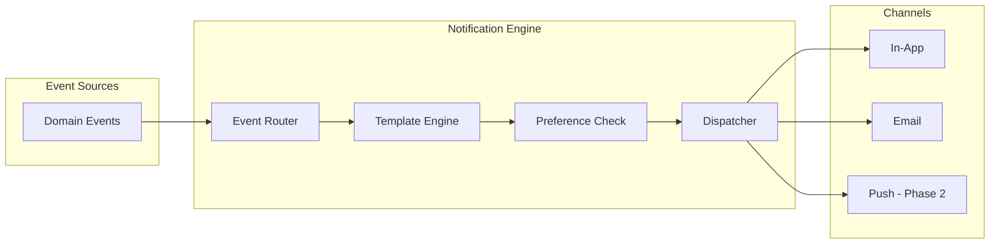
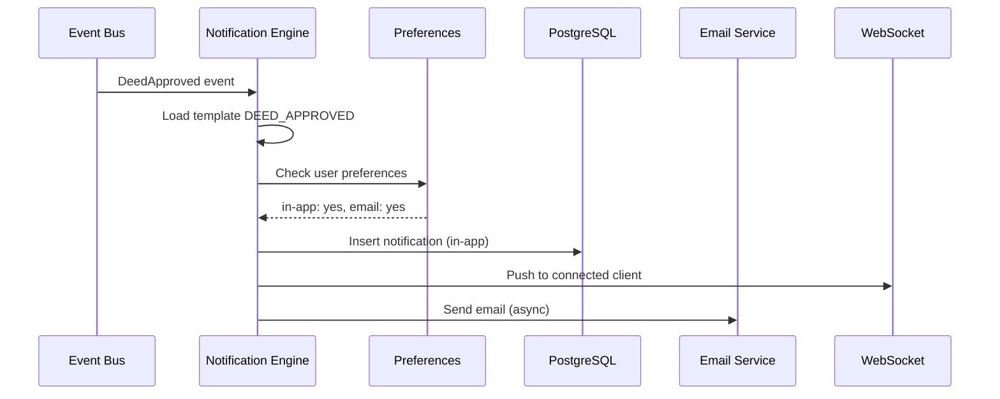

# ЛУЧИ — Notifications Module

**Версия:** 1.0.0  
**Дата:** 2026-08-07  

---

## 1. Overview

Notifications модуль доставляет уведомления пользователям через in-app, email (MVP) и push (Phase 2) каналы. Реагирует на domain events.

---

## 2. Architecture



---

## 3. Notification Types

| Type | Trigger | Channels | Priority |
|------|---------|----------|----------|
| `DEED_APPROVED` | DeedApproved event | in-app, email | High |
| `DEED_REJECTED` | DeedRejected event | in-app, email | High |
| `RAYS_RECEIVED` | RaysCredited/Transferred | in-app | Medium |
| `RAYS_TRANSFERRED` | RaysTransferred (sender) | in-app | Medium |
| `FRIEND_REQUEST` | FriendRequestSent | in-app | Medium |
| `FRIEND_ACCEPTED` | FriendRequestAccepted | in-app | Low |
| `NEW_FOLLOWER` | FollowCreated | in-app | Low |
| `POST_REACTION` | ReactionAdded | in-app | Low |
| `POST_COMMENT` | CommentCreated | in-app | Medium |
| `NEW_MESSAGE` | MessageSent | in-app, push | High |
| `ORDER_CONFIRMED` | OrderPaid | in-app, email | High |
| `ORDER_SHIPPED` | OrderShipped | in-app, email | Medium |
| `ACCOUNT_WARNING` | UserWarned | in-app, email | Critical |
| `ACCOUNT_BANNED` | UserBanned | email | Critical |
| `SYSTEM_ANNOUNCEMENT` | Admin broadcast | in-app, email | Variable |

---

## 4. Notification Flow



---

## 5. User Preferences

```json
{
  "DEED_APPROVED": { "in_app": true, "email": true, "push": true },
  "POST_REACTION": { "in_app": true, "email": false, "push": false },
  "NEW_FOLLOWER": { "in_app": true, "email": false, "push": false },
  "NEW_MESSAGE": { "in_app": true, "email": true, "push": true }
}
```

Default: all in-app enabled, email only for critical events.

---

## 6. Module Structure

```
modules/notifications/
├── domain/
│   ├── entities/
│   │   ├── notification.entity.ts
│   │   └── notification-preference.entity.ts
│   └── events/
├── application/
│   ├── services/
│   │   ├── notification-dispatcher.service.ts
│   │   └── template.service.ts
│   ├── handlers/
│   │   ├── on-deed-approved.handler.ts
│   │   ├── on-rays-credited.handler.ts
│   │   └── on-message-sent.handler.ts
│   └── queries/
│       └── get-notifications.query.ts
├── infrastructure/
│   ├── email/
│   │   └── email.service.ts
│   └── repositories/
└── presentation/
    └── controllers/
        └── notifications.controller.ts
```

---

## 7. API Endpoints

| Method | Endpoint | Description |
|--------|----------|-------------|
| GET | /notifications | List notifications (paginated) |
| GET | /notifications/unread-count | Unread count |
| POST | /notifications/:id/read | Mark as read |
| POST | /notifications/read-all | Mark all as read |
| GET | /notifications/preferences | Get preferences |
| PATCH | /notifications/preferences | Update preferences |

---

## 8. Email Templates

| Template | Subject |
|----------|---------|
| deed_approved | «Ваше доброе дело подтверждено! +{amount} Лучей» |
| deed_rejected | «Дело не прошло проверку» |
| order_confirmed | «Заказ #{order_id} оформлен» |
| password_reset | «Сброс пароля — ЛУЧИ» |
| welcome | «Добро пожаловать в ЛУЧИ!» |
| account_banned | «Ваш аккаунт заблокирован» |

---

## 9. Business Rules

1. Notifications stored indefinitely (user can clear)
2. Max 100 unread notifications displayed
3. Batch similar notifications (5 reactions → "5 people reacted")
4. Rate limit: max 50 notifications/user/hour
5. Critical notifications bypass preferences
6. Email sent async (queue)
7. Unsubscribe link in all emails
8. WebSocket delivery for online users

---

## 10. Edge Cases

| Case | Handling |
|------|----------|
| User offline | Store in DB, deliver on next login |
| Email bounce | Mark email invalid, disable email channel |
| Notification for deleted content | Show generic message |
| Self-action (like own post) | No notification |

---

## 11. Unit Tests

| Test | Description |
|------|-------------|
| Event → notification | Correct type and data |
| Preference filtering | Disabled channel skipped |
| Mark as read | is_read updated |
| Unread count | Correct count |
| Batch grouping | Similar notifications grouped |

---

## 12. Связанные документы

- [API.md](./API.md)
- [DATABASE.md](./DATABASE.md)
- [CHAT.md](./CHAT.md)
