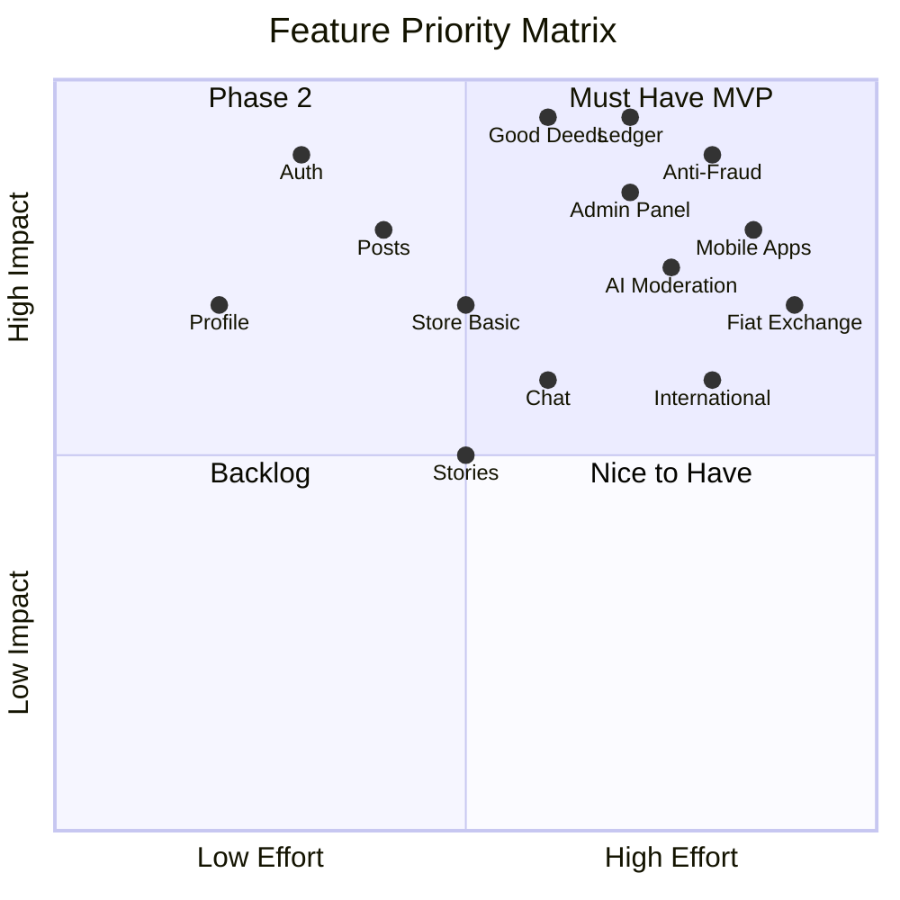

# ЛУЧИ — Project Scope

**Версия:** 1.0.0  
**Дата:** 2026-08-07  

---

## 1. Обзор

Документ определяет границы проекта ЛУЧИ: что входит в MVP, что в Phase 2+, и что явно исключено.

---

## 2. Scope Matrix

---

## 3. MVP Scope (Phase 1 — Q4 2026)

### 3.1 In Scope ✅

#### Identity & Access
- [x] Регистрация (email + password)
- [x] Авторизация (JWT + refresh rotation)
- [x] OAuth2 (Google, VK) — optional MVP
- [x] Профиль пользователя (CRUD)
- [x] RBAC (базовые роли: Guest, User, Verified User, Moderator, Admin)

#### Social Core
- [x] Посты (текст + фото)
- [x] Комментарии
- [x] Лайки / реакции
- [x] Друзья / подписчики / подписки
- [x] Лента (feed algorithm — chronological MVP)

#### Good Deeds
- [x] Категории добрых дел
- [x] Создание заданий (организация + платформа)
- [x] Выполнение задания (upload proof)
- [x] Верификация модератором
- [x] Волонтёрские мероприятия (CRUD)
- [x] Организации (регистрация + верификация)

#### Rays (Ledger)
- [x] Double-entry ledger
- [x] Начисление Лучей (reward)
- [x] Списание Лучей (store purchase)
- [x] Передача Лучей (P2P transfer)
- [x] История операций
- [x] Idempotency + rollback

#### Store
- [x] Каталог товаров
- [x] Покупка за Лучи
- [x] История покупок

#### Moderation
- [x] Очередь модерации
- [x] Approve / Reject good deeds
- [x] Жалобы (reports)
- [x] Блокировки пользователей

#### Admin
- [x] Dashboard (базовая статистика)
- [x] Управление пользователями
- [x] Управление организациями
- [x] Управление товарами
- [x] Просмотр транзакций
- [x] Система ролей

#### Infrastructure
- [x] REST API
- [x] PostgreSQL
- [x] Redis (cache + sessions)
- [x] S3-compatible storage (media)
- [x] Event bus (in-process MVP → Kafka Phase 2)
- [x] Audit log
- [x] Rate limiting
- [x] Demo database seed

#### Security
- [x] OWASP Top 10 compliance
- [x] Argon2id passwords
- [x] JWT + HttpOnly cookies
- [x] CSRF protection
- [x] Input validation
- [x] Audit logging

#### Anti-Fraud (Basic)
- [x] IP limiting
- [x] Device fingerprinting
- [x] Duplicate photo detection (hash)
- [x] Rate limits on transfers
- [x] Anomaly detection (rule-based)

#### Notifications
- [x] In-app notifications
- [x] Email notifications (critical events)

#### Search
- [x] Basic search (users, posts, organizations)

#### Analytics
- [x] Basic metrics (DAU, registrations, deeds, rays)

---

### 3.2 Out of Scope MVP ❌

| Feature | Phase | Reason |
|---------|-------|--------|
| Stories | Phase 2 | Not critical for core loop |
| Group chats | Phase 2 | 1:1 chat sufficient for MVP |
| Video upload/processing | Phase 2 | Photo sufficient for proof |
| Fiat/money exchange | Phase 3 | Regulatory |
| Mobile native apps | Phase 2 | Web-first PWA |
| AI auto-moderation | Phase 2 | Human moderation MVP |
| Advanced feed algorithm | Phase 2 | Chronological sufficient |
| Push notifications | Phase 2 | Email + in-app MVP |
| Elasticsearch | Phase 2 | PostgreSQL full-text MVP |
| Multi-language | Phase 3 | RU only MVP |
| Blockchain/NFT | Never | Not aligned with mission |

---

## 4. Phase 2 Scope (Q1–Q2 2027)

- Stories (24h ephemeral content)
- Group chats + channels
- Video upload + transcoding
- Push notifications (FCM/APNs)
- Advanced feed algorithm (ML ranking)
- Achievements + levels system
- Elasticsearch full-text search
- AI-assisted moderation (pre-screen)
- Extended anti-fraud (ML models)
- PWA mobile optimization
- OAuth2 providers expansion
- Real-time chat (WebSocket)

---

## 5. Phase 3 Scope (2028)

- Native mobile apps (iOS/Android)
- Fiat bridge architecture (legal review)
- Certificate exchange in store
- International localization (EN)
- Microservices decomposition
- Kafka event streaming
- CQRS for ledger reads
- Government API integrations
- Corporate ESG dashboard

---

## 6. Functional Requirements Summary

### 6.1 User Stories (MVP — top 20)

| ID | As a... | I want to... | So that... | Priority |
|----|---------|--------------|------------|----------|
| US-001 | User | Register with email | I can join the platform | P0 |
| US-002 | User | Complete my profile | Others can see my impact | P0 |
| US-003 | User | Browse good deed tasks | I can find ways to help | P0 |
| US-004 | User | Submit proof of good deed | I can earn Rays | P0 |
| US-005 | User | See my Ray balance/history | I know my rewards | P0 |
| US-006 | User | Transfer Rays to a friend | I can share rewards | P0 |
| US-007 | User | Buy items in store | I can spend my Rays | P0 |
| US-008 | User | Create posts about my deeds | I can inspire others | P0 |
| US-009 | User | Follow other users | I see their activity | P0 |
| US-010 | User | Comment and react | I can engage | P0 |
| US-011 | Org | Register as organization | I can create tasks | P0 |
| US-012 | Org | Create volunteer events | People can join | P0 |
| US-013 | Moderator | Review deed submissions | Only real deeds get Rays | P0 |
| US-014 | Moderator | Handle user reports | Platform stays safe | P0 |
| US-015 | Admin | View dashboard stats | I monitor platform health | P0 |
| US-016 | Admin | Manage users and roles | I control access | P0 |
| US-017 | User | Search users and orgs | I find people to connect | P1 |
| US-018 | User | Receive notifications | I stay informed | P1 |
| US-019 | User | Report inappropriate content | Platform stays safe | P1 |
| US-020 | User | Block another user | I control my experience | P1 |

---

## 7. Non-Functional Requirements

| Category | Requirement | Target |
|----------|-------------|--------|
| Performance | API response p95 | < 300ms |
| Performance | API response p99 | < 500ms |
| Performance | Feed load | < 1s |
| Scalability | Concurrent users | 10K MVP, 1M target |
| Availability | Uptime | 99.9% |
| Security | OWASP Top 10 | Full compliance |
| Security | Pentest | Before launch |
| Data | Backup RPO | < 1 hour |
| Data | Backup RTO | < 4 hours |
| Accessibility | WCAG | Level AA |
| i18n | Languages MVP | Russian |
| Browser support | Modern browsers | Last 2 versions |

---

## 8. Demo Database Requirements

| Entity | Count | Notes |
|--------|-------|-------|
| Users | ≥ 500 | Mixed roles |
| Posts | ≥ 2000 | With media refs |
| Stories | ≥ 100 | Phase 2 seed ready |
| Comments | ≥ 10000 | Nested threads |
| Organizations | ≥ 50 | Verified |
| Events | ≥ 150 | Past + upcoming |
| Tasks | ≥ 150 | All categories |
| Store items | ≥ 100 | Various prices |
| Ledger entries | ≥ 100000 | Realistic distribution |
| Friendships | ≥ 2000 | Bidirectional |
| Chats | ≥ 200 | With messages |
| Notifications | ≥ 5000 | Various types |
| Achievements | ≥ 30 | Templates |

---

## 9. Acceptance Criteria (MVP Launch)

1. ✅ User can register, login, complete profile
2. ✅ User can browse tasks, submit proof, receive Rays
3. ✅ Moderator can approve/reject submissions
4. ✅ User can transfer Rays and buy in store
5. ✅ Ledger balances always reconcile (zero discrepancies)
6. ✅ Admin panel fully functional
7. ✅ Anti-fraud blocks obvious abuse
8. ✅ Demo database seeded and looks live
9. ✅ Security audit passed
10. ✅ Load test: 1000 concurrent users stable

---

## 10. Dependencies

| Dependency | Type | Owner |
|------------|------|-------|
| Cloud provider | Infrastructure | DevOps |
| Domain + SSL | Infrastructure | DevOps |
| Email provider (SendGrid/SES) | External | DevOps |
| S3 storage | External | DevOps |
| OAuth apps (Google/VK) | External | Product |
| Legal review (bonus points model) | Legal | Business |

---

## 11. Risks to Scope

| Risk | Impact | Mitigation |
|------|--------|------------|
| Scope creep | Delay | Strict phase gates |
| Ledger complexity | Delay | Dedicated sprint 0 |
| Moderation bottleneck | UX | AI assist Phase 2 |
| Partner store items | Empty store | Seed + direct partnerships |

---

## 12. Связанные документы

- [VISION.md](./VISION.md)
- [ROADMAP.md](./ROADMAP.md)
- [ARCHITECTURE.md](./ARCHITECTURE.md)
- [TESTING.md](./TESTING.md)
