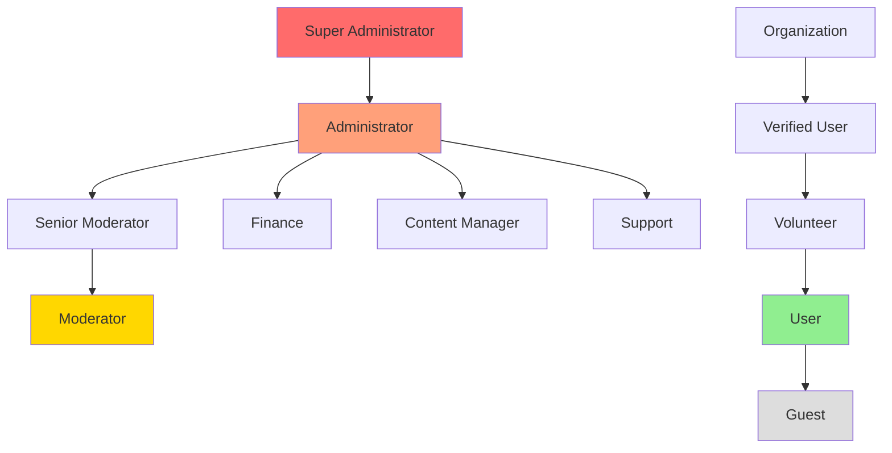
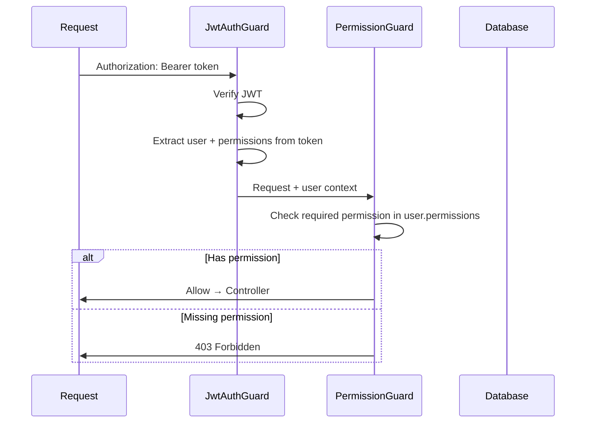
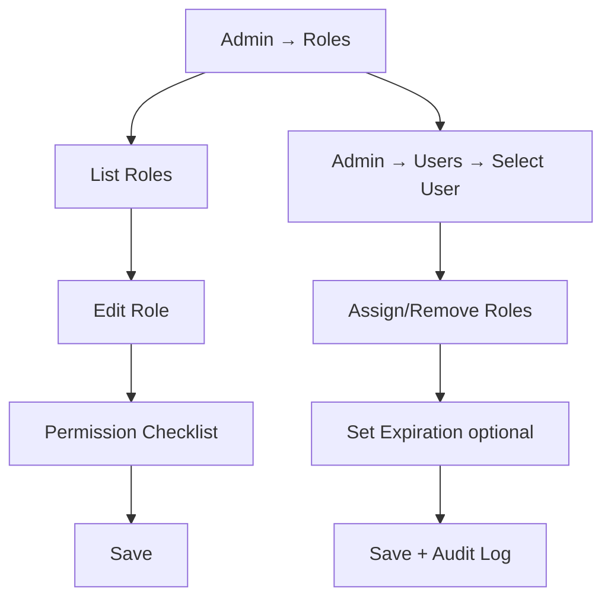

# ЛУЧИ — Role-Based Access Control (RBAC)

**Версия:** 1.0.0  
**Дата:** 2026-08-07  

---

## 1. Overview

RBAC система ЛУЧИ реализует Permission-Based Access Control (PBAC) поверх ролей. Каждая роль содержит набор permissions, каждый API endpoint защищён required permission.

**Принцип:** Least Privilege — пользователь получает минимально необходимые права.

---

## 2. Role Hierarchy



---

## 3. Roles Definition

| Role | Code | Description | Assignable By |
|------|------|-------------|---------------|
| Guest | `guest` | Unauthenticated visitor | System |
| User | `user` | Registered user | System (on register) |
| Verified User | `verified_user` | Email/identity verified | System (on verify) |
| Volunteer | `volunteer` | Active volunteer profile | User (self) / Admin |
| Organization | `organization` | Verified organization account | Admin |
| Moderator | `moderator` | Content/deed moderator | Admin |
| Senior Moderator | `senior_moderator` | Senior mod + escalation | Admin |
| Support | `support` | Customer support | Admin |
| Finance | `finance` | Financial operations | Super Admin |
| Content Manager | `content_manager` | Content curation | Admin |
| Administrator | `administrator` | Full admin except system | Super Admin |
| Super Administrator | `super_administrator` | Unrestricted access | Manual only |

---

## 4. Permissions Catalog

### 4.1 IAM Permissions

| Permission | Description | Roles |
|------------|-------------|-------|
| `user:read` | View user profiles | user+ |
| `user:update:own` | Edit own profile | user+ |
| `user:update:any` | Edit any profile | admin+ |
| `user:delete:own` | Delete own account | user+ |
| `user:ban` | Ban users | moderator+, admin+ |
| `role:assign` | Assign roles to users | admin+ |
| `role:manage` | Create/edit roles | super_admin |

### 4.2 Social Permissions

| Permission | Description | Roles |
|------------|-------------|-------|
| `post:create` | Create posts | verified_user+ |
| `post:update:own` | Edit own posts | user+ |
| `post:delete:own` | Delete own posts | user+ |
| `post:delete:any` | Delete any post | moderator+ |
| `post:hide` | Hide posts | moderator+ |
| `comment:create` | Create comments | verified_user+ |
| `comment:delete:any` | Delete any comment | moderator+ |
| `reaction:create` | Add reactions | user+ |
| `friend:manage` | Friend requests | user+ |
| `follow:manage` | Follow/unfollow | user+ |
| `story:create` | Create stories | verified_user+ |

### 4.3 Good Deeds Permissions

| Permission | Description | Roles |
|------------|-------------|-------|
| `deed:submit` | Submit good deed proof | verified_user+ |
| `deed:view` | View tasks and submissions | user+ |
| `task:create` | Create tasks | organization+, admin+ |
| `task:update:own` | Edit own org tasks | organization+ |
| `task:delete:own` | Cancel own tasks | organization+ |
| `event:create` | Create events | organization+ |
| `event:manage` | Manage event participants | organization+ |
| `org:register` | Register organization | user+ |
| `org:verify` | Verify organizations | admin+ |
| `org:manage` | Manage any organization | admin+ |

### 4.4 Ledger Permissions

| Permission | Description | Roles |
|------------|-------------|-------|
| `rays:view:own` | View own balance/history | user+ |
| `rays:view:any` | View any user's balance | finance+, admin+ |
| `rays:transfer` | Transfer Rays to others | verified_user+ |
| `rays:credit` | Manual credit (admin) | finance+, super_admin |
| `rays:debit` | Manual debit (admin) | finance+, super_admin |
| `rays:rollback` | Rollback transaction | finance+, super_admin |
| `transaction:view:all` | View all transactions | finance+, admin+ |

### 4.5 Store Permissions

| Permission | Description | Roles |
|------------|-------------|-------|
| `store:browse` | Browse products | user+ |
| `store:purchase` | Purchase products | verified_user+ |
| `product:create` | Add products | content_manager+, admin+ |
| `product:update` | Edit products | content_manager+, admin+ |
| `product:delete` | Remove products | admin+ |
| `order:view:own` | View own orders | user+ |
| `order:view:all` | View all orders | support+, admin+ |
| `order:manage` | Update order status | support+, admin+ |

### 4.6 Chat Permissions

| Permission | Description | Roles |
|------------|-------------|-------|
| `chat:send` | Send messages | verified_user+ |
| `chat:create_group` | Create group chats | verified_user+ |
| `chat:moderate` | Delete messages in groups | moderator+ |
| `chat:view:any` | View any conversation | support+ (with audit) |

### 4.7 Moderation Permissions

| Permission | Description | Roles |
|------------|-------------|-------|
| `moderation:review` | Review queue items | moderator+ |
| `moderation:approve` | Approve submissions | moderator+ |
| `moderation:reject` | Reject submissions | moderator+ |
| `moderation:escalate` | Escalate to senior | moderator+ |
| `moderation:resolve_escalation` | Resolve escalations | senior_moderator+ |
| `report:view` | View reports | moderator+ |
| `report:resolve` | Resolve reports | moderator+ |
| `ban:create` | Ban users | moderator+ |
| `ban:remove` | Unban users | senior_moderator+, admin+ |

### 4.8 Admin Permissions

| Permission | Description | Roles |
|------------|-------------|-------|
| `admin:dashboard` | View admin dashboard | admin+ |
| `admin:settings` | Manage platform settings | admin+ |
| `admin:audit_log` | View audit log | admin+ |
| `admin:analytics` | View full analytics | admin+ |
| `admin:system` | System-level operations | super_admin |

### 4.9 Anti-Fraud Permissions

| Permission | Description | Roles |
|------------|-------------|-------|
| `fraud:view` | View fraud signals/cases | moderator+, admin+ |
| `fraud:investigate` | Investigate cases | senior_moderator+, admin+ |
| `fraud:resolve` | Resolve fraud cases | admin+ |

---

## 5. Role → Permissions Matrix

```
┌──────────────────────┬───────┬──────┬────────┬───────┬──────┬──────┬───────┬───────┐
│ Permission           │ Guest │ User │ Verif. │ Volun.│ Org  │ Mod  │ Admin │ S.Admin│
├──────────────────────┼───────┼──────┼────────┼───────┼──────┼──────┼───────┼───────┤
│ user:read            │   ✓   │  ✓   │   ✓    │   ✓   │  ✓   │  ✓   │   ✓   │   ✓   │
│ post:create          │       │      │   ✓    │   ✓   │  ✓   │  ✓   │   ✓   │   ✓   │
│ deed:submit          │       │      │   ✓    │   ✓   │      │      │       │   ✓   │
│ rays:transfer        │       │      │   ✓    │   ✓   │      │      │       │   ✓   │
│ store:purchase       │       │      │   ✓    │   ✓   │      │      │       │   ✓   │
│ task:create          │       │      │        │       │  ✓   │      │   ✓   │   ✓   │
│ moderation:review    │       │      │        │       │      │  ✓   │   ✓   │   ✓   │
│ moderation:approve   │       │      │        │       │      │  ✓   │   ✓   │   ✓   │
│ rays:credit          │       │      │        │       │      │      │       │   ✓   │
│ admin:dashboard      │       │      │        │       │      │      │   ✓   │   ✓   │
│ admin:system         │       │      │        │       │      │      │       │   ✓   │
└──────────────────────┴───────┴──────┴────────┴───────┴──────┴──────┴───────┴───────┘
```

*Полная матрица хранится в БД (role_permissions). Таблица сокращена для читаемости.*

---

## 6. Implementation

### 6.1 Guard Decorator

```typescript
@RequirePermission('post:create')
@Post('/posts')
async createPost(@Body() dto: CreatePostDto) { ... }
```

### 6.2 Permission Check Flow



### 6.3 Resource Ownership Check

Beyond role permissions, resource-level checks:

```typescript
// User can edit own post OR has post:update:any permission
@RequirePermission('post:update:own')
@CheckOwnership('Post', 'authorId')
@Patch('/posts/:id')
async updatePost() { ... }
```

---

## 7. Role Assignment Rules

| Rule | Description |
|------|-------------|
| Default role | `user` on registration |
| Auto-upgrade | `verified_user` on email verification |
| Self-assign | `volunteer` (user opts in) |
| Admin assign | All other roles by admin+ |
| Super admin | Only manual DB / super_admin |
| Role expiration | Optional `expires_at` on user_roles |
| Multiple roles | User can have multiple roles simultaneously |
| Effective permissions | Union of all role permissions |

---

## 8. Permission Inheritance

Roles do NOT inherit from each other in code. Each role has explicit permission set. However, higher roles are configured with superset of lower role permissions during seeding.

```
super_administrator ⊃ administrator ⊃ senior_moderator ⊃ moderator
administrator ⊃ content_manager, support, finance (partial)
verified_user ⊃ user
volunteer ⊃ verified_user (same + volunteer badge)
organization ⊃ user (different permission set)
```

---

## 9. Dynamic Permissions

Some permissions are context-dependent:

| Permission | Context |
|------------|---------|
| `task:update:own` | User must be org owner of the task |
| `post:delete:own` | User must be post author |
| `chat:moderate` | User must be group admin |
| `event:manage` | User must be org member |

Checked via `@CheckOwnership()` decorator + domain service.

---

## 10. Admin Panel Role Management

### UI Flow



### API

```
GET    /admin/roles
POST   /admin/roles
PATCH  /admin/roles/:id
GET    /admin/roles/:id/permissions
PATCH  /admin/roles/:id/permissions
POST   /admin/users/:id/roles
DELETE /admin/users/:id/roles/:roleId
```

---

## 11. Seed Data (Default Roles & Permissions)

On first migration, seed:
- 12 roles (all defined above)
- ~80 permissions (all defined above)
- Role-permission mappings
- System account with `super_administrator` (disabled by default)

---

## 12. Business Rules

1. Cannot remove last super_administrator
2. Cannot assign role higher than own role
3. Role changes logged in audit_log
4. Banned users retain roles but cannot exercise permissions
5. Permission check happens on every request (no caching of permissions in MVP)
6. JWT contains permissions snapshot — refreshed on token refresh

---

## 13. Edge Cases

| Case | Handling |
|------|----------|
| Role removed while user active | Next request fails permission check |
| Permission added to role | Effective on next token refresh |
| User with org + moderator roles | Union of both permission sets |
| Expired role assignment | Treated as no role |
| Super admin demotes self | Blocked if last super admin |

---

## 14. Unit Tests

| Test | Description |
|------|-------------|
| Permission check pass | User with permission accesses endpoint |
| Permission check fail | User without permission gets 403 |
| Ownership check | User can edit own resource |
| Ownership fail | User cannot edit others' resource |
| Multiple roles | Permissions union correctly |
| Role expiration | Expired role not applied |
| Admin role assignment | Admin can assign lower roles |
| Admin role blocked | Admin cannot assign super_admin |

---

## 15. Связанные документы

- [AUTH.md](./AUTH.md)
- [SECURITY.md](./SECURITY.md)
- [ADMIN_PANEL.md](./ADMIN_PANEL.md)
- [API.md](./API.md)
