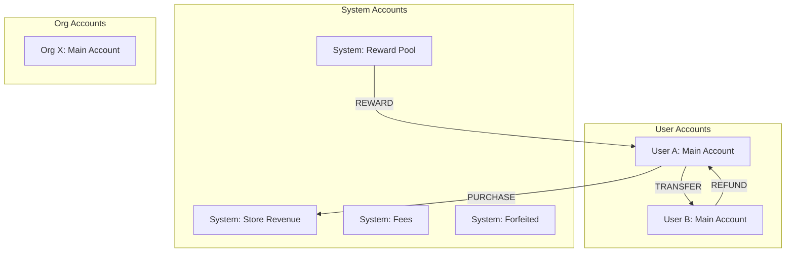
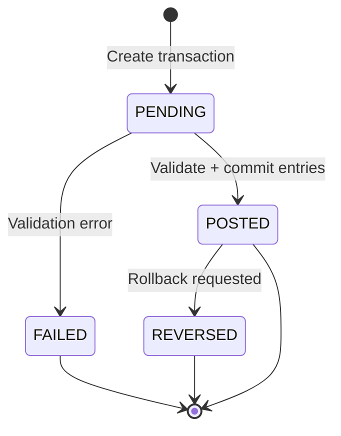
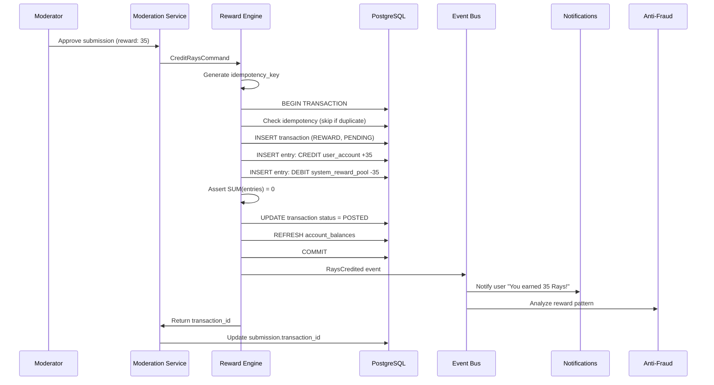
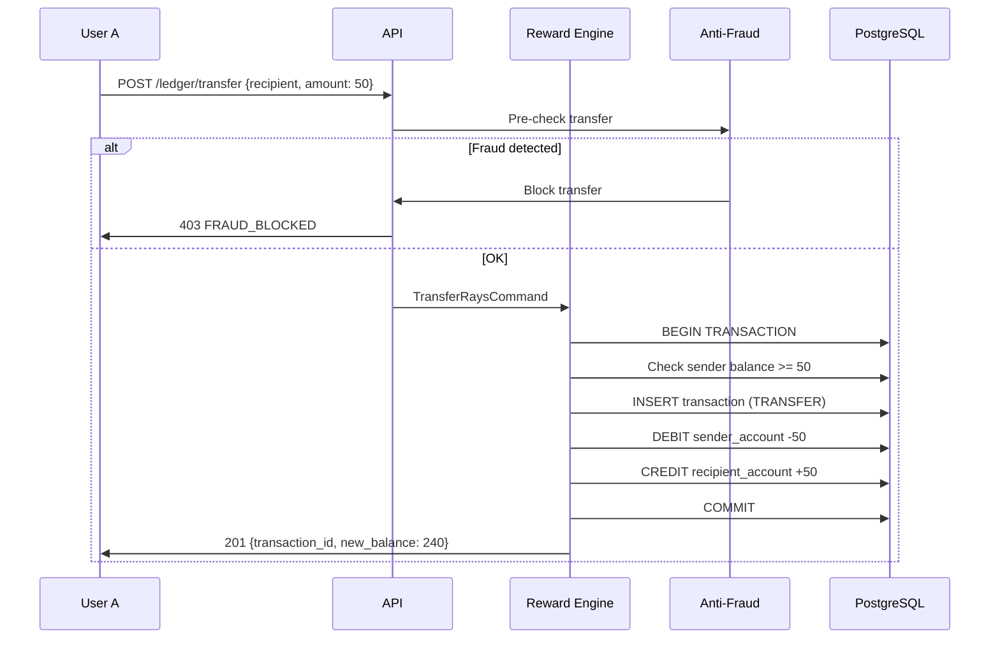
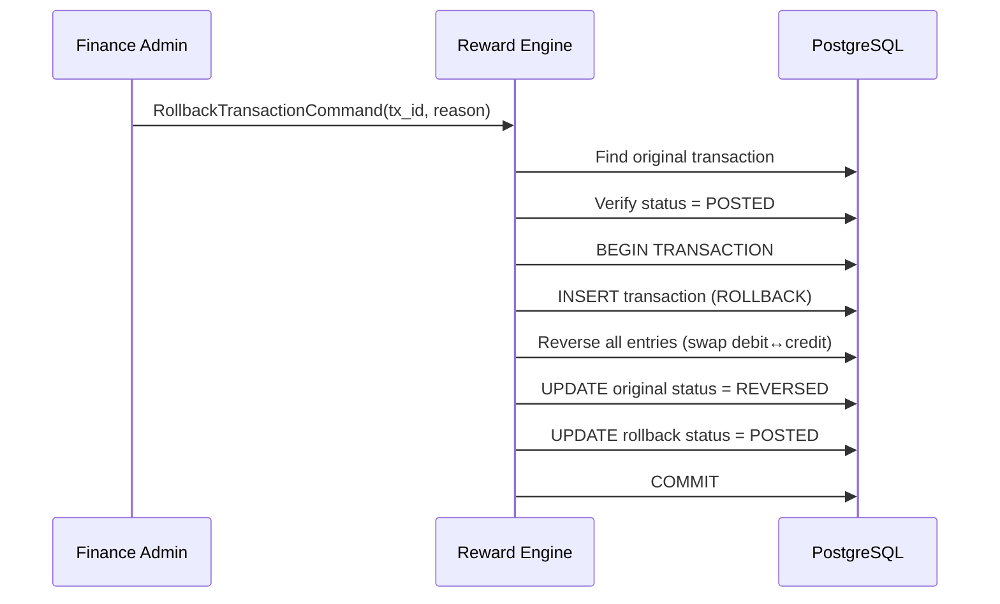

# ЛУЧИ — Reward Engine (Ledger & Rays)

**Версия:** 1.0.0  
**Дата:** 2026-08-07  

---

## 1. Overview

Reward Engine — ядро финансовой системы платформы. Управляет начислением, списанием и переводом «Лучей» через Double-Entry Ledger. Баланс **никогда** не хранится как изменяемое число.

---

## 2. Core Principles

| # | Principle | Implementation |
|---|-----------|---------------|
| 1 | Double-Entry | Every transaction: debit + credit, SUM = 0 |
| 2 | Immutable entries | Entries never updated, only reversed |
| 3 | Computed balance | balance = SUM(credits) - SUM(debits) |
| 4 | Idempotency | Duplicate requests rejected |
| 5 | Audit trail | Full history: who, when, why, how much |
| 6 | Rollback | Reverse transaction creates offsetting entries |
| 7 | ACID | All operations in database transactions |

---

## 3. Account Model



### Account Types

| Type | Owner | Purpose |
|------|-------|---------|
| `MAIN` | User / Organization | Primary balance account |
| `ESCROW` | System | Held funds (disputes, pending) |
| `SYSTEM` | Platform | Reward pool, revenue, fees |

---

## 4. Transaction Types

| Type | Direction | Description |
|------|-----------|-------------|
| `REWARD` | System → User | Good deed approved |
| `TRANSFER` | User → User | P2P Ray transfer |
| `PURCHASE` | User → System | Store purchase |
| `REFUND` | System → User | Order refund |
| `ADMIN_CREDIT` | System → User | Manual admin credit |
| `ADMIN_DEBIT` | User → System | Manual admin debit |
| `ROLLBACK` | Reverse | Reverse previous transaction |
| `FEE` | User → System | Platform fee |
| `EXCHANGE` | User → System | Exchange for certificate/money (Phase 3) |

---

## 5. Transaction Lifecycle



---

## 6. Reward Flow (Good Deed Approved)



---

## 7. Transfer Flow (P2P)



---

## 8. Rollback Flow



---

## 9. Reward Calculation Rules

### 9.1 Base Formula

```
final_reward = base_reward × category_multiplier × quality_multiplier × streak_bonus
```

### 9.2 Components

| Component | Source | Range |
|-----------|--------|-------|
| `base_reward` | Task definition (reward_min – reward_max) | 5–100 |
| `category_multiplier` | Category config | 0.8–1.5 |
| `quality_multiplier` | Moderator assessment | 0.5–1.5 |
| `streak_bonus` | Consecutive days with deeds | 1.0–1.3 |

### 9.3 Category Defaults

| Category | Base Range | Multiplier |
|----------|-----------|------------|
| Экология | 10–50 | 1.2 |
| Социальная помощь | 15–80 | 1.3 |
| Образование | 10–60 | 1.0 |
| Здоровье | 20–100 | 1.4 |
| Животные | 10–50 | 1.1 |
| Культура | 10–40 | 0.9 |

### 9.4 Quality Assessment (Moderator)

| Quality | Multiplier | Criteria |
|---------|-----------|----------|
| Exceptional | 1.5 | Extra effort, multiple proofs, impact |
| Good | 1.0 | Meets all requirements |
| Minimal | 0.7 | Barely meets requirements |
| Insufficient | 0 (reject) | Does not meet requirements |

### 9.5 Streak Bonus

| Streak Days | Bonus |
|-------------|-------|
| 3 | +5% |
| 7 | +10% |
| 14 | +15% |
| 30 | +30% |

---

## 10. Transfer Limits

| Limit | Value | Period |
|-------|-------|--------|
| Min transfer | 1 Ray | — |
| Max single transfer | 1000 Rays | — |
| Daily transfer limit | 5000 Rays | 24h |
| Daily transfer count | 20 | 24h |
| Min account age for transfer | 7 days | — |
| Min balance after transfer | 0 Rays | — |

*All limits configurable via Admin Panel settings.*

---

## 11. Idempotency

```typescript
interface IdempotencyRecord {
  key: string;           // Client-provided UUID
  requestHash: string;   // SHA-256 of request body
  responseStatus: number;
  responseBody: object;
  expiresAt: Date;       // 24 hours
}
```

**Flow:**
1. Client sends `Idempotency-Key` header
2. Server checks `shared.idempotency_keys`
3. If exists with same hash → return cached response
4. If exists with different hash → 422 Conflict
5. If not exists → process + store result

---

## 12. Balance Queries

### Get Balance (Read)

```sql
SELECT balance FROM ledger.account_balances WHERE account_id = $1;
```

### Get History (Read)

```sql
SELECT t.*, le.amount, le.entry_type
FROM ledger.transactions t
JOIN ledger.ledger_entries le ON le.transaction_id = t.id
WHERE le.account_id = $1
ORDER BY t.created_at DESC
LIMIT $2;
```

### Reconciliation (Admin)

```sql
-- Verify double-entry integrity
SELECT transaction_id, 
       SUM(CASE WHEN entry_type = 'DEBIT' THEN amount ELSE -amount END) AS net
FROM ledger.ledger_entries
WHERE status = 'POSTED'
GROUP BY transaction_id
HAVING SUM(CASE WHEN entry_type = 'DEBIT' THEN amount ELSE -amount END) != 0;
-- Must return 0 rows
```

---

## 13. Module Structure

```
modules/ledger/
├── domain/
│   ├── entities/
│   │   ├── account.entity.ts
│   │   ├── transaction.entity.ts
│   │   └── ledger-entry.entity.ts
│   ├── value-objects/
│   │   ├── money.vo.ts              // Positive integer, Rays
│   │   ├── transaction-id.vo.ts
│   │   ├── idempotency-key.vo.ts
│   │   └── account-id.vo.ts
│   ├── events/
│   │   ├── rays-credited.event.ts
│   │   ├── rays-debited.event.ts
│   │   ├── rays-transferred.event.ts
│   │   └── transaction-rolled-back.event.ts
│   ├── services/
│   │   └── ledger-domain.service.ts  // Double-entry validation
│   ├── repositories/
│   │   ├── account.repository.interface.ts
│   │   └── transaction.repository.interface.ts
│   └── exceptions/
│       ├── insufficient-balance.exception.ts
│       ├── duplicate-transaction.exception.ts
│       └── invalid-transaction.exception.ts
├── application/
│   ├── commands/
│   │   ├── credit-rays.command.ts
│   │   ├── debit-rays.command.ts
│   │   ├── transfer-rays.command.ts
│   │   └── rollback-transaction.command.ts
│   ├── queries/
│   │   ├── get-balance.query.ts
│   │   ├── get-transaction-history.query.ts
│   │   └── reconcile-ledger.query.ts
│   └── handlers/
│       ├── credit-rays.handler.ts
│       ├── transfer-rays.handler.ts
│       └── get-balance.handler.ts
├── infrastructure/
│   └── repositories/
│       ├── account.repository.ts
│       └── transaction.repository.ts
└── presentation/
    └── controllers/
        └── ledger.controller.ts
```

---

## 14. Business Rules

1. Every user gets a MAIN account on registration (auto)
2. Every organization gets a MAIN account on verification
3. System accounts created on platform init (seed)
4. Reward pool must have sufficient balance (monitored)
5. Cannot transfer to self
6. Cannot transfer to banned users
7. Cannot transfer more than balance
8. Rollback only by finance+ roles
9. Original transaction must be POSTED to rollback
10. Rollback creates new transaction, does not delete original

---

## 15. Error Codes

| Code | HTTP | Description |
|------|------|-------------|
| INSUFFICIENT_BALANCE | 422 | Not enough Rays |
| SELF_TRANSFER | 422 | Cannot transfer to yourself |
| RECIPIENT_NOT_FOUND | 404 | Recipient account not found |
| RECIPIENT_BANNED | 403 | Recipient is banned |
| TRANSFER_LIMIT_EXCEEDED | 429 | Daily/hourly limit reached |
| DUPLICATE_TRANSACTION | 409 | Idempotency key already used |
| TRANSACTION_NOT_FOUND | 404 | Transaction ID not found |
| TRANSACTION_NOT_REVERSIBLE | 422 | Already reversed or failed |
| ACCOUNT_FROZEN | 403 | Account is frozen |
| REWARD_POOL_EMPTY | 503 | System reward pool depleted |

---

## 16. Edge Cases

| Case | Handling |
|------|----------|
| Concurrent transfers draining balance | DB transaction + row lock on account |
| Reward during account freeze | Reject, queue for later |
| Rollback of transfer | Both parties affected (reverse entries) |
| User deleted with balance | Balance → system forfeit account |
| Reward pool empty | Alert admin, queue rewards |
| Duplicate deed approval | Idempotency on submission_id |
| Fractional Rays | Not supported, integer only |
| Negative amount | Rejected at validation |

---

## 17. Unit Tests

| Test | Description |
|------|-------------|
| Credit creates balanced entries | Debit = Credit |
| Debit fails on insufficient balance | Exception thrown |
| Transfer creates 2 entries | Sender debit + recipient credit |
| Idempotency returns same result | Duplicate request handled |
| Rollback reverses entries | Original REVERSED, new POSTED |
| Balance computation | Matches sum of entries |
| Self-transfer rejected | Validation error |
| Zero amount rejected | Validation error |
| Concurrent transfers | Only one succeeds if insufficient |

---

## 18. Integration Tests

| Test | Description |
|------|-------------|
| Full reward flow | Approve deed → credit → balance updated |
| Full purchase flow | Buy item → debit → order created |
| Full transfer flow | Transfer → both balances updated |
| Rollback flow | Credit → rollback → balance restored |
| Reconciliation | All transactions balance to zero |

---

## 19. Monitoring & Alerts

| Metric | Alert Threshold |
|--------|----------------|
| Reward pool balance | < 100,000 Rays |
| Failed transactions/min | > 10 |
| Reconciliation mismatch | Any row |
| Transfer volume spike | > 3x daily average |
| Average reward amount | > 2x category average |

---

## 20. Связанные документы

- [DATABASE.md](./DATABASE.md) — ledger schema
- [ARCHITECTURE.md](./ARCHITECTURE.md) — CQRS strategy
- [ANTI_FRAUD.md](./ANTI_FRAUD.md) — fraud checks on transfers
- [STORE.md](./STORE.md) — purchase flow
- [API.md](./API.md) — ledger endpoints
