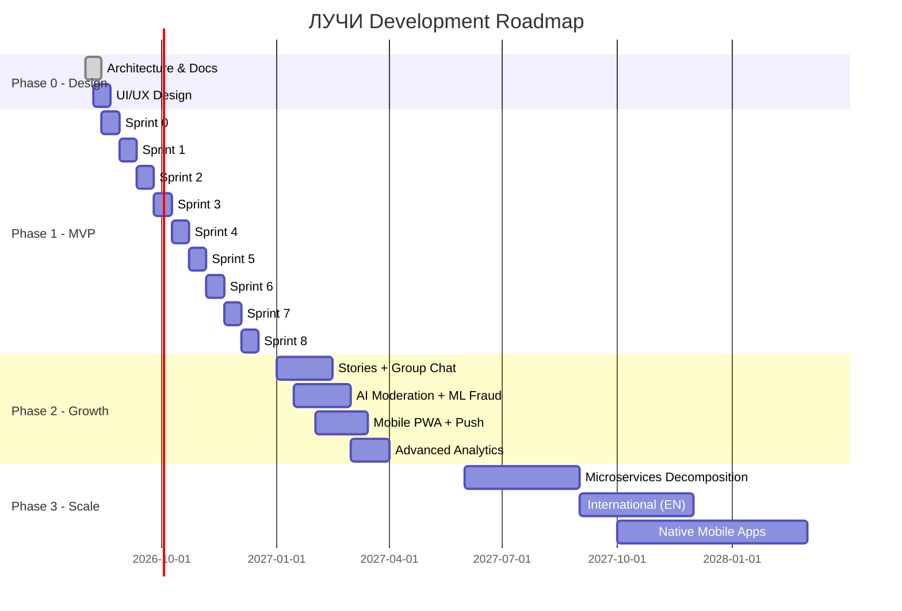

# ЛУЧИ — Roadmap

**Версия:** 1.0.0  
**Дата:** 2026-08-07  

---

## 1. Overview

Дорожная карта реализации платформы ЛУЧИ от проектирования до международного масштаба.

---

## 2. Timeline

---

## 3. Phase 0: Design & Documentation (Current)

**Duration:** 2 weeks (Aug 2026)  
**Status:** In Progress

| Task | Status | Deliverable |
|------|--------|-------------|
| Architecture design | ✅ Done | ARCHITECTURE.md |
| Database design | ✅ Done | DATABASE.md |
| API specification | ✅ Done | API.md |
| Security design | ✅ Done | SECURITY.md, AUTH.md, RBAC.md |
| Module documentation | ✅ Done | All module docs |
| UI/UX design system | ✅ Done | UI_SYSTEM.md |
| Testing strategy | ✅ Done | TESTING.md |
| Deployment plan | ✅ Done | DEPLOYMENT.md |
| Cursor rules | ✅ Done | CURSOR_RULES.md |
| Coding standards | ✅ Done | CODING_STANDARDS.md |

**Exit Criteria:** All documentation reviewed and approved. No code until Phase 0 complete.

---

## 4. Phase 1: MVP (Aug – Dec 2026)

**Goal:** Launch functional platform with core loop: register → do good deed → get Rays → spend in store.

### Sprint 0: Infrastructure (2 weeks)

| Task | Priority | Module |
|------|----------|--------|
| Monorepo setup (Turborepo) | P0 | infra |
| Docker Compose (PG, Redis, MinIO) | P0 | infra |
| NestJS app skeleton + Clean Architecture | P0 | api |
| Next.js web app skeleton | P0 | web |
| Next.js admin app skeleton | P0 | admin |
| Shared packages (ui, types, config) | P0 | packages |
| CI pipeline (lint, test, build) | P0 | infra |
| Database migrations setup | P0 | infra |
| Shared kernel (base entity, events) | P0 | api/shared |

### Sprint 1: IAM + Auth (2 weeks)

| Task | Priority | Module |
|------|----------|--------|
| User entity + repository | P0 | iam |
| Registration flow | P0 | iam |
| Login flow (JWT + refresh) | P0 | iam |
| Password hashing (Argon2id) | P0 | iam |
| Session management | P0 | iam |
| RBAC seed (roles + permissions) | P0 | iam |
| Auth guards + decorators | P0 | iam |
| Profile CRUD | P0 | iam |
| Email verification | P1 | iam |
| Audit log middleware | P0 | audit |

### Sprint 2: Ledger Engine (2 weeks)

| Task | Priority | Module |
|------|----------|--------|
| Account entity + auto-create on register | P0 | ledger |
| Transaction + LedgerEntry entities | P0 | ledger |
| Double-entry validation | P0 | ledger |
| Credit Rays command | P0 | ledger |
| Debit Rays command | P0 | ledger |
| Transfer Rays command | P0 | ledger |
| Rollback command | P0 | ledger |
| Idempotency middleware | P0 | shared |
| Balance materialized view | P0 | ledger |
| Ledger API endpoints | P0 | ledger |
| Reconciliation query | P0 | ledger |

### Sprint 3: Good Deeds (2 weeks)

| Task | Priority | Module |
|------|----------|--------|
| Categories seed | P0 | good-deeds |
| Task CRUD | P0 | good-deeds |
| Submission flow | P0 | good-deeds |
| Organization registration | P0 | good-deeds |
| Event CRUD + registration | P1 | good-deeds |
| GPS validation | P0 | good-deeds |
| Good deeds API endpoints | P0 | good-deeds |
| Reward Engine integration | P0 | good-deeds → ledger |

### Sprint 4: Social Core (2 weeks)

| Task | Priority | Module |
|------|----------|--------|
| Posts CRUD | P0 | social |
| Comments (nested) | P0 | social |
| Reactions | P0 | social |
| Friends (request/accept/decline) | P0 | social |
| Follows | P0 | social |
| Feed (chronological) | P0 | social |
| Feed cache (Redis) | P1 | social |
| Social API endpoints | P0 | social |
| User search (PG FTS) | P1 | search |

### Sprint 5: Store + Moderation (2 weeks)

| Task | Priority | Module |
|------|----------|--------|
| Product CRUD | P0 | store |
| Order flow (purchase) | P0 | store |
| Refund flow | P1 | store |
| Review queue | P0 | moderation |
| Approve/reject submissions | P0 | moderation |
| Reports system | P0 | moderation |
| Ban system | P0 | moderation |
| Store + Moderation API | P0 | store, moderation |
| Media upload (photos) | P0 | media |
| pHash computation | P0 | media |

### Sprint 6: Admin + Anti-Fraud (2 weeks)

| Task | Priority | Module |
|------|----------|--------|
| Admin dashboard | P0 | admin |
| User management | P0 | admin |
| Organization management | P0 | admin |
| Transaction viewer | P0 | admin |
| Moderation panel | P0 | admin |
| Store management | P0 | admin |
| Settings management | P1 | admin |
| Role management | P0 | admin |
| Device fingerprinting | P0 | anti-fraud |
| Duplicate photo detection | P0 | anti-fraud |
| Transfer velocity checks | P0 | anti-fraud |
| Risk scoring | P0 | anti-fraud |
| Notifications (in-app + email) | P0 | notifications |

### Sprint 7: Polish + Demo Seed (2 weeks)

| Task | Priority | Module |
|------|----------|--------|
| UI polish (all pages) | P0 | web |
| Design system components | P0 | packages/ui |
| Demo database seeder | P0 | scripts/seed |
| 500 users, 2000 posts, 100K transactions | P0 | scripts/seed |
| Achievements system | P1 | social |
| User levels | P1 | iam |
| Rating system | P1 | social |
| Performance optimization | P1 | all |
| Error handling polish | P0 | all |

### Sprint 8: Testing + Launch (2 weeks)

| Task | Priority |
|------|----------|
| Full test suite (unit + integration) | P0 |
| E2E tests (Playwright) | P0 |
| Load testing (k6, 1000 users) | P0 |
| Security scan (OWASP ZAP) | P0 |
| Penetration test | P0 |
| Staging deployment | P0 |
| Production deployment | P0 |
| Monitoring setup | P0 |
| Launch! | P0 |

---

## 5. Phase 2: Growth (Q1–Q2 2027)

| Feature | Sprint | Priority |
|---------|--------|----------|
| Stories (24h ephemeral) | 2 weeks | P1 |
| Group chats | 3 weeks | P1 |
| WebSocket real-time chat | 2 weeks | P1 |
| Push notifications (FCM) | 2 weeks | P1 |
| AI-assisted moderation | 3 weeks | P1 |
| ML bot detection | 3 weeks | P1 |
| Advanced feed algorithm | 2 weeks | P2 |
| Elasticsearch search | 2 weeks | P2 |
| PWA optimization | 2 weeks | P1 |
| OAuth2 (Google, VK, Yandex) | 1 week | P2 |
| Video upload + transcoding | 3 weeks | P2 |
| Achievements expansion | 1 week | P2 |
| Corporate ESG dashboard | 3 weeks | P2 |

**Phase 2 Goals:**
- DAU 10K
- 50K verified good deeds/month
- 50+ organization partners
- Mobile PWA with push notifications

---

## 6. Phase 3: Scale (H2 2027 – 2028)

| Feature | Duration | Priority |
|---------|----------|----------|
| Microservices decomposition | 3 months | P1 |
| Kafka event streaming | 1 month | P1 |
| CQRS for ledger reads | 1 month | P1 |
| International (English) | 2 months | P1 |
| Native iOS app | 3 months | P2 |
| Native Android app | 3 months | P2 |
| Fiat bridge (legal review) | 3 months | P3 |
| Certificate exchange | 1 month | P2 |
| Government API integrations | 2 months | P3 |
| Multi-region deployment | 2 months | P2 |

**Phase 3 Goals:**
- 100K+ DAU
- CIS market expansion
- B2B API for partners
- Native mobile apps in stores

---

## 7. Phase 4: Ecosystem (2029+)

- Open API platform for third-party developers
- ESG Impact Index (public ranking)
- Integration with education (student volunteering)
- Integration with HR (corporate volunteering programs)
- Blockchain transparency layer (optional, evaluation)
- Global expansion (5+ languages)

---

## 8. Sprint Ceremonies

| Ceremony | Frequency | Duration |
|----------|-----------|----------|
| Sprint Planning | Bi-weekly (Monday) | 2 hours |
| Daily Standup | Daily | 15 min |
| Sprint Review | Bi-weekly (Friday) | 1 hour |
| Retrospective | Bi-weekly (Friday) | 30 min |
| Architecture Review | Monthly | 1 hour |

---

## 9. Definition of Done

A task is done when:

- [ ] Code implemented following CODING_STANDARDS.md
- [ ] Unit tests written and passing
- [ ] Integration tests for API endpoints
- [ ] No linter errors
- [ ] Code reviewed and approved
- [ ] Documentation updated (if API changed)
- [ ] Tested on staging
- [ ] Audit log verified (for sensitive operations)

---

## 10. Risk Register

| Risk | Impact | Probability | Mitigation | Owner |
|------|--------|-------------|------------|-------|
| Ledger bugs at launch | Critical | Medium | Extensive testing, reconciliation | Backend |
| Moderation bottleneck | High | High | AI assist (Phase 2), hire moderators | Product |
| Low initial user base | High | Medium | NKO partnerships, demo looks live | Marketing |
| Scope creep | Medium | High | Strict sprint planning, phase gates | PM |
| Security breach | Critical | Low | Bank-grade security, pentest | Security |
| Regulatory (Rays as currency) | High | Medium | Legal model as bonus points | Legal |

---

## 11. Success Metrics by Phase

| Metric | MVP (Phase 1) | Growth (Phase 2) | Scale (Phase 3) |
|--------|--------------|-------------------|-----------------|
| Registered users | 1,000 | 50,000 | 500,000 |
| DAU | 200 | 10,000 | 100,000 |
| Verified deeds/month | 500 | 50,000 | 500,000 |
| Organizations | 10 | 50 | 500 |
| Store products | 20 | 100 | 500 |
| Fraud rate | < 2% | < 0.5% | < 0.1% |
| Uptime | 99% | 99.9% | 99.95% |

---

## 12. Связанные документы

- [VISION.md](./VISION.md)
- [PROJECT_SCOPE.md](./PROJECT_SCOPE.md)
- [ARCHITECTURE.md](./ARCHITECTURE.md)
- [DEPLOYMENT.md](./DEPLOYMENT.md)
- [TESTING.md](./TESTING.md)
