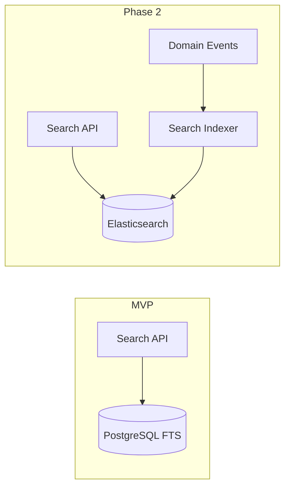

# ЛУЧИ — Search Module

**Версия:** 1.0.0  
**Дата:** 2026-08-07  

---

## 1. Overview

Search модуль обеспечивает полнотекстовый поиск по пользователям, постам, организациям и заданиям.

**MVP:** PostgreSQL Full-Text Search (Russian)  
**Phase 2:** Elasticsearch migration

---

## 2. Architecture



---

## 3. Searchable Entities

| Entity | Fields | Weight |
|--------|--------|--------|
| Users | username, display_name, bio, city | A |
| Posts | content | B |
| Organizations | name, description, city | A |
| Tasks | title, description, city | A |
| Events | title, description, location | B |

---

## 4. Search API

```
GET /search?q=экология&type=users,posts,tasks&cursor=...&limit=20
```

### Response

```json
{
  "data": {
    "users": [
      { "id": "uuid", "username": "eco_hero", "display_name": "...", "avatar_url": "..." }
    ],
    "posts": [
      { "id": "uuid", "content": "...highlighted...", "author": {...} }
    ],
    "organizations": [...],
    "tasks": [...]
  },
  "meta": { "query": "экология", "total_results": 42 }
}
```

---

## 5. PostgreSQL FTS Implementation (MVP)

```sql
-- Already defined in DATABASE.md
-- search_vector columns with GIN indexes

SELECT id, username, display_name,
       ts_rank(search_vector, query) AS rank
FROM iam.users, plainto_tsquery('russian', $1) query
WHERE search_vector @@ query
ORDER BY rank DESC
LIMIT 20;
```

### Multi-entity Search

```typescript
async search(query: string, types: string[], limit: number) {
  const results = {};
  if (types.includes('users')) {
    results.users = await this.userRepo.search(query, limit);
  }
  if (types.includes('posts')) {
    results.posts = await this.postRepo.search(query, limit);
  }
  // ... parallel queries
  return results;
}
```

---

## 6. Phase 2: Elasticsearch

### Index Structure

```json
{
  "users": {
    "mappings": {
      "properties": {
        "username": { "type": "text", "analyzer": "russian" },
        "display_name": { "type": "text", "analyzer": "russian" },
        "city": { "type": "keyword" },
        "rays_balance": { "type": "integer" }
      }
    }
  }
}
```

### Event-Driven Indexing

| Event | Action |
|-------|--------|
| UserRegistered | Index user |
| PostCreated | Index post |
| PostDeleted | Remove from index |
| TaskCreated | Index task |
| UserUpdated | Re-index user |

---

## 7. Search Filters

| Filter | Applies To | Example |
|--------|-----------|---------|
| `type` | All | `users,posts,tasks` |
| `city` | Users, Tasks, Orgs | `Москва` |
| `category` | Tasks | `ecology` |
| `date_from` | Posts | `2026-01-01` |

---

## 8. Business Rules

1. Min query length: 2 characters
2. Max results per type: 20
3. Rate limit: 30 searches/minute
4. Deleted/hidden content excluded
5. Banned users excluded from user search
6. Search queries logged for analytics (no PII)

---

## 9. Module Structure

```
modules/search/
├── application/
│   ├── services/
│   │   └── search.service.ts
│   └── queries/
│       └── search.query.ts
├── infrastructure/
│   ├── postgres/
│   │   └── pg-search.repository.ts
│   └── elasticsearch/     # Phase 2
│       └── es-search.repository.ts
└── presentation/
    └── controllers/
        └── search.controller.ts
```

---

## 10. Unit Tests

| Test | Description |
|------|-------------|
| Search users | Returns matching users ranked |
| Search posts | Full-text match in content |
| Empty query | Returns 422 |
| Short query | Returns 422 (< 2 chars) |
| Multi-type search | Returns results for each type |
| Deleted content excluded | Hidden posts not in results |

---

## 11. Связанные документы

- [DATABASE.md](./DATABASE.md)
- [API.md](./API.md)
- [ARCHITECTURE.md](./ARCHITECTURE.md)
