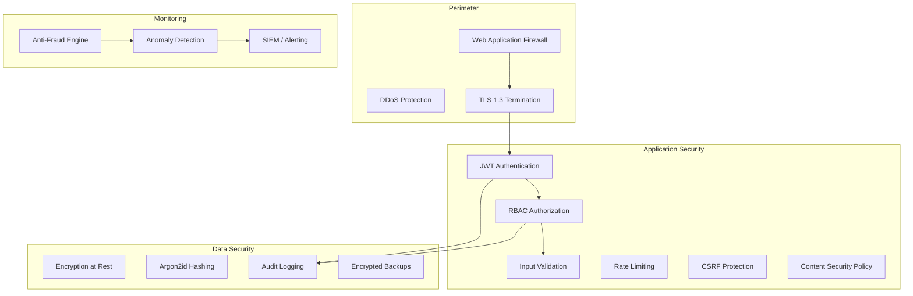
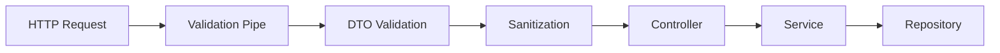
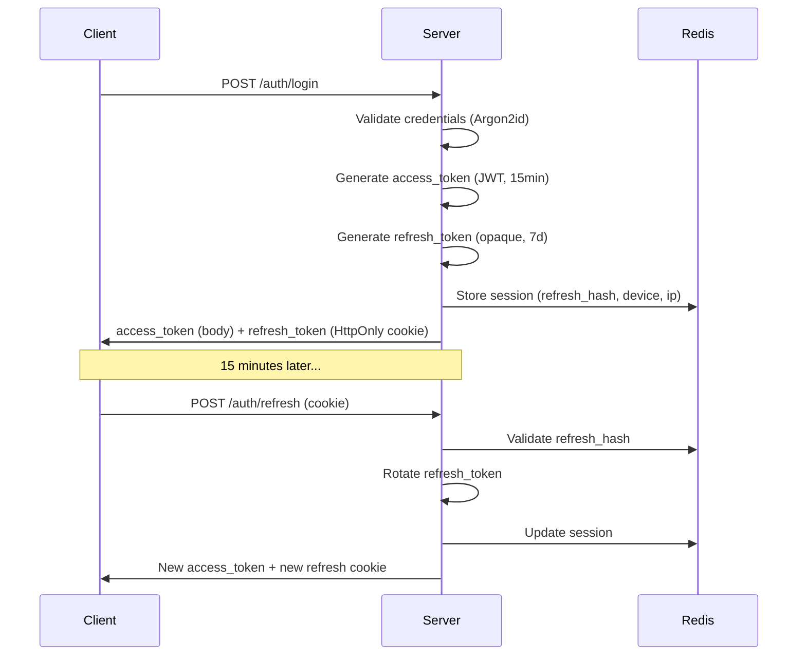

# ЛУЧИ — Security Architecture

**Версия:** 1.0.0  
**Дата:** 2026-08-07  
**Уровень:** Bank-Grade / Enterprise  

---

## 1. Security Vision

Безопасность платформы ЛУЧИ проектируется на уровне банковского ПО, поскольку внутренняя валюта «Лучи» требует финансовой точности, полной аудируемости и защиты от мошенничества.

**Принцип:** Zero Trust — каждый запрос аутентифицируется, авторизуется, валидируется и логируется.

---

## 2. Security Architecture Overview



---

## 3. OWASP Top 10 Mitigation

| # | Risk | Mitigation |
|---|------|------------|
| A01 | Broken Access Control | RBAC + permission checks on every endpoint, resource ownership validation |
| A02 | Cryptographic Failures | TLS 1.3, Argon2id, AES-256 at rest, no secrets in code |
| A03 | Injection | Parameterized queries (ORM), input validation, output encoding |
| A04 | Insecure Design | Threat modeling, security reviews, principle of least privilege |
| A05 | Security Misconfiguration | Hardened defaults, security headers, automated scanning |
| A06 | Vulnerable Components | Dependabot, npm audit, SCA in CI |
| A07 | Auth Failures | JWT + refresh rotation, account lockout, MFA (Phase 2) |
| A08 | Data Integrity Failures | Idempotency keys, signed webhooks, CSRF tokens |
| A09 | Logging Failures | Structured audit log, correlation IDs, centralized logging |
| A10 | SSRF | URL allowlist for external requests, no user-controlled URLs in server requests |

---

## 4. Authentication Security

See [AUTH.md](./AUTH.md) for full details.

| Control | Implementation |
|---------|---------------|
| Password hashing | Argon2id (memory: 64MB, iterations: 3, parallelism: 4) |
| Access token | JWT RS256, 15 min TTL |
| Refresh token | Opaque token, HttpOnly cookie, SameSite=Strict, 7 days |
| Refresh rotation | New refresh on every use, old invalidated |
| Session management | Max 5 active sessions per user |
| Account lockout | 5 failed attempts → 15 min lockout |
| Password policy | Min 8 chars, uppercase, lowercase, digit, special |

---

## 5. Authorization

See [RBAC.md](./RBAC.md) for full details.

- Permission-based access control (PBAC)
- Every endpoint protected by `@RequirePermission()` decorator
- Resource-level ownership checks (user can only edit own posts)
- Admin actions require elevated permissions + audit log

---

## 6. Transport Security

```
TLS 1.3 only
├── Cipher suites: TLS_AES_256_GCM_SHA384, TLS_CHACHA20_POLY1305_SHA256
├── HSTS: max-age=31536000; includeSubDomains; preload
├── Certificate: Let's Encrypt / commercial CA
└── mTLS: Internal service communication (Phase 2)
```

### Security Headers

```
Strict-Transport-Security: max-age=31536000; includeSubDomains; preload
Content-Security-Policy: default-src 'self'; script-src 'self'; style-src 'self' 'unsafe-inline'; img-src 'self' https://cdn.luchi.app data:; connect-src 'self' wss://api.luchi.app
X-Content-Type-Options: nosniff
X-Frame-Options: DENY
X-XSS-Protection: 0
Referrer-Policy: strict-origin-when-cross-origin
Permissions-Policy: camera=(), microphone=(), geolocation=(self)
Cross-Origin-Opener-Policy: same-origin
Cross-Origin-Resource-Policy: same-origin
```

---

## 7. Input Validation & Output Encoding

### Validation Pipeline



### Rules

| Layer | Validation |
|-------|-----------|
| Controller | class-validator decorators on DTOs |
| Domain | Business rule validation in entities |
| Database | CHECK constraints, NOT NULL, FK |
| Output | HTML encoding for user content, JSON serialization |
| File upload | MIME type check, magic bytes, size limit, virus scan (Phase 2) |

### Content Sanitization

- User-generated HTML: DOMPurify (allowlist tags)
- Markdown: sanitized rendering
- SQL: ORM parameterized queries only
- NoSQL injection: typed queries only

---

## 8. CSRF Protection

| Context | Protection |
|---------|-----------|
| Cookie-based auth (refresh) | CSRF token in header `X-CSRF-Token` |
| Bearer token auth (API) | Not needed (no cookies sent) |
| State-changing forms | Double-submit cookie pattern |

---

## 9. Rate Limiting

### Implementation: Redis Sliding Window

```typescript
interface RateLimitConfig {
  windowMs: number;
  maxRequests: number;
  keyGenerator: (req) => string;
}
```

| Scope | Limit | Key |
|-------|-------|-----|
| Global per IP | 1000/min | `rl:ip:{ip}` |
| Auth endpoints | 10/min | `rl:auth:{ip}` |
| API per user | 100/min | `rl:user:{userId}` |
| Ledger transfer | 5/min | `rl:transfer:{userId}` |
| Media upload | 20/hour | `rl:upload:{userId}` |
| Registration | 3/hour per IP | `rl:register:{ip}` |
| Password reset | 3/hour per email | `rl:reset:{email}` |

### IP Limiting

- Block known VPN/proxy IPs for registration (configurable)
- Geo validation: flag logins from unusual locations
- IP reputation check (Phase 2)

---

## 10. Device Fingerprinting

Collected on login/register (client-side library + server-side):

| Signal | Source |
|--------|--------|
| User-Agent | Header |
| Screen resolution | Client JS |
| Timezone | Client JS |
| Language | Client JS |
| Canvas fingerprint | Client JS (hashed) |
| WebGL renderer | Client JS (hashed) |
| IP address | Server |
| TLS fingerprint | Server (JA3) |

Stored in `fraud.device_fingerprints`, linked to users.  
Used by Anti-Fraud module for multi-account detection.

---

## 11. Audit Logging

**Every user action is logged.** No exceptions.

```sql
-- Every mutation creates an audit entry
INSERT INTO audit.audit_log (
    actor_id, action, resource_type, resource_id,
    old_values, new_values, ip_address, correlation_id
) VALUES (...);
```

### Logged Actions

| Category | Actions |
|----------|---------|
| Auth | login, logout, register, password_change, failed_login |
| Profile | update, avatar_change, delete |
| Social | post_create, post_delete, comment, reaction, friend_request |
| Deeds | submit, approve, reject |
| Ledger | credit, debit, transfer, rollback |
| Store | purchase, refund |
| Admin | user_ban, role_change, settings_change, manual_credit |
| Moderation | approve, reject, ban, report_resolve |

### Audit Log Properties

- **Immutable:** Append-only, no UPDATE/DELETE
- **Correlation ID:** Traces request across services
- **Retention:** 7 years (regulatory)
- **Access:** Admin + Finance roles only

---

## 12. Secrets Management

| Rule | Implementation |
|------|---------------|
| No secrets in code | Environment variables only |
| No secrets in git | .env in .gitignore, git-secrets hook |
| Production secrets | Vault / AWS Secrets Manager / Yandex Lockbox |
| Rotation | JWT keys: 90 days, DB passwords: 90 days |
| Development | .env.example with placeholder values |

### Required Environment Variables

```
DATABASE_URL
REDIS_URL
JWT_PRIVATE_KEY
JWT_PUBLIC_KEY
JWT_ACCESS_TTL=900
JWT_REFRESH_TTL=604800
S3_ENDPOINT
S3_ACCESS_KEY
S3_SECRET_KEY
S3_BUCKET
SMTP_HOST
SMTP_USER
SMTP_PASSWORD
ARGON2_MEMORY=65536
ARGON2_ITERATIONS=3
ARGON2_PARALLELISM=4
CSRF_SECRET
ENCRYPTION_KEY
```

---

## 13. Data Protection

### Encryption at Rest

| Data | Method |
|------|--------|
| Database | PostgreSQL TDE / disk encryption |
| S3 objects | AES-256 server-side encryption |
| Backups | Encrypted before storage |
| PII fields | Application-level encryption for phone, address (Phase 2) |

### Encryption in Transit

- TLS 1.3 for all external communication
- TLS for database connections
- TLS for Redis connections

### Data Classification

| Level | Examples | Controls |
|-------|----------|----------|
| Public | Posts, profiles, org info | Standard access |
| Internal | Audit logs, analytics | Role-based access |
| Confidential | Passwords, tokens, PII | Encryption + strict access |
| Restricted | JWT keys, DB credentials | Vault only |

---

## 14. Session Security



### Cookie Attributes

```
Set-Cookie: refresh_token=<token>;
  HttpOnly;
  Secure;
  SameSite=Strict;
  Path=/api/v1/auth;
  Max-Age=604800
```

---

## 15. Security Testing

| Type | Tool | Frequency |
|------|------|-----------|
| SAST | ESLint security plugins, Semgrep | Every PR |
| DAST | OWASP ZAP | Weekly (staging) |
| Dependency scan | npm audit, Snyk | Every PR |
| Penetration test | External firm | Pre-launch + annual |
| Load test security | k6 + auth scenarios | Pre-launch |

See [TESTING.md](./TESTING.md) for full testing strategy.

---

## 16. Incident Response

### Severity Levels

| Level | Example | Response Time |
|-------|---------|---------------|
| P0 Critical | Ledger breach, mass data leak | 15 min |
| P1 High | Auth bypass, XSS exploit | 1 hour |
| P2 Medium | Rate limit bypass, info disclosure | 4 hours |
| P3 Low | Minor misconfiguration | 24 hours |

### Response Process

1. **Detect** — Monitoring alert / user report
2. **Contain** — Block affected endpoints/users
3. **Investigate** — Audit log analysis, correlation
4. **Remediate** — Fix + deploy
5. **Communicate** — User notification if data affected
6. **Post-mortem** — Root cause analysis, prevention

---

## 17. Compliance Readiness

| Standard | Status | Notes |
|----------|--------|-------|
| GDPR | Ready | Data export, deletion, consent |
| 152-ФЗ (RU) | Ready | Personal data localization |
| PCI DSS | N/A (MVP) | Required for fiat exchange (Phase 3) |
| OWASP ASVS Level 2 | Target | Pre-launch audit |

---

## 18. Security Checklist (Pre-Launch)

- [ ] All endpoints require authentication (except public)
- [ ] RBAC enforced on every endpoint
- [ ] Input validation on all DTOs
- [ ] SQL injection tested (parameterized queries)
- [ ] XSS tested (output encoding)
- [ ] CSRF protection active
- [ ] Security headers configured
- [ ] TLS 1.3 enforced
- [ ] Rate limiting active
- [ ] Audit logging complete
- [ ] Secrets in environment variables only
- [ ] Dependency vulnerabilities resolved
- [ ] Penetration test passed
- [ ] Account lockout tested
- [ ] Refresh token rotation tested
- [ ] Idempotency keys tested for ledger

---

## 19. Связанные документы

- [AUTH.md](./AUTH.md)
- [RBAC.md](./RBAC.md)
- [ANTI_FRAUD.md](./ANTI_FRAUD.md)
- [TESTING.md](./TESTING.md)
