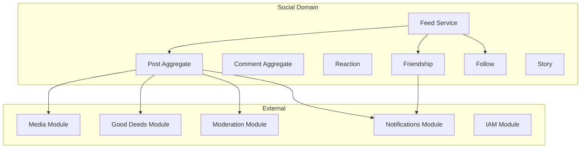
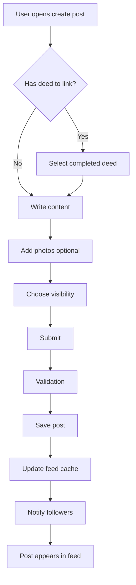
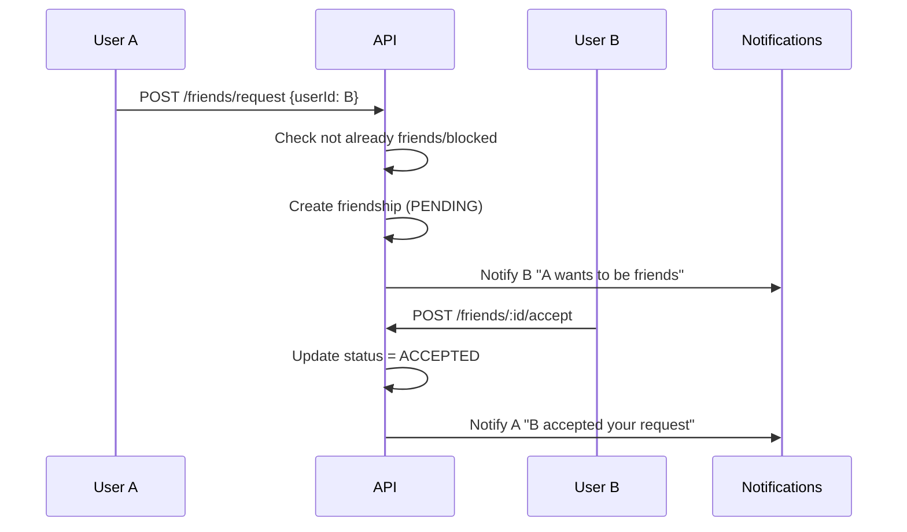
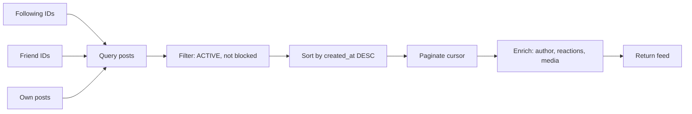

# ЛУЧИ — Social Network Module

**Версия:** 1.0.0  
**Дата:** 2026-08-07  

---

## 1. Overview

Social Network модуль — социальная ткань платформы ЛУЧИ. Объединяет пользователей через посты, комментарии, реакции, stories, дружбу и подписки. Контент привязан к добрым делам — основная лента мотивирует через реальные achievements.

---

## 2. Module Architecture



---

## 3. Aggregates

### 3.1 Post

```typescript
interface Post {
  id: UUID;
  authorId: UUID;
  content: string;           // max 5000 chars
  mediaIds: UUID[];          // max 10
  deedSubmissionId?: UUID;   // linked good deed
  visibility: 'PUBLIC' | 'FRIENDS' | 'PRIVATE';
  status: 'ACTIVE' | 'HIDDEN' | 'DELETED';
  likesCount: number;        // denormalized
  commentsCount: number;     // denormalized
  sharesCount: number;       // denormalized
  createdAt: DateTime;
  updatedAt: DateTime;
}
```

### 3.2 Comment

```typescript
interface Comment {
  id: UUID;
  postId: UUID;
  authorId: UUID;
  parentId?: UUID;           // nested replies (max depth: 3)
  content: string;           // max 2000 chars
  status: 'ACTIVE' | 'HIDDEN' | 'DELETED';
  likesCount: number;
  createdAt: DateTime;
}
```

### 3.3 Friendship

```typescript
interface Friendship {
  id: UUID;
  requesterId: UUID;
  addresseeId: UUID;
  status: 'PENDING' | 'ACCEPTED' | 'DECLINED' | 'BLOCKED';
  createdAt: DateTime;
}
```

---

## 4. User Flows

### 4.1 Create Post Flow



### 4.2 Friend Request Flow



### 4.3 Feed Generation

**MVP:** Chronological feed from following + friends + own posts.

**Phase 2:** Algorithmic ranking based on:
- Recency (decay function)
- Engagement (reactions, comments)
- Good deed relevance
- Author's Ray rank
- Content type preference



---

## 5. Reactions System

### Reaction Types

| Type | Emoji | Meaning |
|------|-------|---------|
| LIKE | 👍 | General appreciation |
| LOVE | ❤️ | Strong positive |
| SUPPORT | 🤝 | Support for good deed |
| INSPIRE | ✨ | Inspired by action |
| CELEBRATE | 🎉 | Celebration |

One reaction per user per target. Changing reaction updates existing record.

---

## 6. Stories (Phase 2, architecture ready)

```typescript
interface Story {
  id: UUID;
  authorId: UUID;
  mediaId: UUID;
  caption?: string;
  viewsCount: number;
  expiresAt: DateTime;       // createdAt + 24 hours
  createdAt: DateTime;
}
```

- Auto-expire after 24 hours (cron job)
- Visible to followers only
- View tracking (who viewed)

---

## 7. Module Structure

```
modules/social/
├── domain/
│   ├── entities/
│   │   ├── post.entity.ts
│   │   ├── comment.entity.ts
│   │   ├── friendship.entity.ts
│   │   ├── follow.entity.ts
│   │   ├── reaction.entity.ts
│   │   └── story.entity.ts
│   ├── events/
│   │   ├── post-created.event.ts
│   │   ├── post-deleted.event.ts
│   │   ├── comment-created.event.ts
│   │   ├── reaction-added.event.ts
│   │   ├── friend-request-sent.event.ts
│   │   └── friend-request-accepted.event.ts
│   ├── repositories/
│   │   ├── post.repository.interface.ts
│   │   ├── comment.repository.interface.ts
│   │   └── friendship.repository.interface.ts
│   └── services/
│       └── feed.service.ts
├── application/
│   ├── commands/
│   │   ├── create-post.command.ts
│   │   ├── create-comment.command.ts
│   │   ├── add-reaction.command.ts
│   │   ├── send-friend-request.command.ts
│   │   └── accept-friend-request.command.ts
│   ├── queries/
│   │   ├── get-feed.query.ts
│   │   ├── get-post.query.ts
│   │   └── get-friends.query.ts
│   └── dto/
│       ├── create-post.dto.ts
│       └── feed-item.dto.ts
├── infrastructure/
│   └── repositories/
└── presentation/
    └── controllers/
        ├── posts.controller.ts
        ├── comments.controller.ts
        ├── friends.controller.ts
        └── feed.controller.ts
```

---

## 8. API Endpoints

See [API.md](./API.md) Section 5 for full endpoint list.

---

## 9. Business Rules

1. Post content max 5000 characters
2. Max 10 media attachments per post
3. Comments max depth: 3 levels
4. Comment max 2000 characters
5. Cannot friend yourself
6. Cannot friend blocked user
7. Friend request auto-declines after 30 days
8. Unfollow does not affect friendship
9. Block removes friendship and follow both ways
10. Deleted posts: soft delete, content replaced with "[deleted]"
11. Post linked to deed shows deed badge in feed
12. Only verified users can create posts (MVP policy)

---

## 10. Feed Cache Strategy

| Layer | Storage | TTL |
|-------|---------|-----|
| User feed IDs | Redis sorted set | 5 min |
| Post details | Redis hash | 10 min |
| Author info | Redis hash | 30 min |
| Invalidation | On post create/delete, follow/unfollow |

```
feed:{userId} → sorted set of post IDs by timestamp
post:{postId} → hash of post data
```

---

## 11. Error Codes

| Code | HTTP | Description |
|------|------|-------------|
| POST_NOT_FOUND | 404 | Post does not exist |
| POST_NOT_OWNER | 403 | Cannot edit others' posts |
| COMMENT_TOO_DEEP | 422 | Max nesting depth exceeded |
| ALREADY_FRIENDS | 409 | Already friends or pending |
| CANNOT_FRIEND_SELF | 422 | Self-friending not allowed |
| USER_BLOCKED | 403 | Cannot interact with blocked user |
| CONTENT_TOO_LONG | 422 | Exceeds character limit |
| MEDIA_LIMIT | 422 | Too many media attachments |

---

## 12. Edge Cases

| Case | Handling |
|------|----------|
| Post author deleted account | Post shows "[deleted user]" |
| Comment on deleted post | Return 404 |
| Friend request to banned user | Reject silently |
| Feed with 0 following | Show popular/platform posts |
| Reaction on deleted content | Return 404 |
| Concurrent friend requests | First wins, second gets 409 |

---

## 13. Unit Tests

| Test | Description |
|------|-------------|
| Create post | Valid post saved with correct fields |
| Create post with deed link | deedSubmissionId set |
| Comment nesting | Max depth enforced |
| Friend request lifecycle | Request → accept → friends |
| Block removes friendship | Both directions cleaned |
| Reaction toggle | Add → change → remove |
| Feed pagination | Cursor-based works correctly |
| Visibility filter | FRIENDS posts not in public feed |

---

## 14. Integration Tests

| Test | Description |
|------|-------------|
| Full post lifecycle | Create → comment → react → delete |
| Friend flow | Request → accept → see in friends list |
| Feed generation | Follow user → see their posts in feed |
| Block flow | Block → posts hidden, cannot interact |

---

## 15. Связанные документы

- [API.md](./API.md)
- [DATABASE.md](./DATABASE.md)
- [MODERATION.md](./MODERATION.md)
- [NOTIFICATIONS.md](./NOTIFICATIONS.md)
- [MEDIA.md](./MEDIA.md)
