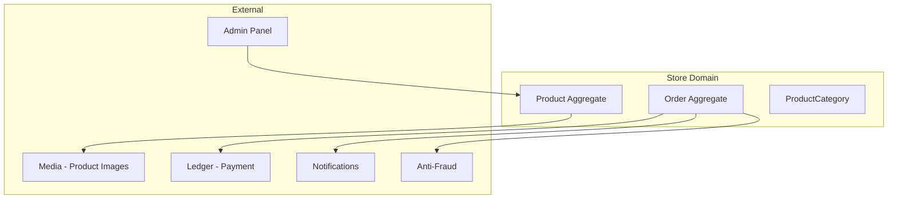
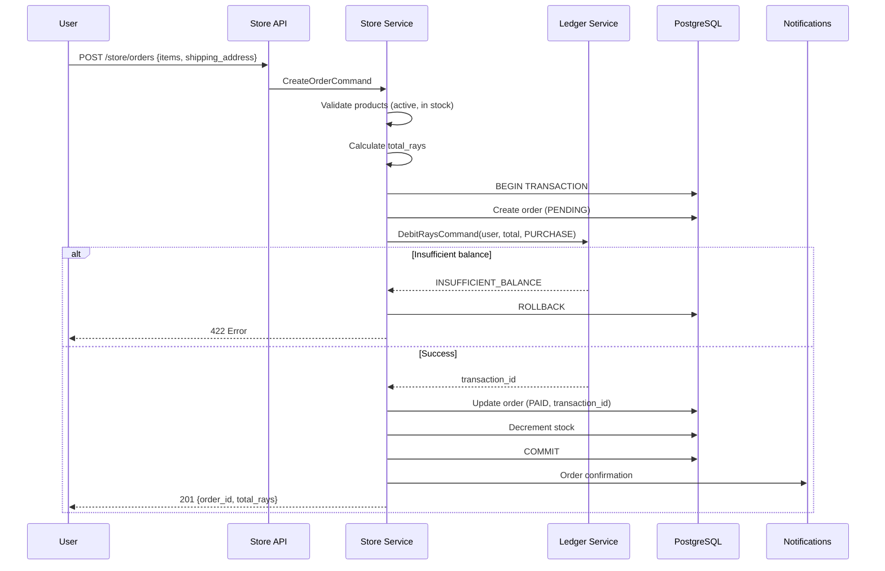
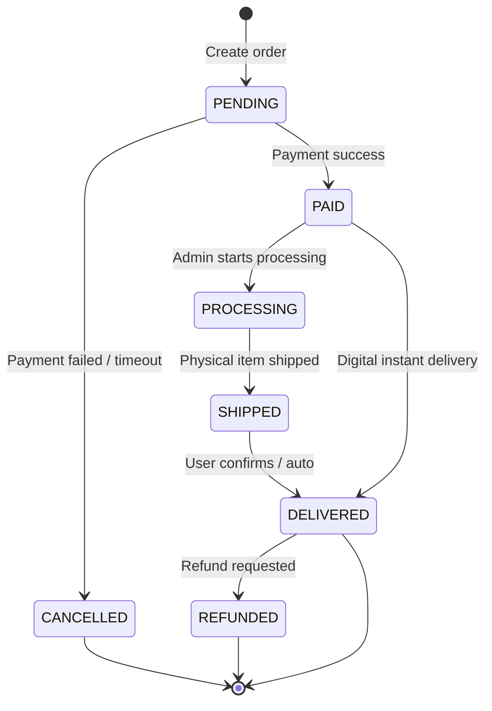
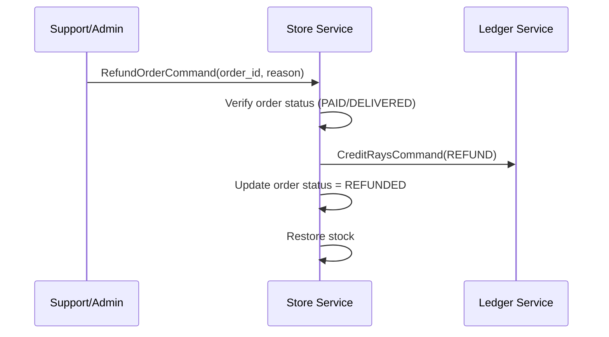
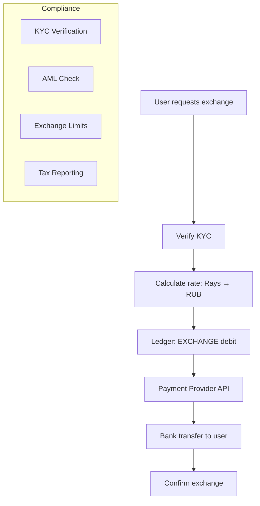

# ЛУЧИ — Store Module

**Версия:** 1.0.0  
**Дата:** 2026-08-07  

---

## 1. Overview

Store — маркетплейс для обмена «Лучей» на товары, цифровые товары, сертификаты и (в перспективе) деньги. Каждая покупка проходит через Ledger для списания Лучей.

---

## 2. Architecture



---

## 3. Product Types

| Type | Description | Delivery |
|------|-------------|----------|
| `PHYSICAL` | Physical goods | Shipping address required |
| `DIGITAL` | Digital goods (codes, downloads) | Instant delivery |
| `CERTIFICATE` | Gift certificates | Code generation |
| `VOUCHER` | Partner vouchers | Code generation |

**Phase 3:** `FIAT_EXCHANGE` — architecture prepared, regulatory review required.

---

## 4. Purchase Flow



---

## 5. Order Lifecycle



---

## 6. Refund Flow



---

## 7. Module Structure

```
modules/store/
├── domain/
│   ├── entities/
│   │   ├── product.entity.ts
│   │   ├── order.entity.ts
│   │   └── order-item.entity.ts
│   ├── events/
│   │   ├── order-created.event.ts
│   │   ├── order-paid.event.ts
│   │   └── order-refunded.event.ts
│   └── repositories/
│       ├── product.repository.interface.ts
│       └── order.repository.interface.ts
├── application/
│   ├── commands/
│   │   ├── create-order.command.ts
│   │   ├── refund-order.command.ts
│   │   └── update-product.command.ts
│   └── queries/
│       ├── get-products.query.ts
│       └── get-orders.query.ts
├── infrastructure/
│   └── repositories/
└── presentation/
    └── controllers/
        ├── products.controller.ts
        └── orders.controller.ts
```

---

## 8. Fiat Exchange Architecture (Phase 3 — Prepared)



**Not implemented in MVP.** Database schema and API endpoints reserved.

---

## 9. Business Rules

1. Product price in Rays (integer, min 1)
2. Stock tracked per product (null = unlimited)
3. One order can contain multiple items
4. Shipping address required for PHYSICAL products
5. Digital products delivered instantly on payment
6. Order timeout: 15 minutes in PENDING → auto-cancel
7. Refund within 14 days (configurable)
8. Refund restores Rays via Ledger REFUND transaction
9. Cannot purchase if account not verified
10. Max 10 items per order

---

## 10. Error Codes

| Code | HTTP | Description |
|------|------|-------------|
| PRODUCT_NOT_FOUND | 404 | Product does not exist |
| PRODUCT_OUT_OF_STOCK | 422 | No stock available |
| PRODUCT_INACTIVE | 422 | Product not available |
| INSUFFICIENT_BALANCE | 422 | Not enough Rays |
| ORDER_NOT_FOUND | 404 | Order does not exist |
| ORDER_NOT_REFUNDABLE | 422 | Order status prevents refund |
| MAX_ITEMS_EXCEEDED | 422 | Too many items in order |

---

## 11. Edge Cases

| Case | Handling |
|------|----------|
| Stock race condition | DB row lock during purchase |
| Partial stock (want 3, have 2) | Reject entire order |
| Product price changed during checkout | Use price at order creation |
| User banned after order | Order still processed if PAID |
| Duplicate order (idempotency) | Return existing order |

---

## 12. Unit Tests

| Test | Description |
|------|-------------|
| Create order | Items validated, total calculated |
| Purchase with sufficient balance | Order PAID, stock decremented |
| Purchase insufficient balance | Order cancelled, no stock change |
| Refund | Rays restored, stock incremented |
| Out of stock | Order rejected |

---

## 13. Integration Tests

| Test | Description |
|------|-------------|
| Full purchase flow | Browse → order → pay → delivered |
| Refund flow | Purchase → refund → balance restored |
| Stock management | Purchase decrements, refund increments |

---

## 14. Связанные документы

- [REWARD_ENGINE.md](./REWARD_ENGINE.md)
- [API.md](./API.md)
- [DATABASE.md](./DATABASE.md)
- [ADMIN_PANEL.md](./ADMIN_PANEL.md)
