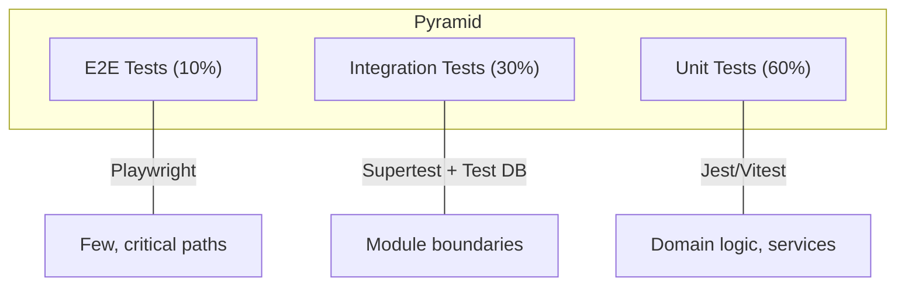

# ЛУЧИ — Testing Strategy

**Версия:** 1.0.0  
**Дата:** 2026-08-07  

---

## 1. Overview

Стратегия тестирования платформы ЛУЧИ обеспечивает высокое качество кода, особенно для критических модулей (Ledger, Auth, Anti-Fraud). Цель: > 80% coverage для domain/application layers.

---

## 2. Testing Pyramid



---

## 3. Test Types

### 3.1 Unit Tests

**Scope:** Domain entities, value objects, domain services, application handlers  
**Tool:** Jest (backend), Vitest (frontend)  
**Location:** `*.spec.ts` / `*.test.ts` next to source file  
**Run:** Every PR, < 30 seconds total

**Rules:**
- No database, no network, no filesystem
- All dependencies mocked
- Test one behavior per test
- AAA pattern: Arrange, Act, Assert

**Example:**

```typescript
describe('LedgerDomainService', () => {
  describe('validateDoubleEntry', () => {
    it('should pass when debits equal credits', () => {
      const entries = [
        { type: 'DEBIT', amount: 100 },
        { type: 'CREDIT', amount: 100 },
      ];
      expect(service.validateDoubleEntry(entries)).toBe(true);
    });

    it('should fail when debits do not equal credits', () => {
      const entries = [
        { type: 'DEBIT', amount: 100 },
        { type: 'CREDIT', amount: 50 },
      ];
      expect(() => service.validateDoubleEntry(entries)).toThrow(InvalidTransactionException);
    });
  });
});
```

### 3.2 Integration Tests

**Scope:** API endpoints, database operations, module interactions  
**Tool:** Jest + Supertest + Testcontainers (PostgreSQL, Redis)  
**Location:** `test/integration/`  
**Run:** Every PR, < 3 minutes total

**Rules:**
- Real database (Testcontainers or test DB)
- Transaction rollback after each test
- Test module boundaries, not internals
- Seed minimal test data per test

**Example:**

```typescript
describe('POST /api/v1/deeds/tasks/:id/submit', () => {
  it('should create submission and add to moderation queue', async () => {
    const user = await createTestUser({ verified: true });
    const task = await createTestTask();
    const media = await createTestMedia(user.id);

    const response = await request(app.getHttpServer())
      .post(`/api/v1/deeds/tasks/${task.id}/submit`)
      .set('Authorization', `Bearer ${user.token}`)
      .send({
        description: 'Cleaned the park',
        proof_media_ids: [media.id],
        gps_lat: 55.7903,
        gps_lng: 37.6786,
      });

    expect(response.status).toBe(201);
    expect(response.body.data.status).toBe('PENDING');

    const queueItem = await findReviewQueueItem(response.body.data.id);
    expect(queueItem).toBeDefined();
    expect(queueItem.item_type).toBe('DEED_SUBMISSION');
  });
});
```

### 3.3 End-to-End Tests

**Scope:** Critical user journeys  
**Tool:** Playwright  
**Location:** `test/e2e/`  
**Run:** Pre-deploy, < 10 minutes total

**Critical Paths:**

| # | Journey | Steps |
|---|---------|-------|
| E2E-01 | Registration → Profile | Register → verify email → complete profile |
| E2E-02 | Good deed cycle | Browse tasks → submit proof → (mock approve) → see Rays |
| E2E-03 | Social interaction | Create post → comment → react |
| E2E-04 | Ray transfer | Check balance → transfer → verify new balance |
| E2E-05 | Store purchase | Browse store → buy item → verify order |
| E2E-06 | Admin moderation | Login admin → review queue → approve → verify Rays |
| E2E-07 | Auth flow | Login → access protected → refresh → logout |

### 3.4 Contract Tests (Phase 2)

**Scope:** API contract between frontend and backend  
**Tool:** Pact or OpenAPI validation  
**Purpose:** Ensure API changes don't break clients

---

## 4. Coverage Requirements

| Layer | Min Coverage | Critical Modules |
|-------|-------------|-----------------|
| Domain | 90% | Ledger, Auth, Anti-Fraud |
| Application | 85% | All handlers |
| Infrastructure | 70% | Repositories |
| Presentation | 60% | Controllers (via integration) |
| Frontend components | 70% | UI components |
| **Overall** | **80%** | — |

### Critical Module Coverage: 95%

- `ledger/` — financial accuracy
- `iam/` — security
- `anti-fraud/` — fraud prevention
- `moderation/` — content safety

---

## 5. Test Infrastructure

### 5.1 Backend Test Setup

```
apps/api/test/
├── unit/                          # Unit tests (co-located preferred)
├── integration/
│   ├── setup/
│   │   ├── test-app.ts            # NestJS test module
│   │   ├── test-database.ts       # Testcontainers PG
│   │   ├── test-redis.ts          # Testcontainers Redis
│   │   └── factories/
│   │       ├── user.factory.ts
│   │       ├── task.factory.ts
│   │       ├── submission.factory.ts
│   │       └── transaction.factory.ts
│   ├── iam/
│   ├── ledger/
│   ├── good-deeds/
│   ├── social/
│   ├── store/
│   └── moderation/
└── e2e/
    ├── auth.e2e.spec.ts
    ├── good-deeds.e2e.spec.ts
    ├── ledger.e2e.spec.ts
    └── store.e2e.spec.ts
```

### 5.2 Test Factories

```typescript
// test/integration/setup/factories/user.factory.ts
export async function createTestUser(overrides?: Partial<CreateUserDto>) {
  const defaults = {
    email: `test-${uuid()}@example.com`,
    password: 'TestP@ss123!',
    username: `user_${randomString(8)}`,
    display_name: 'Test User',
  };
  const user = await userService.register({ ...defaults, ...overrides });
  if (overrides?.verified) {
    await userService.verifyEmail(user.id);
  }
  return user;
}
```

### 5.3 Database Isolation

```typescript
beforeEach(async () => {
  await dataSource.query('BEGIN');
});

afterEach(async () => {
  await dataSource.query('ROLLBACK');
});
```

---

## 6. Module Test Plans

### 6.1 Ledger (Critical)

| Test | Type | Priority |
|------|------|----------|
| Double-entry validation | Unit | P0 |
| Credit Rays | Unit + Integration | P0 |
| Debit with insufficient balance | Unit + Integration | P0 |
| Transfer between users | Integration | P0 |
| Idempotency (duplicate request) | Integration | P0 |
| Rollback transaction | Integration | P0 |
| Balance computation | Unit + Integration | P0 |
| Concurrent transfers | Integration | P0 |
| Reconciliation (zero sum) | Integration | P0 |
| Self-transfer rejected | Unit | P0 |
| Account frozen → reject | Integration | P1 |

### 6.2 Auth (Critical)

| Test | Type | Priority |
|------|------|----------|
| Register valid user | Integration | P0 |
| Register duplicate email | Integration | P0 |
| Login valid credentials | Integration | P0 |
| Login invalid credentials | Integration | P0 |
| Account lockout (5 failures) | Integration | P0 |
| JWT token validation | Unit | P0 |
| Refresh token rotation | Integration | P0 |
| Refresh token reuse detection | Integration | P0 |
| Password policy enforcement | Unit | P0 |
| Logout revokes session | Integration | P0 |
| Password reset flow | Integration | P1 |

### 6.3 Good Deeds

| Test | Type | Priority |
|------|------|----------|
| Submit proof | Integration | P0 |
| Approve → Rays credited | Integration | P0 |
| Reject → no Rays | Integration | P0 |
| GPS validation | Unit | P0 |
| Duplicate photo rejected | Integration | P0 |
| Task CRUD | Integration | P1 |
| Event registration | Integration | P1 |

### 6.4 Anti-Fraud

| Test | Type | Priority |
|------|------|----------|
| Multi-account detection | Unit | P0 |
| Duplicate photo (pHash) | Unit | P0 |
| Transfer ring detection | Unit | P0 |
| Risk score calculation | Unit | P0 |
| Block high-risk transfer | Integration | P0 |
| GPS spoof detection | Unit | P1 |

### 6.5 Social

| Test | Type | Priority |
|------|------|----------|
| Create post | Integration | P0 |
| Comment nesting limit | Unit | P1 |
| Friend request lifecycle | Integration | P1 |
| Block user | Integration | P1 |
| Feed generation | Integration | P1 |

### 6.6 Store

| Test | Type | Priority |
|------|------|----------|
| Purchase with balance | Integration | P0 |
| Purchase insufficient balance | Integration | P0 |
| Refund restores Rays | Integration | P0 |
| Out of stock rejection | Integration | P1 |

---

## 7. Security Testing

| Type | Tool | Frequency |
|------|------|-----------|
| SAST | Semgrep, ESLint security | Every PR |
| Dependency audit | npm audit, Snyk | Every PR |
| DAST | OWASP ZAP | Weekly (staging) |
| Auth testing | Custom test suite | Every PR |
| Penetration test | External firm | Pre-launch, annual |

### Security Test Cases

| # | Test | Expected |
|---|------|----------|
| S-01 | Access API without token | 401 |
| S-02 | Access admin endpoint as user | 403 |
| S-03 | SQL injection in search | Blocked/sanitized |
| S-04 | XSS in post content | Encoded on output |
| S-05 | CSRF on state-changing request | Blocked |
| S-06 | Rate limit exceeded | 429 |
| S-07 | Expired JWT | 401 |
| S-08 | Tampered JWT | 401 |
| S-09 | IDOR: access other user's data | 403 |
| S-10 | Mass assignment on user update | Ignored fields |

---

## 8. Performance Testing

| Type | Tool | Target |
|------|------|--------|
| Load test | k6 | 1000 concurrent users |
| Stress test | k6 | Find breaking point |
| Ledger benchmark | Custom | 1000 tx/sec |
| API latency | k6 | p99 < 500ms |

### k6 Scenarios

```javascript
// Load test: user registration + browse + submit deed
export const options = {
  stages: [
    { duration: '2m', target: 100 },
    { duration: '5m', target: 500 },
    { duration: '2m', target: 1000 },
    { duration: '3m', target: 0 },
  ],
  thresholds: {
    http_req_duration: ['p(99)<500'],
    http_req_failed: ['rate<0.01'],
  },
};
```

---

## 9. CI Pipeline

```mermaid
graph LR
    PR[Pull Request] --> LINT[Lint + Type Check]
    LINT --> UNIT[Unit Tests]
    UNIT --> INT[Integration Tests]
    INT --> COV[Coverage Check]
    COV --> BUILD[Build]
    BUILD --> E2E[E2E Tests]
    E2E --> SEC[Security Scan]
    SEC --> MERGE[Merge Ready]
    
    MERGE --> DEPLOY_STG[Deploy Staging]
    DEPLOY_STG --> DAST[OWASP ZAP]
    DAST --> DEPLOY_PROD[Deploy Production]
```



### CI Configuration

```yaml
# .github/workflows/test.yml (conceptual)
jobs:
  unit:
    runs-on: ubuntu-latest
    steps:
      - uses: actions/checkout@v4
      - run: npm ci
      - run: npm run test:unit
      - run: npm run test:unit -- --coverage
      
  integration:
    runs-on: ubuntu-latest
    services:
      postgres:
        image: postgres:16
      redis:
        image: redis:7
    steps:
      - run: npm run test:integration
      
  e2e:
    runs-on: ubuntu-latest
    steps:
      - run: npx playwright test
```

---

## 10. Demo Database Testing

The demo seed script must be tested:

| Test | Description |
|------|-------------|
| Seed completes | No errors during seed |
| User count | ≥ 500 users |
| Post count | ≥ 2000 posts |
| Ledger integrity | All transactions balance to zero |
| Realistic data | No empty required fields |
| Relationships valid | All FKs resolve |

---

## 11. Test Naming Convention

```
describe('[Module] [Class/Function]', () => {
  describe('[method/scenario]', () => {
    it('should [expected behavior] when [condition]', () => {});
  });
});
```

**Examples:**
- `'should credit Rays when deed is approved'`
- `'should reject transfer when balance is insufficient'`
- `'should return 403 when user lacks permission'`

---

## 12. Forbidden in Tests

- `any` type
- `console.log` (use test output)
- Hardcoded IDs (use factories)
- Tests depending on other tests (isolation)
- Skipped tests in main branch (fix or delete)
- Sleep/wait without proper async handling

---

## 13. Связанные документы

- [ARCHITECTURE.md](./ARCHITECTURE.md)
- [SECURITY.md](./SECURITY.md)
- [CODING_STANDARDS.md](./CODING_STANDARDS.md)
- [DEPLOYMENT.md](./DEPLOYMENT.md)
