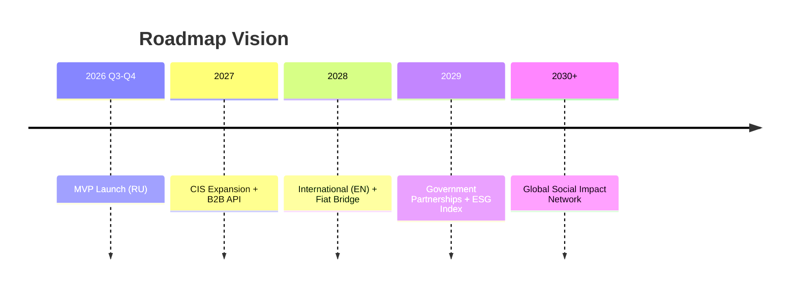

# ЛУЧИ — Vision Document

**Версия:** 1.0.0  
**Статус:** Draft → Approved  
**Дата:** 2026-08-07  
**Автор:** Architecture Team  

---

## 1. Видение

**ЛУЧИ** — крупнейшая социальная экосистема, где ценность человека измеряется не количеством лайков, а реальным вкладом в общество.

Мы создаём мир, в котором добрые дела становятся измеримыми, видимыми и вознаграждаемыми — без возможности накрутки, фальсификации или превращения добра в спекуляцию.

---

## 2. Проблема

| Проблема | Последствие |
|----------|-------------|
| Социальные сети поощряют внимание, а не действие | Поверхностный контент, токсичность |
| Волонтёрство не имеет системного учёта | Низкая мотивация, отсутствие прозрачности |
| Благотворительность непрозрачна | Недоверие к НКО и фондам |
| Нет единой системы признания добрых дел | Разрозненные инициативы без масштаба |
| Внутренние валюты в приложениях легко накручиваются | Потеря доверия к платформе |

---

## 3. Решение

Платформа **ЛУЧИ** объединяет:

1. **Социальную сеть** — посты, stories, друзья, чаты, рейтинги
2. **Систему добрых дел** — задания, мероприятия, верификация
3. **Валюту «Лучи»** — double-entry ledger, банковский уровень учёта
4. **Магазин** — обмен Лучей на товары, сертификаты, (в перспективе) деньги
5. **Антифрод** — ML + rule engine, защита от накрутки
6. **Модерацию** — многоуровневая проверка контента и действий

---

## 4. Ценности платформы

```
┌─────────────────────────────────────────────────────────┐
│                    ЦЕННОСТИ ЛУЧИ                        │
├─────────────┬─────────────┬─────────────┬───────────────┤
│  ПРАВДИВОСТЬ │  ПРОЗРАЧНОСТЬ │  БЕЗОПАСНОСТЬ │  МАСШТАБ     │
│  Только      │  Каждый Луч  │  Банковский  │  Миллионы     │
│  подтверждён-│  прослежива- │  уровень     │  пользовате-  │
│  ные действия│  ем          │  защиты      │  лей          │
├─────────────┼─────────────┼─────────────┼───────────────┤
│  СООБЩЕСТВО  │  ДОСТУПНОСТЬ │  УСТОЙЧИВОСТЬ│  ИННОВАЦИИ    │
│  Люди помога-│  Простой UX  │  Экология,   │  AI для       │
│  ют друг другу│  для всех    │  волонтёрство│  модерации    │
└─────────────┴─────────────┴─────────────┴───────────────┘
```

---

## 5. Целевая аудитория

### 5.1 Первичная
- **Активные граждане** (18–45) — хотят делать добро и получать признание
- **Волонтёры** — участвуют в мероприятиях, нужен учёт часов
- **Студенты** — социальные проекты, практика, портфолио

### 5.2 Вторичная
- **НКО и организации** — публикация заданий, верификация, отчётность
- **Бренды (ESG)** — спонсорство, корпоративное волонтёрство
- **Государственные программы** — интеграция с программами поддержки

### 5.3 B2B / B2G
- Организации-партнёры (верификация заданий)
- Магазины-партнёры (товары за Лучи)
- Муниципалитеты (экологические и социальные программы)

---

## 6. Уникальное торговое предложение (USP)

| Конкурент | Их подход | ЛУЧИ |
|-----------|-----------|------|
| Instagram / VK | Лайки, подписчики | Лучи за подтверждённые дела |
| Volunteer apps | Узкий фокус | Соцсеть + валюта + магазин |
| Charity platforms | Только пожертвования | Личное участие + вознаграждение |
| Gamification apps | Легко накрутить | Double-entry ledger + antifraud |

**Формула USP:**  
> *«Единственная социальная сеть, где твоя ценность = твои реальные добрые дела, защищённые банковским учётом и AI-антифродом.»*

---

## 7. Долгосрочное видение (5–10 лет)



### Фазы развития

**Phase 1 — Foundation (2026)**  
MVP: регистрация, профиль, посты, добрые дела, начисление Лучей, базовый магазин, модерация.

**Phase 2 — Growth (2027)**  
Stories, групповые чаты, достижения, организации, расширенная аналитика, мобильные приложения.

**Phase 3 — Scale (2028)**  
Микросервисная декомпозиция, международная локализация, обмен на сертификаты/деньги (регуляторно).

**Phase 4 — Ecosystem (2029+)**  
Open API для партнёров, ESG-индекс пользователей, интеграция с образованием и HR.

---

## 8. Метрики успеха (North Star)

| Метрика | Описание | Цель Year 1 |
|---------|----------|--------------|
| **Verified Good Deeds** | Подтверждённые добрые дела / месяц | 50 000 |
| **Active Rays Earners** | Пользователи, получившие ≥1 Луч за 30 дней | 100 000 |
| **Fraud Rate** | % отклонённых начислений | < 0.5% |
| **DAU/MAU** | Stickiness | > 40% |
| **NPS** | Net Promoter Score | > 50 |
| **Org Partners** | Активные организации | 500 |

**North Star Metric:** *Verified Good Deeds per Month*

---

## 9. Принципы архитектурного видения

1. **Domain-First** — бизнес-домены первичны, технологии вторичны
2. **Ledger-Native** — баланс никогда не хранится как число
3. **Event-Sourced Critical Paths** — все операции с Лучами через события
4. **Zero Trust Security** — каждый запрос проверяется
5. **Modular Monolith → Microservices** — без переписывания кода
6. **Audit Everything** — полная трассируемость действий
7. **Privacy by Design** — GDPR-ready с первого дня

---

## 10. Риски и митигация

| Риск | Вероятность | Влияние | Митигация |
|------|-------------|---------|-----------|
| Накрутка Лучей | Высокая | Критическое | Anti-fraud + ledger + модерация |
| Регуляторные ограничения (валюта) | Средняя | Высокое | Юридическая модель «бонусных баллов» |
| Низкая начальная аудитория | Средняя | Высокое | Партнёрства с НКО, gamification |
| Масштабирование ledger | Средняя | Высокое | Sharding, CQRS, read replicas |
| Модерационная нагрузка | Высокая | Среднее | AI pre-moderation + community |

---

## 11. Глоссарий

| Термин | Определение |
|--------|-------------|
| **Луч (Ray)** | Единица внутренней валюты, начисляемая за подтверждённое доброе дело |
| **Ledger** | Double-entry журнал всех операций с Лучами |
| **Доброе дело (Good Deed)** | Верифицированное полезное действие |
| **Задание (Task)** | Конкретное доброе дело от организации или платформы |
| **Мероприятие (Event)** | Волонтёрское событие с участниками |
| **Организация (Organization)** | Верифицированная НКО/компания, создающая задания |
| **Verification** | Процесс подтверждения выполнения доброго дела |

---

## 12. Связанные документы

- [MISSION.md](./MISSION.md) — миссия и цели
- [PROJECT_SCOPE.md](./PROJECT_SCOPE.md) — scope MVP и полной версии
- [ARCHITECTURE.md](./ARCHITECTURE.md) — техническая архитектура
- [ROADMAP.md](./ROADMAP.md) — дорожная карта реализации

---

*Документ является живым и обновляется по мере эволюции продукта.*
